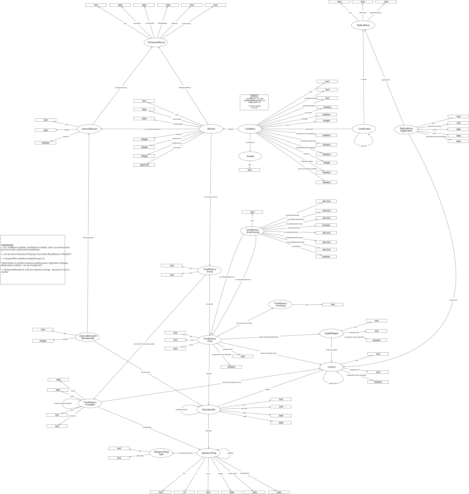

# Importing election data to Data Graphs

This page lists the Postgres queries necessary to produce CSV files to populate Data Graphs.

## StatutoryThingType

<pre>
	<code>
		COPY (
			SELECT *
			FROM legislation_types
		)
		TO '/Users/smethurstm/Documents/ontologies/election/meta/candidates/data-graphs/instance-data/legislation-types.csv' DELIMITER ',' CSV HEADER;
	</code>
</pre>

## StatutoryThing, hasStatutorThingType and enabledBy

<pre>
	<code>
		COPY (
			SELECT
				li.*,
				enabled_by.enabling_legislation_string AS enabled_by
			FROM legislation_items li
			LEFT JOIN
				(
					SELECT
						e.enabled_legislation_id AS enabled_legislation_id,
						STRING_AGG(e.enabling_legislation_id::text, ', ') AS enabling_legislation_string
					FROM enablings e
					GROUP BY e.enabled_legislation_id
				) enabled_by
			ON enabled_by.enabled_legislation_id = li.id
		)
		TO '/Users/smethurstm/Documents/ontologies/election/meta/candidates/data-graphs/instance-data/legislation-items.csv' DELIMITER ',' CSV HEADER;
	</code>
</pre>

## Country and parentCountry

<pre>
	<code>
		COPY (
			SELECT *
			FROM countries
		)
		TO '/Users/smethurstm/Documents/ontologies/election/meta/candidates/data-graphs/instance-data/countries.csv' DELIMITER ',' CSV HEADER;
	</code>
</pre>

## BoundarySet, parentBoundarySet, definedBy and appliesTo

<pre>
	<code>
		COPY (
			SELECT
				bs.*,
				CONCAT( country.name, ' (', bs.start_on, ' - ', bs.end_on, ')') AS name,
				legislation.legislation_string
				
			FROM boundary_sets bs
			LEFT JOIN
				(
					SELECT
						bsli.boundary_set_id,
						STRING_AGG(bsli.legislation_item_id::text, ', ') legislation_string
					FROM boundary_set_legislation_items bsli
					GROUP BY bsli.boundary_set_id
				) AS legislation
			ON legislation.boundary_set_id = bs.id
			
			INNER JOIN
				(
					SELECT *
					FROM countries
				) AS country
			ON country.id = bs.country_id
		)
		TO '/Users/smethurstm/Documents/ontologies/election/meta/candidates/data-graphs/instance-data/boundary-sets.csv' DELIMITER ',' CSV HEADER;
	</code>
</pre>

## ConstituencyGroupSet, parentConstituencyGroupSet, establishedBy and constituencyGroupSetInCountry

<pre>
	<code>
		COPY (
			SELECT
				cgs.*,
				CONCAT( country.name, ' (', cgs.start_on, ' - ', cgs.end_on, ')') AS name,
				legislation.legislation_string
				
			FROM constituency_group_sets cgs
			LEFT JOIN
				(
					SELECT
						cgsli.constituency_group_set_id,
						STRING_AGG(cgsli.legislation_item_id::text, ', ') legislation_string
					FROM constituency_group_set_legislation_items cgsli
					GROUP BY cgsli.constituency_group_set_id
				) AS legislation
			ON legislation.constituency_group_set_id = cgs.id
			
			INNER JOIN
				(
					SELECT *
					FROM countries
				) AS country
			ON country.id = cgs.country_id
		)
		TO '/Users/smethurstm/Documents/ontologies/election/meta/candidates/data-graphs/instance-data/constituency-group-sets.csv' DELIMITER ',' CSV HEADER;
	</code>
</pre>

## EnglishRegion and whollyContainedBy

<pre>
	<code>
		COPY (
			SELECT
				*
				
			FROM english_regions
		)
		TO '/Users/smethurstm/Documents/ontologies/election/meta/candidates/data-graphs/instance-data/english-regions.csv' DELIMITER ',' CSV HEADER;
	</code>
</pre>

## ConstituencyAreaType

<pre>
	<code>
		COPY (
			SELECT
				*
				
			FROM constituency_area_types
		)
		TO '/Users/smethurstm/Documents/ontologies/election/meta/candidates/data-graphs/instance-data/constituency-area-types.csv' DELIMITER ',' CSV HEADER;
	</code>
</pre>

## ParliamentPeriod

<pre>
	<code>
		COPY (
			SELECT
				*
				
			FROM general_election_publication_states
		)
		TO '/Users/smethurstm/Documents/ontologies/election/meta/candidates/data-graphs/instance-data/general-election-publication-states.csv' DELIMITER ',' CSV HEADER;
	</code>
</pre>

#### DONE TO HERE

## ConstituencyArea

<pre>
	<code>
		COPY (
			SELECT
				*
				
			FROM constituency_areas
		)
		TO '/Users/smethurstm/Documents/ontologies/election/meta/candidates/data-graphs/instance-data/constituency-areas.csv' DELIMITER ',' CSV HEADER;
	</code>
</pre>

