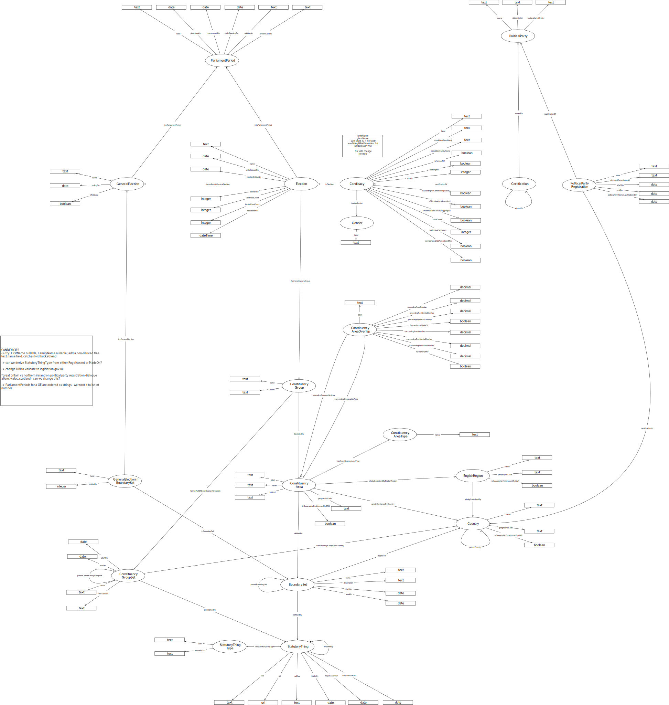

# Importing election data to Data Graphs

This page lists the Postgres queries necessary to produce CSV files to populate Data Graphs.

## StatutoryThingType

<pre>
	<code>
		COPY (
			SELECT *
			FROM legislation_types
		)
		TO '/Users/smethurstm/Documents/ontologies/election/meta/candidates/data-graphs/instance-data/legislation-types.csv' DELIMITER ',' CSV HEADER;
	</code>
</pre>

## StatutoryThing, hasStatutorThingType and enabledBy

<pre>
	<code>
		COPY (
			SELECT
				li.id,
				li.title,
				li.uri AS legislationGovURI,
				li.url_key AS urlKey,
				li.royal_assent_on AS royalAssentOn,
				li.made_on AS madeOn,
				li.statute_book_on AS statuteBookOn,
				li.legislation_type_id AS hasStatutoryThingType,
				enabled_by.enabling_legislation_string AS enabledBy
			FROM legislation_items li
			LEFT JOIN
				(
					SELECT
						e.enabled_legislation_id AS enabled_legislation_id,
						STRING_AGG(e.enabling_legislation_id::text, ', ') AS enabling_legislation_string
					FROM enablings e
					GROUP BY e.enabled_legislation_id
				) enabled_by
			ON enabled_by.enabled_legislation_id = li.id
		)
		TO '/Users/smethurstm/Documents/ontologies/election/meta/candidates/data-graphs/instance-data/legislation-items.csv' DELIMITER ',' CSV HEADER;
	</code>
</pre>

## Country and parentCountry

<pre>
	<code>
		COPY (
			SELECT 
				id,
				name,
				geographic_code AS geographicCode,
				parent_country_id AS parentCountry,
				CASE
					WHEN geographic_code IS NOT NULL
					THEN 'true'
					ELSE 'false'
				END AS isGeographicCodeIssuedByONS 
			FROM countries
		)
		TO '/Users/smethurstm/Documents/ontologies/election/meta/candidates/data-graphs/instance-data/countries.csv' DELIMITER ',' CSV HEADER;
	</code>
</pre>

## EnglishRegion and whollyContainedBy

<pre>
	<code>
		COPY (
			SELECT 
				id,
				name,
				geographic_code AS geographicCode,
				'true' AS isGeographicCodeIssuedByONS,
				country_id AS whollyContainedBy
			FROM english_regions
		)
		TO '/Users/smethurstm/Documents/ontologies/election/meta/candidates/data-graphs/instance-data/english-regions.csv' DELIMITER ',' CSV HEADER;
	</code>
</pre>

## ConstituencyAreaType

<pre>
	<code>
		COPY (
			SELECT
				id,
				area_type AS name
			FROM constituency_area_types
		)
		TO '/Users/smethurstm/Documents/ontologies/election/meta/candidates/data-graphs/instance-data/constituency-area-types.csv' DELIMITER ',' CSV HEADER;
	</code>
</pre>

## ParliamentPeriod

<pre>
	<code>
		COPY (
			SELECT
			id,
			number,
			summoned_on AS summonedOn,
			state_opening_on AS stateOpeningOn,
			dissolved_on AS dissolvedOn,
			wikidata_id AS wikidataId,
			london_gazette AS londonGazetteCitation,
			CONCAT ( 'Parliament ', number ) AS label
			FROM parliament_periods
		)
		TO '/Users/smethurstm/Documents/ontologies/election/meta/candidates/data-graphs/instance-data/parliament_periods.csv' DELIMITER ',' CSV HEADER;
	</code>
</pre>

## Gender

<pre>
	<code>
		COPY (
			SELECT
				id,
				gender AS label
			FROM genders
		)
		TO '/Users/smethurstm/Documents/ontologies/election/meta/candidates/data-graphs/instance-data/genders.csv' DELIMITER ',' CSV HEADER;
	</code>
</pre>

## PoliticalParty

<pre>
	<code>
		COPY (
			SELECT
				id,
				name,
				abbreviation,
				mnis_id AS politicalPartyMnisId
			FROM political_parties
		)
		TO '/Users/smethurstm/Documents/ontologies/election/meta/candidates/data-graphs/instance-data/political-parties.csv' DELIMITER ',' CSV HEADER;
	</code>
</pre>

## PoliticalPartyRegistration

<pre>
	<code>
		COPY (
			SELECT
				ppr.id,
				CONCAT( 'Registration of ', political_party.name, ' in ', country.name, ' (', ppr.start_on, ' - ', ppr.end_on, ')' ) AS label,
				ppr.political_party_id AS registrationOf,
				ppr.country_id AS registrationIn,
				ppr.start_on AS startOn,
				ppr.end_on AS endOn,
				ppr.electoral_commission_id AS electoralCommissionId,
				ppr.political_party_name_last_updated_on AS politicalPartyNameLastUpdatedOn
				
			FROM political_party_registrations AS ppr
			INNER JOIN (
				SELECT *
				FROM political_parties
			) AS political_party
			ON political_party.id = ppr.political_party_id
			
			INNER JOIN (
				SELECT *
				FROM countries
			) AS country
			ON country.id = ppr.country_id
		)
		TO '/Users/smethurstm/Documents/ontologies/election/meta/candidates/data-graphs/instance-data/political-party-registrations.csv' DELIMITER ',' CSV HEADER;
	</code>
</pre>

## BoundarySet, parentBoundarySet, definedBy and appliesTo

<pre>
	<code>
		COPY (
			SELECT
				bs.id,
				CONCAT( 'Boundary set for ', country.name, ' (', bs.start_on, ' - ', bs.end_on, ')') AS name,
				bs.start_on AS startOn,
				bs.end_on AS endOn,
				bs.description,
				bs.parent_boundary_set_id AS parentBoundarySet,
				bs.country_id AS appliesTo,
				legislation.legislation_string AS definedBy
			FROM boundary_sets bs
			LEFT JOIN
				(
					SELECT
						bsli.boundary_set_id,
						STRING_AGG(bsli.legislation_item_id::text, ', ') legislation_string
					FROM boundary_set_legislation_items bsli
					GROUP BY bsli.boundary_set_id
				) AS legislation
			ON legislation.boundary_set_id = bs.id
			
			INNER JOIN
				(
					SELECT *
					FROM countries
				) AS country
			ON country.id = bs.country_id
		)
		TO '/Users/smethurstm/Documents/ontologies/election/meta/candidates/data-graphs/instance-data/boundary-sets.csv' DELIMITER ',' CSV HEADER;
	</code>
</pre>

## ConstituencyGroupSet, parentConstituencyGroupSet, establishedBy and constituencyGroupSetInCountry

<pre>
	<code>
		COPY (
			SELECT
				cgs.id,
				CONCAT( 'Constituency group set for ', country.name, ' (', cgs.start_on, ' - ', cgs.end_on, ')') AS name,
				cgs.start_on AS startOn,
				cgs.end_on AS endOn,
				cgs.description,
				cgs.parent_constituency_group_set_id AS parentConstituencyGroupSet,
				cgs.country_id AS constituencyGroupSetInCountry,
				legislation.legislation_string AS establishedBy
			FROM constituency_group_sets cgs
			LEFT JOIN
				(
					SELECT
						cgsli.constituency_group_set_id,
						STRING_AGG(cgsli.legislation_item_id::text, ', ') legislation_string
					FROM constituency_group_set_legislation_items cgsli
					GROUP BY cgsli.constituency_group_set_id
				) AS legislation
			ON legislation.constituency_group_set_id = cgs.id
			
			INNER JOIN
				(
					SELECT *
					FROM countries
				) AS country
			ON country.id = cgs.country_id
		)
		TO '/Users/smethurstm/Documents/ontologies/election/meta/candidates/data-graphs/instance-data/constituency-group-sets.csv' DELIMITER ',' CSV HEADER;
	</code>
</pre>

## ConstituencyArea

<pre>
	<code>
		COPY (
			SELECT
				ca.id,
				CONCAT( ca.name, ' (', bs.start_on, ' - ', bs.end_on, ')' ) as label,
				ca.name,
				ca.boundary_set_id AS definedIn,
				ca.country_id AS whollyContainedByCountry,
				ca.english_region_id AS whollyContainedByEnglishRegion,
				ca.constituency_area_type_id AS hasConstuencyAreaType,
				ca.geographic_code AS geographicCode,
				CASE
					WHEN is_geographic_code_issued_by_ons THEN 'true'
					ELSE 'false'
				END AS isGeographicCodeIssuedByONS,
				ca.mnis_id AS mnisId
				
			FROM constituency_areas ca, boundary_sets bs
			WHERE ca.boundary_set_id = bs.id
		)
		TO '/Users/smethurstm/Documents/ontologies/election/meta/candidates/data-graphs/instance-data/constituency-areas.csv' DELIMITER ',' CSV HEADER;
	</code>
</pre>

## ConstituencyGroup, boundedBy and formsPartOfConstituencyGroupSet

<pre>
	<code>
		COPY (
			SELECT
				cg.id,
				CONCAT( cg.name, ' (', bs.start_on, ' - ', bs.end_on, ')' ) as label,
				cg.name,
				cg.constituency_group_set_id AS formsPartOfConstituencyGroupSet,
				cg.constituency_area_id AS boundedBy
				
			FROM constituency_groups cg, constituency_areas ca, boundary_sets bs
			WHERE cg.constituency_area_id = ca.id
			AND ca.boundary_set_id = bs.id
		)
		TO '/Users/smethurstm/Documents/ontologies/election/meta/candidates/data-graphs/instance-data/constituency-groups.csv' DELIMITER ',' CSV HEADER;
	</code>
</pre>

## ConstituencyAreaOverlap, precedingGeographicArea and succeedingGeographicArea

<pre>
	<code>
		COPY (
			SELECT
				cao.id,
				CONCAT ( 'Overlap from ', preceding_constituency_area.name, ' (', preceding_constituency_area.start_on, ' - ', preceding_constituency_area.end_on, ') to ', succeeding_constituency_area.name, ' (', succeeding_constituency_area.start_on, ' - ', succeeding_constituency_area.end_on, ')' ) AS label,
				cao.from_constituency_area_id AS precedingGeographicArea,
				cao.to_constituency_area_id AS succeedingGeographicArea,
				CASE
					WHEN cao.from_constituency_geographical > -0.0001 AND cao.from_constituency_geographical < 0.0001
					THEN 0.0
					ELSE cao.from_constituency_geographical
				END precedingAreaOverlap,
				
				CASE
					WHEN cao.from_constituency_residential > -0.0001 AND cao.from_constituency_residential < 0.0001
					THEN 0.0
					ELSE cao.from_constituency_residential
				END precedingResidentialOverlap,
				
				CASE
					WHEN cao.from_constituency_population > -0.0001 AND cao.from_constituency_population < 0.0001
					THEN 0.0
					ELSE cao.from_constituency_population
				END precedingPopulationOverlap,
				CASE
					WHEN cao.formed_from_whole_of IS TRUE
					THEN 'true'
					ELSE 'false'
				END AS formedFromWholeOf,
				CASE
					WHEN cao.to_constituency_geographical > -0.0001 AND cao.to_constituency_geographical < 0.0001
					THEN 0.0
					ELSE cao.to_constituency_geographical
				END succeedingAreaOverlap,
				
				CASE
					WHEN cao.to_constituency_residential > -0.0001 AND cao.to_constituency_residential < 0.0001
					THEN 0.0
					ELSE cao.to_constituency_residential
				END succeedingResidentialOverlap,
				
				CASE
					WHEN cao.to_constituency_population > -0.0001 AND cao.to_constituency_population < 0.0001
					THEN 0.0
					ELSE cao.to_constituency_population
				END succeedingPopulationOverlap,
				CASE
					WHEN cao.forms_whole_of IS TRUE
					THEN 'true'
					ELSE 'false'
				END AS formsWholeOf
				
			FROM constituency_area_overlaps cao
			
			INNER JOIN (
				SELECT ca.*, bs.start_on, bs.end_on
				FROM constituency_areas ca, boundary_sets bs
				WHERE ca.boundary_set_id = bs.id
			) AS preceding_constituency_area
			ON preceding_constituency_area.id = cao.from_constituency_area_id
			
			INNER JOIN (
				SELECT ca.*, bs.start_on, bs.end_on
				FROM constituency_areas ca, boundary_sets bs
				WHERE ca.boundary_set_id = bs.id
			) AS succeeding_constituency_area
			ON succeeding_constituency_area.id = cao.to_constituency_area_id
		)
		TO '/Users/smethurstm/Documents/ontologies/election/meta/candidates/data-graphs/instance-data/constituency-area-overlaps.csv' DELIMITER ',' CSV HEADER;
	</code>
</pre>

## GeneralElection, hasPublicationState and forParliamentPeriod

<pre>
	<code>
		COPY (
			SELECT
				id,
				CASE
				  WHEN is_notional IS TRUE THEN CONCAT( 'Notional general election on ', polling_on )
				ELSE
				  CONCAT( 'General election on ', polling_on )
				END AS name,
				polling_on AS pollingOn,
				CASE
				  WHEN is_notional IS TRUE THEN 'true'
				ELSE
					'false'
				END AS isNotional,
				parliament_period_id AS forParliamentPeriod
				
			FROM general_elections
		)
		TO '/Users/smethurstm/Documents/ontologies/election/meta/candidates/data-graphs/instance-data/general-elections.csv' DELIMITER ',' CSV HEADER;
	</code>
</pre>

## GeneralElectionInBoundarySet, forGeneralElection and inBoundarySet

<pre>
	<code>
		COPY (
			SELECT
				gebs.id,
				CONCAT( general_election.polling_on, ' was general election number ', gebs.ordinality, ' in ', boundary_set.country_name, ' (', boundary_set.start_on, ' - ', boundary_set.end_on, ')' ) AS label,
				gebs.ordinality,
				gebs.general_election_id AS forGeneralElection,
				gebs.boundary_set_id AS inBoundarySet
				
				                                                   
			FROM general_election_in_boundary_sets gebs
			
			INNER JOIN (
				SELECT *
				FROM general_elections
			) AS general_election
			ON general_election.id = gebs.general_election_id
			
			INNER JOIN (
				SELECT bs.*, c.name AS country_name
				FROM boundary_sets bs, countries c
				WHERE bs.country_id = c.id
			) AS boundary_set
			ON boundary_set.id = gebs.boundary_set_id
		)
		TO '/Users/smethurstm/Documents/ontologies/election/meta/candidates/data-graphs/instance-data/general-election-in-boundary-sets.csv' DELIMITER ',' CSV HEADER;
	</code>
</pre>

## Election, intoParliamentPeriod, formsPartOfGeneralElection and forConstituencyGroup
 
<pre>
	<code>
		COPY (
			SELECT
				e.id,
				CASE
					WHEN e.general_election_id IS NOT NULL
					THEN
						CASE
							WHEN general_election.is_notional
							THEN CONCAT( 'Notional general election for ', constituency_group.name, ' on ', e.polling_on )
							ELSE CONCAT( 'General election for ', constituency_group.name, ' on ', e.polling_on )
						END
					ELSE CONCAT( 'By-election for ', constituency_group.name, ' on ', e.polling_on )
				END AS name,
				e.writ_issued_on AS writIssuedOn,
				e.polling_on AS electionPollingOn,
				electorate.population_count AS electorate,
				e.valid_vote_count AS validVoteCount,
				e.invalid_vote_count AS invalidVoteCount,
				e.declaration_at AS declarationAt,
				e.parliament_period_id AS intoParliamentPeriod,
				e.general_election_id AS formsPartOfGeneralElection,
				e.constituency_group_id AS forConstituencyGroup
				
			FROM elections e
			
			LEFT JOIN (
				SELECT *
				FROM general_elections
			) AS general_election
			ON general_election.id = e.general_election_id
			
			INNER JOIN (
				SELECT *
				FROM constituency_groups
			) AS constituency_group
			ON constituency_group.id = e.constituency_group_id
			
			LEFT JOIN (
				SELECT *
				FROM result_summaries
			) AS result_summary
			ON result_summary.id = e.result_summary_id
			
			INNER JOIN (
				SELECT *
				FROM electorates
			) AS electorate
			ON electorate.id = e.electorate_id
		)
		TO '/Users/smethurstm/Documents/ontologies/election/meta/candidates/data-graphs/instance-data/elections.csv' DELIMITER ',' CSV HEADER;
	</code>
</pre>

## Candidacy, inElection, ofMember and havingGender

<pre>
	<code>
		COPY (
			SELECT
				cand.id,
				CASE
					WHEN cand.candidate_given_name IS NOT NULL
					THEN 
						CASE 
							WHEN main_political_party.name IS NOT NULL
							THEN CONCAT( 'Candidacy of ', cand.candidate_given_name, ' ', cand.candidate_family_name, ' standing for ', main_political_party.name,' in ', election.constituency_name, ' as part of a ', election.election_type, ' on ', election.polling_on )
					
							WHEN cand.is_standing_as_commons_speaker IS TRUE
							THEN CONCAT( 'Candidacy of ', cand.candidate_given_name, ' ', cand.candidate_family_name, ' standing as Commons Speaker in ', election.constituency_name, ' as part of a ', election.election_type, ' on ', election.polling_on )
					
							WHEN cand.is_standing_as_independent IS TRUE
							THEN CONCAT( 'Candidacy of ', cand.candidate_given_name, ' ', cand.candidate_family_name, ' standing as an independent in ', election.constituency_name, ' as part of a ', election.election_type, ' on ', election.polling_on )
					
							WHEN cand.is_notional_political_party_aggregate IS TRUE
							THEN CONCAT( 'Candidacy of ', cand.candidate_given_name, ' ', cand.candidate_family_name, ' standing for a notional aggregate party in ', election.constituency_name, ' as part of a ', election.election_type, ' on ', election.polling_on )
						END
				
					ELSE 
						CASE 
							WHEN main_political_party.name IS NOT NULL
							THEN CONCAT( 'Candidacy standing for ', main_political_party.name,' in ', election.constituency_name, ' as part of a ', election.election_type, ' on ', election.polling_on )
					
							WHEN cand.is_standing_as_commons_speaker IS TRUE
							THEN CONCAT( 'Candidacy standing as Commons Speaker in ', election.constituency_name, ' as part of a ', election.election_type, ' on ', election.polling_on )
					
							WHEN cand.is_standing_as_independent IS TRUE
							THEN CONCAT( 'Candidacy standing as an independent in ', election.constituency_name, ' as part of a ', election.election_type, ' on ', election.polling_on )
					
							WHEN cand.is_notional_political_party_aggregate IS TRUE
							THEN CONCAT( 'Candidacy standing for a notional aggregate party in ', election.constituency_name, ' as part of a ', election.election_type, ' on ', election.polling_on )
						END
				END AS label,
				cand.candidate_given_name AS candidateGivenName,
				cand.candidate_family_name AS candidateFamilyName,
				cand.candidate_gender_id AS havingGender,
				CASE
					WHEN cand.candidate_is_sitting_mp
					THEN 'true'
					ELSE 'false'
				END wasSittingMPAtDissolution,
				CASE
					WHEN cand.candidate_is_former_mp
					THEN 'true'
					ELSE 'false'
				END hasBeenMP,
				member.mnis_id AS mnisID,
				cand.election_id AS inElection,
				CASE
					WHEN cand.is_standing_as_independent
					THEN 'true'
					ELSE 'false'
				END isStandingAsIndependent,
				CASE
					WHEN cand.is_standing_as_commons_speaker
					THEN 'true'
					ELSE 'false'
				END isStandingAsCommonsSpeaker,
				CASE
					WHEN cand.is_notional_political_party_aggregate
					THEN 'true'
					ELSE 'false'
				END isNotionalPoliticalPartyAggregate,
				cand.vote_count AS voteCount,
				CASE
					WHEN cand.is_winning_candidacy
					THEN 'true'
					ELSE 'false'
				END isWinningCandidacy,
				cand.democracy_club_person_identifier AS democracyClubPersonIdentifier
		
			FROM candidacies cand
	
			INNER JOIN (
				SELECT
					e.*,
					constituency_group.name AS constituency_name,
					CASE
						WHEN e.general_election_id IS NULL
						THEN 'by-election'
						ELSE general_election.general_election_type
					END AS election_type
			
				FROM elections e
		
				LEFT JOIN (
					SELECT ge.*,
						CASE
							WHEN ge.is_notional IS TRUE
							THEN 'notional general election'
							ELSE 'general election'
						END AS general_election_type
					FROM general_elections ge
				) AS general_election
				ON general_election.id = e.general_election_id
		
		
				INNER JOIN (
					SELECT *
					FROM constituency_groups
				) constituency_group
				ON constituency_group.id = e.constituency_group_id
			) election
			ON election.id = cand.election_id
		
			LEFT JOIN (
				SELECT *
				FROM members
			) member
			on member.id = cand.member_id
	
			LEFT JOIN (
				SELECT cert.candidacy_id, pp.name
				FROM certifications cert, political_parties pp
				WHERE cert.political_party_id = pp.id
			) main_political_party
			ON main_political_party.candidacy_id = cand.id
		)
		TO '/Users/smethurstm/Documents/ontologies/election/meta/candidates/data-graphs/instance-data/candiacies.csv' DELIMITER ',' CSV HEADER;
	</code>
</pre>

## Certification, certificationOn, issuedBy and adjunctTo

<pre>
	<code>
		COPY (
			SELECT
				cert.id,
				CASE
					WHEN candidacy.candidate_family_name IS NULL
					THEN
						CONCAT( 'Certification of a notional candidate by ', political_party.name, ' for an election in ', candidacy.constituency_name, ' on ', candidacy.polling_on )
					ELSE
						CONCAT( 'Certification of ', candidacy.candidate_given_name, ' ', candidacy.candidate_family_name, ' by ', political_party.name, ' for an election in ', candidacy.constituency_name, ' on ', candidacy.polling_on )
					
				END AS label,
				cert.candidacy_id AS certificationOf,
				cert.political_party_id AS issuedBy,
				cert.adjunct_to_certification_id AS adjunctTo
			
			FROM certifications cert
			
			INNER JOIN (
				SELECT *
				FROM political_parties
				
			) political_party
			ON political_party.id = cert.political_party_id
			
			INNER JOIN (
				SELECT cand.*, cg.name AS constituency_name, e.polling_on
				FROM candidacies cand, elections e, constituency_groups cg
				WHERE cand.election_id = e.id
				AND e.constituency_group_id = cg.id
				
			) candidacy
			ON candidacy.id = cert.candidacy_id
		)
		TO '/Users/smethurstm/Documents/ontologies/election/meta/candidates/data-graphs/instance-data/certifications.csv' DELIMITER ',' CSV HEADER;
	</code>
</pre>

