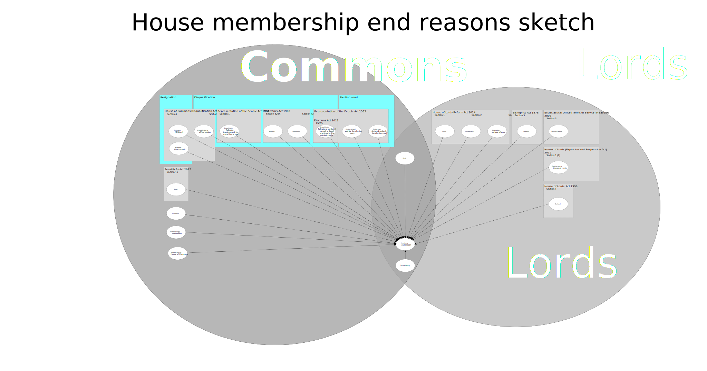

# House membership end reasons

Label | Scope note | Is Commons | Is Lords
Bankruptcy | Disqualified following bankruptcy in England, Wales and Northern Ireland under [section 426A of the Insolvency Act 1986](https://www.legislation.gov.uk/ukpga/1986/45/section/426A) | True | False
Convicted of a serious offence |  [section 3 of the House of Lords Reform Act 2014](https://www.legislation.gov.uk/ukpga/2014/24/section/3/enacted) | False | True
Dissolution | End of a [parliament period](https://ukparliament.github.io/ontologies/time-period/time-period-ontology#d4e177) | True | False
Death | Death whilst incumbent in a House | True | True
Disqualification by office holding | Member loses seat as a result of taking an office listed in the [House of Commons (Disqualification) Act 1975](https://www.legislation.gov.uk/ukpga/1975/24/contents) | True | False
Disqualification following a verdict of corrupt or illegal practices by the criminal courts  |  Member found guilty of corrupt or illegal practices under provisions in the [Representation of the People Act 1983](https://www.legislation.gov.uk/ukpga/1983/2) or under a disqualification order imposed under [part 5 of the Elections Act 2022](https://www.legislation.gov.uk/ukpga/2022/37/part/5/enacted), outside of the election petition process | True | False
Disqualification following imprisonment for more than a year | Disqualification following imprisonment for more than a year under [section 1 of the Respresentation of the People Act 1981](https://www.legislation.gov.uk/ukpga/1981/34/section/1) | True | False
Election return declared undue by the election court | Election return declared to be undue by an election court under the [Representation of the People Act 1983](https://www.legislation.gov.uk/ukpga/1983/2) | True | False
Election declared void by the election court | Election declared to be void by an election court under the [Representation of the People Act 1983](https://www.legislation.gov.uk/ukpga/1983/2) | True | False
Elevation without resignation | Where a Member has been made a Peer, and thereby loses their seat in the Commons | True | False
Excluded |  [section 1 of the House of Lords Act 1999](https://www.legislation.gov.uk/ukpga/1999/34/section/1) | False | True
Expulsion | Determined unfit for Membership by the House, brought by a motion from the Speaker for the House of Commons or, for the House of Lords, under [section 1 (2) of the House of Lords (Expulsion and Suspension) Act 2015](https://www.legislation.gov.uk/ukpga/2015/14/section/1) | True | True
Non attendance (Lord Speaker certified) |  [section 2 of the House of Lords Reform Act 2014](https://www.legislation.gov.uk/ukpga/2014/24/section/2/enacted) | False | True
Recall | Member removed before the end of their term following a successful recall petition under [section 15 of the Recall of MPs Act 2015](https://www.legislation.gov.uk/ukpga/2015/25/section/15/enacted) | True | False
Resignation (Chiltern) | Resignation from the House of Commons by appointment to the Crown Steward and Bailiff of the Chiltern Hundreds under [section 4 of the House of Commons Disqualification Act 1975](https://www.legislation.gov.uk/ukpga/1975/24/section/4) | True | False
Resignation (Northstead) | Resignation from the House of Commons by appointment to the Crown Steward and Bailiff of the Manor of Northstead under [section 4 of the House of Commons Disqualification Act 1975](https://www.legislation.gov.uk/ukpga/1975/24/section/4) | True | False
Retirement | Disqualified following sequestration in Scotland under [section 1 of the House of Lords Reform Act 2014](https://www.legislation.gov.uk/ukpga/2014/24/section/1/enacted) | False | True
Sequestration | Disqualified following sequestration in Scotland under [section 427 of the Insolvency Act 1986](https://www.legislation.gov.uk/ukpga/1986/45/section/427) | True | False
Termination of incumbency | [section 3 of the Ecclesiastical Offices (Terms of Service) Measure 2009](https://www.legislation.gov.uk/ukcm/2009/1/section/3) | False | True
Translation | [section 5 of the Bishoprics Act 1878](https://www.legislation.gov.uk/ukpga/Vict/41-42/68/section/5) | False | True

## House of Commons membership end reasons sketch

