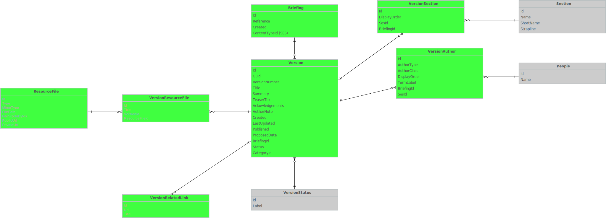

# Loading data from the research briefings application to Data Graphs.

This process relies on getting hold of a dump of the SQLServer database, which is transformed to Postgres by James.

This page lists the Postgres queries necessary to produce CSV files to populate Data Graphs.

## PublicationWork and publishedBy

### Commons publications

<pre>
	<code>
		COPY (
			SELECT
				b."Id",
				b."Reference",
				b."Created"::Date AS createdAt,
				1 AS publishedBy,
				TRIM( BOTH ' ' FROM version."Title") AS title
			FROM "Briefing" AS b
			INNER JOIN (
				SELECT *
				FROM "Version"
			) AS version
			ON version."BriefingId" = b."Id"
			WHERE (
				b."ContentTypeId" = 414033 /* Commons Briefing papers */
				OR
				b."ContentTypeId" = 414037 /* Commons Debate packs */
			)
			GROUP BY b."Id", version."Title"
		)
		TO '/Users/smethurstm/Documents/ontologies/meta/library-information-architecture/publication/data-graphs/data-loading/dumps/commons-publication-works.csv' DELIMITER ',' CSV HEADER;
	</code>
</pre>

This query exports 17,716 publications. Data Graphs only loads 15,011. Why?

### Lords publications

<pre>
	<code>
		COPY (
			SELECT
				b."Id",
				b."Reference",
				b."Created"::Date AS createdAt,
				2 AS publishedBy,
				TRIM( BOTH ' ' FROM version."Title") AS title
			FROM "Briefing" AS b
			INNER JOIN (
				SELECT *
				FROM "Version"
			) AS version
			ON version."BriefingId" = b."Id"
			WHERE (
				b."ContentTypeId" = 414039 /* Lords Briefing packs */
				OR
				b."ContentTypeId" = 414041 /* Lords In Focus */
				OR
				b."ContentTypeId" = 346713 /* Lords Library Briefings */
			)
			GROUP BY b."Id", version."Title"
		)
		TO '/Users/smethurstm/Documents/ontologies/meta/library-information-architecture/publication/data-graphs/data-loading/dumps/lords-publication-works.csv' DELIMITER ',' CSV HEADER;
	</code>
</pre>

### POST publications

<pre>
	<code>
		COPY (
			SELECT
				b."Id",
				b."Reference",
				b."Created"::Date AS createdAt,
				3 AS publishedBy,
				TRIM( BOTH ' ' FROM version."Title") AS title
			FROM "Briefing" AS b
			INNER JOIN (
				SELECT *
				FROM "Version"
			) AS version
			ON version."BriefingId" = b."Id"
			WHERE (
				b."ContentTypeId" = 346721 /* POSTnotes */
				OR
				b."ContentTypeId" = 414035 /* POSTbriefs */
			)
			GROUP BY b."Id", version."Title"
		)
		TO '/Users/smethurstm/Documents/ontologies/meta/library-information-architecture/publication/data-graphs/data-loading/dumps/post-publication-works.csv' DELIMITER ',' CSV HEADER;
	</code>
</pre>

## Person

<pre>
	<code>
		COPY (
			SELECT
				a."SesId" AS id,
				'' AS name
			FROM "VersionAuthor" a
			WHERE a."SesId" IS NOT NULL
		)
		TO '/Users/smethurstm/Documents/ontologies/meta/library-information-architecture/publication/data-graphs/data-loading/dumps/people.csv' DELIMITER ',' CSV HEADER;
	</code>
</pre>

Taking just the people with SES IDs, it's possible for Phil to look up the SES ID to get a label (name) for the person. These then need to be deduped and SES IDs that do not resolve removed. As of 2026-03-04, 10 SES IDs did not resolve.

## PublicationExpression, expressionOf and hasPublicationExpressionStatus

<pre>
	<code>
		COPY (
			SELECT
				v."Id" AS id,
				v."Guid" AS guid,
				v."VersionNumber" AS number,
				TRIM( BOTH ' ' FROM v."Title") AS title,
				/*v."Summary" AS summary,*/
				v."TeaserText" AS teaserText,
				v."Acknowledgements" AS acknowledgements,
				v."AuthorNote" AS authorNote,
				TO_CHAR(v."Created" AT TIME ZONE 'UTC', 'DD/MM/YYYY HH24:MI:SS+00:00') AS createdAt,
				TO_CHAR(v."LastUpdated" AT TIME ZONE 'UTC', 'DD/MM/YYYY HH24:MI:SS+00:00') AS updatedAt,
				TO_CHAR(v."Published" AT TIME ZONE 'UTC', 'DD/MM/YYYY HH24:MI:SS+00:00') AS publishedAt,
				v."ProposedDate"::Date AS proposedDate,
				v."BriefingId" AS expressionOf,
				v."Status" AS hasPublicationExpressionStatus
			FROM "Version" AS v
		)
		TO '/Users/smethurstm/Documents/ontologies/meta/library-information-architecture/publication/data-graphs/data-loading/dumps/publication-expressions.csv' DELIMITER ',' CSV HEADER;
	</code>
</pre>

## Contribution, contributionTo, hasContributionType and contributionBy

<pre>
	<code>
		COPY (
			SELECT
				va."Id" AS id,
				CONCAT( 'Contribution to ', v."Title", ' by ', va."SesId" ) AS label,
				va."BriefingId" AS contributionTo,
				va."AuthorType" AS hasContributionType,
				va."DisplayOrder" AS ordinality,
				va."SesId" AS contributionBy,
				'TRUE' AS isPublic
			FROM
				"VersionAuthor" va,
				"Version" v
			WHERE va."SesId" IS NOT NULL
			AND va."BriefingId" = v."Id"
		)
		TO '/Users/smethurstm/Documents/ontologies/meta/library-information-architecture/publication/data-graphs/data-loading/dumps/contributions.csv' DELIMITER ',' CSV HEADER;
	</code>
</pre>

## SectionContribution, sectionContributionBy and sectionContributionTo

<pre>
	<code>
		COPY (
			SELECT
				s."Id" AS id,
				CASE
					WHEN s."SesId" = 25036
						THEN CONCAT( 'Home Affairs Section', ' contribution to ', v."Title" )
					WHEN s."SesId" = 70459
						THEN CONCAT( 'Social and General Statistics Section', ' contribution to ', v."Title" )
					WHEN s."SesId" = 83435
						THEN CONCAT( 'Statistics Resource Unit', ' contribution to ', v."Title" )
					WHEN s."SesId" = 17113
						THEN CONCAT( 'Economic Policy and Statistics Section', ' contribution to ', v."Title" )
					WHEN s."SesId" = 298694
						THEN CONCAT( 'Indexing and Data Management Section', ' contribution to ', v."Title" )
					WHEN s."SesId" = 16849
						THEN CONCAT( 'Business and Transport Section', ' contribution to ', v."Title" )
					WHEN s."SesId" = 70510
						THEN CONCAT( 'Social Policy Section', ' contribution to ', v."Title" )
					WHEN s."SesId" = 66113
						THEN CONCAT( 'Reference Services Section', ' contribution to ', v."Title" )
					WHEN s."SesId" = 67716
						THEN CONCAT( 'Science and Environment Section', ' contribution to ', v."Title" )
					WHEN s."SesId" = 61096
						THEN CONCAT( 'Parliament Education Service', ' contribution to ', v."Title" )
					WHEN s."SesId" = 37362
						THEN CONCAT( 'International Affairs and Defence Section', ' contribution to ', v."Title" )
					WHEN s."SesId" = 61055
						THEN CONCAT( 'Parliament and Constitution Centre', ' contribution to ', v."Title" )
					WHEN s."SesId" = 42902
						THEN CONCAT( 'Library Resources Section', ' contribution to ', v."Title" )
				END AS label,
				s."DisplayOrder" AS ordinality,
				s."BriefingId" AS sectionContributionTo,
				s."SesId" AS sectionContributionBy
			FROM
				"VersionSection" s,
				"Version" v
			
			WHERE s."BriefingId" = v."Id"
			
			/* Don't include POST or Lords Library */
			AND (
				s."SesId" = 25036
				OR s."SesId" = 70459
				OR s."SesId" = 83435
				OR s."SesId" = 17113
				OR s."SesId" = 298694
				OR s."SesId" = 16849
				OR s."SesId" = 70510
				OR s."SesId" = 66113
				OR s."SesId" = 67716
				OR s."SesId" = 61096
				OR s."SesId" = 37362
				OR s."SesId" = 61055
				OR s."SesId" = 42902
			)
		)
		TO '/Users/smethurstm/Documents/ontologies/meta/library-information-architecture/publication/data-graphs/data-loading/dumps/section-contributions.csv' DELIMITER ',' CSV HEADER;
	</code>
</pre>

## Collection and hasMember

### Parliament facts and figures

<pre>
	<code>
		COPY (
			SELECT
				1 AS id,
				'Parliamentary facts and figures' as name,
				STRING_AGG( b."Id"::text, ', ') AS hasMember
			FROM
				"Briefing" b,
				"Version" v
			WHERE b."Id" = v."BriefingId"
			AND v."Status" = 1
			AND v."CategoryId" = 346703
		)
		TO '/Users/smethurstm/Documents/ontologies/meta/library-information-architecture/publication/data-graphs/data-loading/dumps/facts-and-figures-collection.csv' DELIMITER ',' CSV HEADER;
	</code>
</pre>

### Economic indicators

<pre>
	<code>
		COPY (
			SELECT
				2 AS id,
				'Economic indicators' as name,
				STRING_AGG( b."Id"::text, ', ') AS hasMember
			FROM
				"Briefing" b,
				"Version" v
			WHERE b."Id" = v."BriefingId"
			AND v."Status" = 1
			AND v."CategoryId" = 346705
		)
		TO '/Users/smethurstm/Documents/ontologies/meta/library-information-architecture/publication/data-graphs/data-loading/dumps/economic-indicators-collection.csv' DELIMITER ',' CSV HEADER;
	</code>
</pre>

## RelatedLink

<pre>
	<code>
		COPY (
			SELECT
				"Id" As id,
				"Title" AS title,
				"Url" AS url,
				"VersionId" AS relatedLinkFor
			FROM "VersionRelatedLink"
		)
		TO '/Users/smethurstm/Documents/ontologies/meta/library-information-architecture/publication/data-graphs/data-loading/dumps/related-links.csv' DELIMITER ',' CSV HEADER;
	</code>
</pre>

## ResourceFile

<pre>
	<code>
		COPY (
			SELECT
				"Id" As id,
				"FilePath" AS label,
				"Type" AS fileType,
				"MimeType" AS mimeType,
				"FileSizeInBytes" AS fileSizeInBytes,
				"PublicUrl" AS publicUrl,
				"PrivateUrl" AS privateUrl
			FROM "ResourceFile"
			INNER JOIN (
				SELECT *
				FROM "VersionResourceFile"
			) AS link
			ON link."ResourceFileId" = "Id"
		)
		TO '/Users/smethurstm/Documents/ontologies/meta/library-information-architecture/publication/data-graphs/data-loading/dumps/resource-files.csv' DELIMITER ',' CSV HEADER;
	</code>
</pre>

## ResourceFileLink

<pre>
	<code>
		COPY (
			SELECT
				CONCAT( "VersionId", '-', "ResourceFileId" )  As id,
				CASE
					WHEN "Title" IS NOT NULL
					THEN "Title"
					ELSE
						'fake title'
				END  AS title,
				"VersionId" AS forPublicationExpression,
				"ResourceFileId" AS forResourceFile
			FROM "VersionResourceFile"
		)
		TO '/Users/smethurstm/Documents/ontologies/meta/library-information-architecture/publication/data-graphs/data-loading/dumps/resource-file-links.csv' DELIMITER ',' CSV HEADER;
	</code>
</pre>

## Subjects

<pre>
	<code>
		COPY (
			SELECT
				"Id" As id,
				"Reference"
			FROM "Briefing"
		)
		TO '/Users/smethurstm/Documents/ontologies/meta/library-information-architecture/publication/data-graphs/data-loading/dumps/briefings.csv' DELIMITER ',' CSV HEADER;
	</code>
</pre>

## Other categories (of expressions)

416505	Lords Briefing packs - House of Lords
416509	Lords In Focus - Debates
346719	Lords Library Briefings - House of Lords
416503	Lords Briefing packs - Bills
346715	Lords Library Briefings - Bills
416511	Lords In Focus - Bills
416515	Lords In Focus - Topical
346717	Lords Library Briefings - Debates
416501	Lords Briefing packs - Debates
416507	Lords Briefing packs - Topical
346711	Briefing papers on bills
414951	Lords Library Briefings - Topical
416513	Lords In Focus - House of Lords
   	
		
		
		
		
		
		
		
		
		
		
		
		
		
		
		
		
		
		
		
		
		
	    
	     
	     
	     
	    
	     
	     
