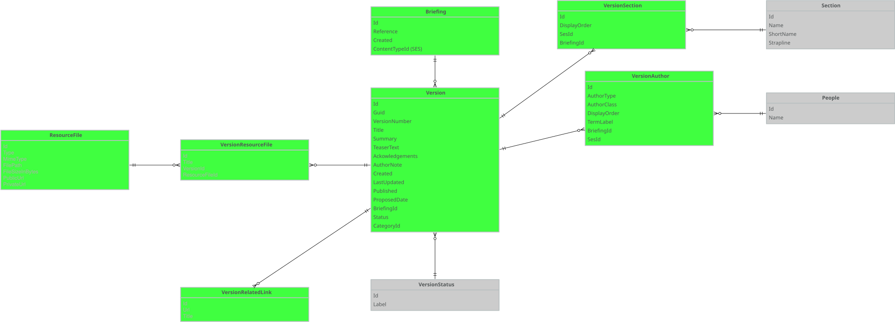
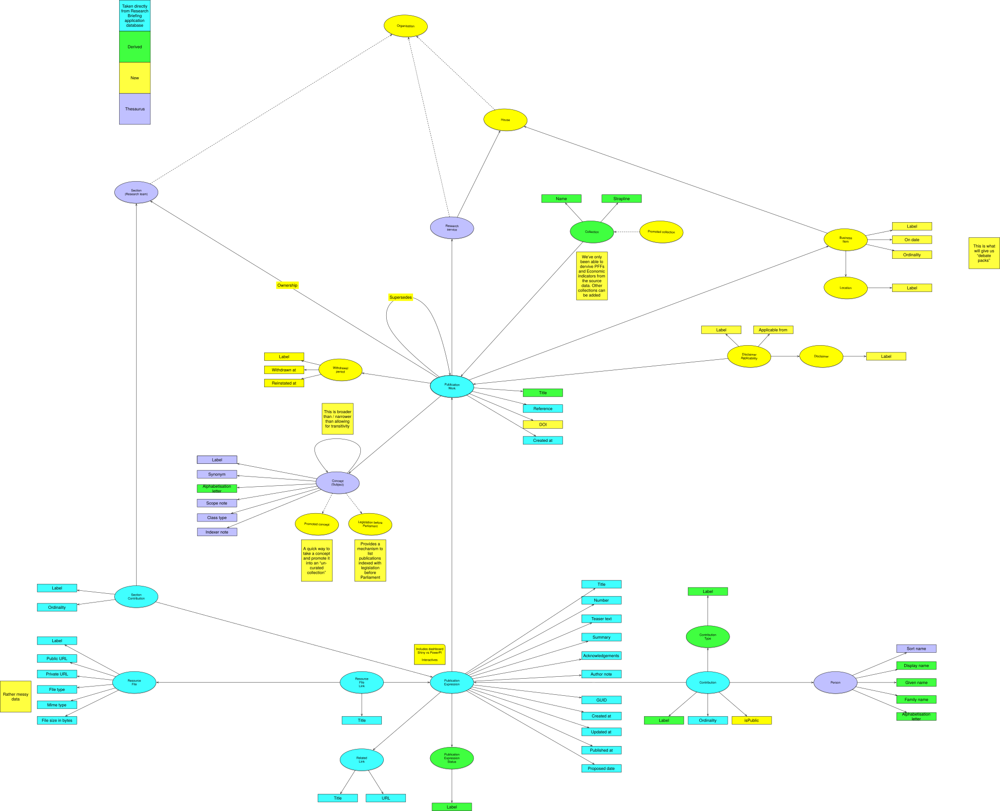

# Loading data from the research briefings application to Data Graphs.

This process relies on getting hold of a dump of the SQLServer database, which is transformed to Postgres by James.

This page lists the Postgres queries necessary to produce CSV files to populate Data Graphs.

## Source data

## Target data

## Explorations

### ContentTypeId

We work on the assumption that every Briefing has a ContentTypeId which is not NULL.

<pre>
	<code>
		SELECT DISTINCT(contenttypeid)
		FROM briefing;
	</code>
</pre>

414033 | Commons Briefing papers
414037 | Commons Debate packs
414039 | Lords Briefing packs
414041 | Lords In Focus
346713 | Lords Library Briefings
346721 | POSTnotes
414035 | POSTbriefs

### Status

We also work on the assumption that every Briefing may have one and only one Version with Status 1. We assume that Statuses are 0 for draft, 1 for published, 2 for superseded and 3 for withdrawn.

A query to get a count of briefings with more than one published version.

<pre>
	<code>
		SELECT count(b.id)
		FROM briefing b
		LEFT JOIN(
			SELECT count(id) AS count, briefingid
			FROM version
			WHERE status = 1
			GROUP BY briefingid
		) AS version
		ON version.briefingid = b.id
		WHERE version.count > 1
		GROUP BY version.count
		ORDER BY version.count DESC;
	</code>
</pre>

As of the conversion to Postgres on 2026-07-16, no briefings have more than one published version.

A query to get a count of briefings with one published version.

<pre>
	<code>
		SELECT count(b.id)
		FROM briefing b
		LEFT JOIN(
			SELECT count(id) AS count, briefingid
			FROM version
			WHERE status = 1
			GROUP BY briefingid
		) AS version
		ON version.briefingid = b.id
		WHERE version.count = 1
		GROUP BY version.count
		ORDER BY version.count DESC;
	</code>
</pre>

As of the conversion to Postgres on 2026-07-16, 14,136 briefings have one published version.

A query to get a count of briefings with no published version.

<pre>
	<code>
		SELECT count(b.id)
		FROM briefing b
		LEFT JOIN(
			SELECT count(id) AS count, briefingid
			FROM version
			WHERE status = 1
			GROUP BY briefingid
		) AS version
		ON version.briefingid = b.id
		WHERE version.count IS NULL
		GROUP BY version.count
		ORDER BY version.count DESC;
	</code>
</pre>

As of the conversion to Postgres on 2026-07-16, 3775 briefings have no published version.

## PublicationWork and publishedBy

### Commons publications

<pre>
	<code>
		COPY (
			SELECT
				b.id,
				b.reference,
				b.created::Date AS createdAt,
				1 AS publishedBy, /* Commons Library */
				CASE
					WHEN published_version.title IS NOT NULL
						THEN TRIM( BOTH ' ' FROM published_version.title)
					WHEN latest_version.title IS NOT NULL
						THEN TRIM( BOTH ' ' FROM latest_version.title)
					ELSE
						'Untitled'
				END AS title,
				CASE
					WHEN published_version.title IS NOT NULL
						THEN LEFT(REPLACE(REPLACE(REPLACE(TRIM( BOTH ' ' FROM published_version.title), '"', ''), '''', ''), '‘', ''), 1)
					WHEN latest_version.title IS NOT NULL
						THEN LEFT(REPLACE(REPLACE(REPLACE(TRIM( BOTH ' ' FROM latest_version.title), '"', ''), '''', ''), '‘', ''), 1)
				END AS alphabetisationLetter,
				CASE
					WHEN published_version.lastupdated IS NOT NULL
						THEN date_part('year', published_version.lastupdated::DATE)
				END AS year,
				'false' as includesDataDashboard
				
			FROM briefing AS b
			LEFT JOIN (
				SELECT *
				FROM version
				WHERE status = 1 /* Published */
			) AS published_version
			ON published_version.briefingid = b.id
			LEFT JOIN (
				SELECT *
				FROM version
				ORDER BY lastupdated DESC
			) AS latest_version
			ON latest_version.briefingid = b.id
			WHERE (
				b.contenttypeid = 414033 /* Commons Briefing papers */
				OR
				b.contenttypeid = 414037 /* Commons Debate packs */
			)
			GROUP BY b.id, published_version.title, latest_version.title, published_version.lastupdated
		)
		TO '/Users/smethurstm/Documents/ontologies/meta/library-information-architecture/publication/data-graphs/data-loading/dumps/commons-publication-works.csv' DELIMITER ',' CSV HEADER;
	</code>
</pre>

### Lords publications

<pre>
	<code>
		COPY (
			SELECT
				b.id,
				b.reference,
				b.created::Date AS createdAt,
				2 AS publishedBy, /* Lords Library */
				CASE
					WHEN published_version.title IS NOT NULL
						THEN TRIM( BOTH ' ' FROM published_version.title)
					WHEN latest_version.title IS NOT NULL
						THEN TRIM( BOTH ' ' FROM latest_version.title)
					ELSE
						'Untitled'
				END AS title,
				CASE
					WHEN published_version.title IS NOT NULL
						THEN LEFT(REPLACE(REPLACE(REPLACE(TRIM( BOTH ' ' FROM published_version.title), '"', ''), '''', ''), '‘', ''), 1)
					WHEN latest_version.title IS NOT NULL
						THEN LEFT(REPLACE(REPLACE(REPLACE(TRIM( BOTH ' ' FROM latest_version.title), '"', ''), '''', ''), '‘', ''), 1)
				END AS alphabetisationLetter,
				CASE
					WHEN published_version.lastupdated IS NOT NULL
						THEN date_part('year', published_version.lastupdated::DATE)
				END AS year,
				'false' as includesDataDashboard
			
			FROM briefing AS b
			LEFT JOIN (
				SELECT *
				FROM version
				WHERE status = 1 /* Published */
			) AS published_version
			ON published_version.briefingid = b.id
			LEFT JOIN (
				SELECT *
				FROM version
				ORDER BY lastupdated DESC
			) AS latest_version
			ON latest_version.briefingid = b.id
			WHERE (
				b.contenttypeid = 414039 /* Lords Briefing packs */
				OR
				b.contenttypeid = 414041 /* Lords In Focus  */
				OR
				b.contenttypeid = 346713 /* Lords Library Briefings  */
			)
			GROUP BY b.id, published_version.title, latest_version.title, published_version.lastupdated
		)
		TO '/Users/smethurstm/Documents/ontologies/meta/library-information-architecture/publication/data-graphs/data-loading/dumps/lords-publication-works.csv' DELIMITER ',' CSV HEADER;
	</code>
</pre>

### POST publications

<pre>
	<code>
		COPY (
			SELECT
				b.id,
				b.reference,
				b.created::Date AS createdAt,
				3 AS publishedBy, /* POST */
				CASE
					WHEN published_version.title IS NOT NULL
						THEN TRIM( BOTH ' ' FROM published_version.title)
					WHEN latest_version.title IS NOT NULL
						THEN TRIM( BOTH ' ' FROM latest_version.title)
					ELSE
						'Untitled'
				END AS title,
				CASE
					WHEN published_version.title IS NOT NULL
						THEN LEFT(REPLACE(REPLACE(REPLACE(TRIM( BOTH ' ' FROM published_version.title), '"', ''), '''', ''), '‘', ''), 1)
					WHEN latest_version.title IS NOT NULL
						THEN LEFT(REPLACE(REPLACE(REPLACE(TRIM( BOTH ' ' FROM latest_version.title), '"', ''), '''', ''), '‘', ''), 1)
				END AS alphabetisationLetter,
				CASE
					WHEN published_version.lastupdated IS NOT NULL
						THEN date_part('year', published_version.lastupdated::DATE)
				END AS year,
				'false' as includesDataDashboard
		
			FROM briefing AS b
			LEFT JOIN (
				SELECT *
				FROM version
				WHERE status = 1 /* Published */
			) AS published_version
			ON published_version.briefingid = b.id
			LEFT JOIN (
				SELECT *
				FROM version
				ORDER BY lastupdated DESC
			) AS latest_version
			ON latest_version.briefingid = b.id
			WHERE (
				b.contenttypeid = 346721 /* POSTnotes */
				OR
				b.contenttypeid = 414035 /* POSTbriefs  */
			)
			GROUP BY b.id, published_version.title, latest_version.title, published_version.lastupdated
		)
		TO '/Users/smethurstm/Documents/ontologies/meta/library-information-architecture/publication/data-graphs/data-loading/dumps/post-publication-works.csv' DELIMITER ',' CSV HEADER;
	</code>
</pre>

## PublicationExpression, expressionOf and hasPublicationExpressionStatus

<pre>
	<code>
		COPY (
			SELECT
				v.id AS id,
				v.guid AS guid,
				v.versionnumber AS number,
				TRIM( BOTH ' ' FROM v.title) AS title,
				v.summary AS summary,
				v.teasertext AS teaserText,
				v.acknowledgements AS acknowledgements,
				v.authornote AS authorNote,
				TO_CHAR(v.created AT TIME ZONE 'UTC', 'DD/MM/YYYY HH24:MI:SS+00:00') AS createdAt,
				TO_CHAR(v.lastupdated AT TIME ZONE 'UTC', 'DD/MM/YYYY HH24:MI:SS+00:00') AS updatedAt,
				TO_CHAR(v.published AT TIME ZONE 'UTC', 'DD/MM/YYYY HH24:MI:SS+00:00') AS publishedAt,
				v.proposeddate::Date AS proposedDate,
				v.briefingid AS expressionOf,
				v.status AS hasPublicationExpressionStatus
			FROM Version AS v
		)
		TO '/Users/smethurstm/Documents/ontologies/meta/library-information-architecture/publication/data-graphs/data-loading/dumps/publication-expressions.csv' DELIMITER ',' CSV HEADER;
	</code>
</pre>

## SectionContribution, sectionContributionBy and sectionContributionTo

<pre>
	<code>
		COPY (
			SELECT
				s.id AS id,
				CASE
					WHEN s.sesid = 25036
						THEN CONCAT( 'Home Affairs Section', ' contribution to ', v.title )
					WHEN s.sesid = 70459
						THEN CONCAT( 'Social and General Statistics Section', ' contribution to ', v.title )
					WHEN s.sesid = 83435
						THEN CONCAT( 'Statistics Resource Unit', ' contribution to ', v.title )
					WHEN s.sesid = 17113
						THEN CONCAT( 'Economic Policy and Statistics Section', ' contribution to ', v.title )
					WHEN s.sesid = 298694
						THEN CONCAT( 'Indexing and Data Management Section', ' contribution to ', v.title )
					WHEN s.sesid = 16849
						THEN CONCAT( 'Business and Transport Section', ' contribution to ', v.title )
					WHEN s.sesid = 70510
						THEN CONCAT( 'Social Policy Section', ' contribution to ', v.title )
					WHEN s.sesid = 66113
						THEN CONCAT( 'Reference Services Section', ' contribution to ', v.title )
					WHEN s.sesid = 67716
						THEN CONCAT( 'Science and Environment Section', ' contribution to ', v.title )
					WHEN s.sesid = 61096
						THEN CONCAT( 'Parliament Education Service', ' contribution to ', v.title )
					WHEN s.sesid = 37362
						THEN CONCAT( 'International Affairs and Defence Section', ' contribution to ', v.title )
					WHEN s.sesid = 61055
						THEN CONCAT( 'Parliament and Constitution Centre', ' contribution to ', v.title )
					WHEN s.sesid = 42902
						THEN CONCAT( 'Library Resources Section', ' contribution to ', v.title )
				END AS label,
				s.displayorder AS ordinality,
				s.briefingid AS sectionContributionTo,
				s.sesid AS sectionContributionBy
			FROM
				versionsection s,
				version v
			
			WHERE s.briefingid = v.id
			
			/* Include only Commons Library sections. Don't include POST or Lords Library */
			AND (
				s.sesId = 25036
				OR s.sesId = 70459
				OR s.sesId = 83435
				OR s.sesId = 17113
				OR s.sesId = 298694
				OR s.sesId = 16849
				OR s.sesId = 70510
				OR s.sesId = 66113
				OR s.sesId = 67716
				OR s.sesId = 61096
				OR s.sesId = 37362
				OR s.sesId = 61055
				OR s.sesId = 42902
			)
		)
		TO '/Users/smethurstm/Documents/ontologies/meta/library-information-architecture/publication/data-graphs/data-loading/dumps/section-contributions.csv' DELIMITER ',' CSV HEADER;
	</code>
</pre>

## Person

<pre>
	<code>
		COPY (
			SELECT
				a.sesid AS id,
				'' AS name
			FROM versionauthor a
			WHERE a.sesid IS NOT NULL
		)
		TO '/Users/smethurstm/Documents/ontologies/meta/library-information-architecture/publication/data-graphs/data-loading/dumps/people.csv' DELIMITER ',' CSV HEADER;
	</code>
</pre>

Taking just the people with SES IDs, it's possible for Phil to look up the SES ID to get a label (name) for the person. These then need to be deduped and SES IDs that do not resolve removed. As of 2026-03-04, 10 SES IDs did not resolve.

## Contribution, contributionTo, hasContributionType and contributionBy

Contribution records have a field for AuthorType, though this is not defined in the database. We work on the assumption that type 0 is owner, type 1 is author and type 2 is contributor.

<pre>
	<code>
		COPY (
			SELECT
				va.id AS id,
				CONCAT( 'Contribution to ', v.title, ' by ', va.sesid ) AS label,
				va.briefingid AS contributionTo, /* Given as BriefingId but points to a Version */
				va.authortype AS hasContributionType,
				va.displayorder AS ordinality,
				va.sesid AS contributionBy,
				'TRUE' AS isPublic
			FROM
				versionauthor va,
				version v
			WHERE va.sesid IS NOT NULL
			AND va.briefingId = v.id
		)
		TO '/Users/smethurstm/Documents/ontologies/meta/library-information-architecture/publication/data-graphs/data-loading/dumps/contributions.csv' DELIMITER ',' CSV HEADER;
	</code>
</pre>

## Collection and hasMember

### Economic indicators

<pre>
	<code>
		COPY (
			SELECT
				2 AS id,
				'Economic indicators' as name,
				STRING_AGG( b.id::text, ', ') AS hasMember,
				'false' AS isPromoted
			FROM
				briefing b,
				version v
			WHERE b.id = v.briefingid
			AND v.status = 1  /* Published */
			AND v.categoryid = 346705
		)
		TO '/Users/smethurstm/Documents/ontologies/meta/library-information-architecture/publication/data-graphs/data-loading/dumps/economic-indicators-collection.csv' DELIMITER ',' CSV HEADER;
	</code>
</pre>

### Parliament facts and figures

<pre>
	<code>
		COPY (
			SELECT
				1 AS id,
				'Parliamentary facts and figures' as name,
				STRING_AGG( b.id::text, ', ') AS hasMember,
				'false' AS isPromoted
			FROM
				briefing b,
				version v
			WHERE b.id = v.briefingid
			AND v.status = 1  /* Published */
			AND v.categoryid = 346703
		)
		TO '/Users/smethurstm/Documents/ontologies/meta/library-information-architecture/publication/data-graphs/data-loading/dumps/facts-and-figures-collection.csv' DELIMITER ',' CSV HEADER;
	</code>
</pre>

## POSTbriefs

<pre>
	<code>
		COPY (
			SELECT
				3 AS id,
				'POSTbriefs' as name,
				STRING_AGG( b.id::text, ', ') AS hasMember,
				'false' AS isPromoted
			FROM
				briefing b,
				version v
			WHERE b.id = v.briefingid
			AND b.contenttypeid = 414035
			AND v.status = 1  /* Published */
		)
		TO '/Users/smethurstm/Documents/ontologies/meta/library-information-architecture/publication/data-graphs/data-loading/dumps/post-briefs-collection.csv' DELIMITER ',' CSV HEADER;
	</code>
</pre>

## POSTnotes

<pre>
	<code>
		COPY (
			SELECT
				4 AS id,
				'POSTnotes' as name,
				STRING_AGG( b.id::text, ', ') AS hasMember,
				'false' AS isPromoted
			FROM
				briefing b,
				version v
			WHERE b.id = v.briefingid
			AND b.contenttypeid = 346721
			AND v.status = 1  /* Published */
		)
		TO '/Users/smethurstm/Documents/ontologies/meta/library-information-architecture/publication/data-graphs/data-loading/dumps/post-notes-collection.csv' DELIMITER ',' CSV HEADER;
	</code>
</pre>

## POSTnotes

<pre>
	<code>
		COPY (
			SELECT
				5 AS id,
				'POSTnotes' as name,
				STRING_AGG( b.id::text, ', ') AS hasMember,
				'false' AS isPromoted
			FROM
				briefing b,
				version v
			WHERE b.id = v.briefingid
			AND b.contenttypeid = 346721
			AND v.status = 1  /* Published */
		)
		TO '/Users/smethurstm/Documents/ontologies/meta/library-information-architecture/publication/data-graphs/data-loading/dumps/post-notes-collection.csv' DELIMITER ',' CSV HEADER;
	</code>
</pre>

## Lords In Focus

<pre>
	<code>
		COPY (
			SELECT
				6 AS id,
				'Research on the House of Lords' as name,
				STRING_AGG( b.id::text, ', ') AS hasMember,
				'false' AS isPromoted
			FROM
				briefing b,
				version v
			WHERE b.id = v.briefingid
			AND (
				v.categoryid = 346719
				OR
				v.categoryid = 416513
			)
			AND v.status = 1  /* Published */
		)
		TO '/Users/smethurstm/Documents/ontologies/meta/library-information-architecture/publication/data-graphs/data-loading/dumps/research-on-the-house-of-lords-collection.csv' DELIMITER ',' CSV HEADER;
	</code>
</pre>

## RelatedLink

There are 79 validation errors when importing to Data Graphs. All of these appear to be cases where the title has been placed in the URL field and vice versa.

13,340 URLs start with http://, whereas 13,760 start https://.

<pre>
	<code>
		COPY (
			SELECT
				id As id,
				title AS title,
				url AS url,
				versionid AS relatedLinkFor
			FROM versionrelatedlink
		)
		TO '/Users/smethurstm/Documents/ontologies/meta/library-information-architecture/publication/data-graphs/data-loading/dumps/related-links.csv' DELIMITER ',' CSV HEADER;
	</code>
</pre>

## ResourceFile

Resource files have a Type which may be 0, 1, or 2. This is not enumerated in the database.

Resource files with Type 0 appear to be mainly PDFs, but also: image/png, application/vnd.ms-excel, application/vnd.ms-excel.sheet.macroEnabled.12, application/vnd.openxmlformats-officedocument.spreadsheetml.sheet, application/vnd.openxmlformats-officedocument.wordprocessingml.document, application/pdf.

Resource files with Type 2 appear to be images having mime types: image/png, image/gif, image/jpeg, image/tiff, image/bmp.

Resource files with Type 1 are a hodgepodge of application/pdf, application/vnd.ms-excel, text/csv, image/gif, application/octet-stream, application/vnd.ms-excel.sheet.macroEnabled.12, application/vnd.openxmlformats-officedocument.spreadsheetml.sheet, application/msword, text/html, application/vnd.openxmlformats-officedocument.wordprocessingml.document, application/x-zip-compressed.

All resource files relate to at least one version. Some are reused across up to 15 versions.

<pre>
	<code>
		COPY (
			SELECT
				id As id,
				filepath AS label,
				type AS fileType,
				mimeType AS mimeType,
				filesizeinbytes AS fileSizeInBytes,
				publicurl AS publicUrl,
				privateurl AS privateUrl
			FROM resourcefile
		)
		TO '/Users/smethurstm/Documents/ontologies/meta/library-information-architecture/publication/data-graphs/data-loading/dumps/resource-files.csv' DELIMITER ',' CSV HEADER;
	</code>
</pre>

## ResourceFileLink

<pre>
	<code>
		COPY (
			SELECT
				CONCAT( versionid, '-', resourcefileid )  As id,
				CASE
					WHEN resource_file.filename IS NOT NULL
					THEN resource_file.filename
					ELSE
						'Untitled'
				END AS title,
				versionid AS forPublicationExpression,
				resourcefileid AS forResourceFile
			FROM versionresourcefile
			INNER JOIN (
				SELECT *
				FROM resourcefile
			) AS resource_file
			ON resource_file.id = resourcefileid
		)
		TO '/Users/smethurstm/Documents/ontologies/meta/library-information-architecture/publication/data-graphs/data-loading/dumps/resource-file-links.csv' DELIMITER ',' CSV HEADER;
	</code>
</pre>

## ToDo: new data dump required.

Constituency Casework collection

Typing of data dashboards