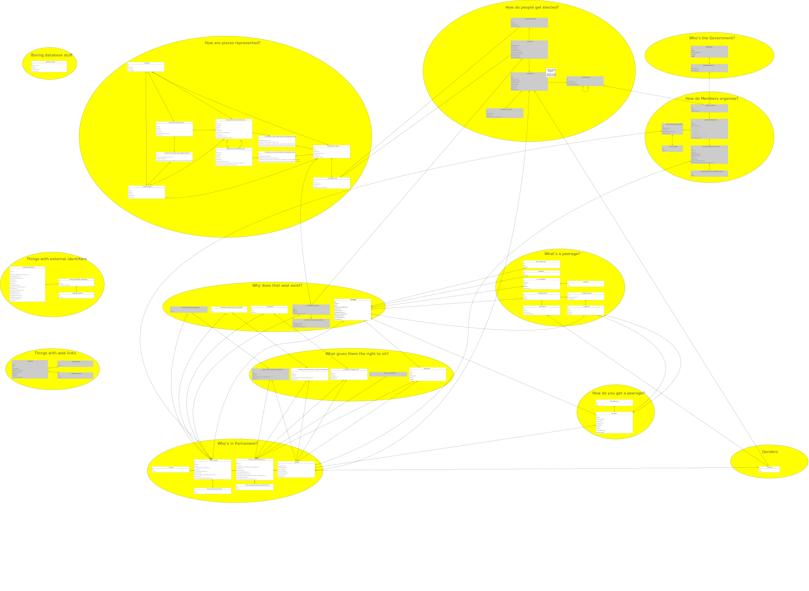

# Relationifying the ontologies

* [Design notes](https://docs.google.com/document/d/1lqAHO6XY_dwceILSVJk74vQVb4NhNap46GMeElr0SHw/edit?usp=sharing)

* [SQL](schema.sql)

# Entity relationship diagram

[Also available as a PDF](schema.pdf).
