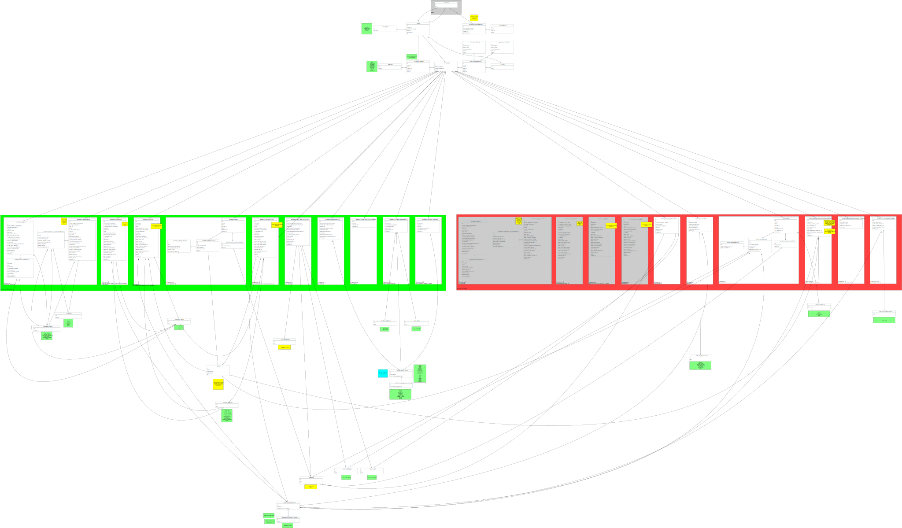

# Register of Members' Financial Interests

## Schema

[PDF](schema.pdf)

[Schema changes](https://hopuk.sharepoint.com/:x:/s/bcp-transformation/EZw5RIBJKANMk6HtmgR1ndQBln7Yp1SdTOuXu2GMZv2CaA?email=smethurstm%40parliament.uk&e=4%3AOhhwyT&at=9&wdLOR=cFE453AEE-5565-E640-8549-A6EECA011D54)

## Competency questions

[Competency questions](https://docs.google.com/spreadsheets/d/1iRsQBRPChMVFitSGBtNJFGNBvFT8XGKQYYqu40zy_OM/edit?usp=sharing)

## Houses

* [House of Commons](commons)

* [House of Lords](lords)

