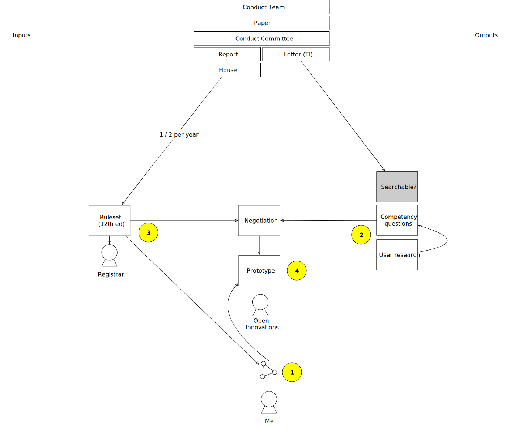

# Register of Members' Financial Interests - House of Lords	

## Reference

## Categories

### Category 1: Directorships

[Rules](categories/category-1)

### Category 2: Remunerated employment etc.

[Rules](categories/category-2)

### Category 3: People with significant control of a company

[Rules](categories/category-3)

### Category 4: Shareholdings

[Rules](categories/category-4)

### Category 5: Land and property

[Rules](categories/category-5)

### Category 6: Sponsorship

[Rules](categories/category-6)

### Category 7: Overseas visits

[Rules](categories/category-7)

### Category 8: Gifts, benefits and hospitality

[Rules](categories/category-8)

### Category 9: Miscellaneous financial interests

[Rules](categories/category-9)

### Category 10: Non-financial interests

[Rules](categories/category-10)

