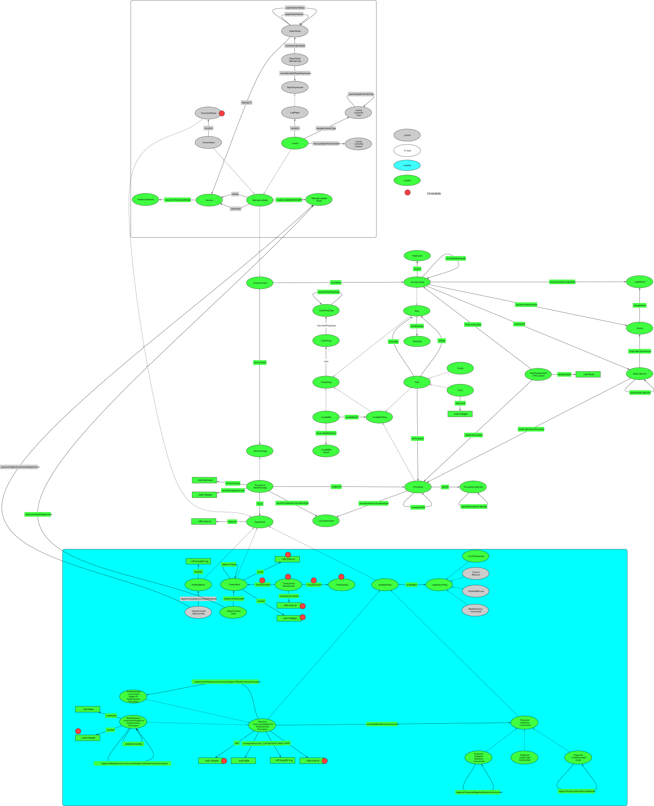

# Importing procedure editor data to Data Graphs

The procedure editor database is [SQL Server](https://en.wikipedia.org/wiki/Microsoft_SQL_Server). Jianhan provides a dump of this data, which is converted to [Postgres](https://en.wikipedia.org/wiki/PostgreSQL) using [DBBeaver](https://en.wikipedia.org/wiki/DBeaver).

This page lists the Postgres queries necessary to produce CSV files to populate Data Graphs.

## Done

### ParliamentPeriod

Sourced from:

[https://docs.google.com/spreadsheets/d/1e3AnQebAO5ug-Pc_0qDq9KkyZiy0dRhJMvm0lRRJOXk/](https://docs.google.com/spreadsheets/d/1e3AnQebAO5ug-Pc_0qDq9KkyZiy0dRhJMvm0lRRJOXk/edit?usp=sharing)

### Session and sessionInParliamentPeriod

Sourced from:

[https://docs.google.com/spreadsheets/d/1e3AnQebAO5ug-Pc_0qDq9KkyZiy0dRhJMvm0lRRJOXk/](https://docs.google.com/spreadsheets/d/1e3AnQebAO5ug-Pc_0qDq9KkyZiy0dRhJMvm0lRRJOXk/edit?usp=sharing)

### OrganisationAccountableToParliament and MakingAvailableBody

[CSV file from SPARQL query](https://github.com/ukparliament/ontologies/blob/master/procedure/meta/editor/data-graphs/instance-data/dumps/loaded/organisations-accountable-parliament.csv)

There are no IDs, so we use the triplestore ID as the Data Graphs ID.

### AvailabilityStatus

Populated by hand (open / closed).

### Publication

<pre>
	<code>
		COPY (
			SELECT *
			FROM procedure.proceduresteppublication
		)
		TO '/Users/smethurstm/Documents/ontologies/procedure/meta/editor/data-graphs/instance-data/dumps/publications.csv' DELIMITER ',' CSV HEADER;
	</code>
</pre>

### Legislature

<pre>
	<code>
		COPY (
			SELECT *
			FROM procedure.legislature
		)
		TO '/Users/smethurstm/Documents/ontologies/procedure/meta/editor/data-graphs/instance-data/dumps/legislatures.csv' DELIMITER ',' CSV HEADER;
	</code>
</pre>

### House and inLegislature

<pre>
	<code>
		COPY (
			SELECT *
			FROM procedure.house
		)
		TO '/Users/smethurstm/Documents/ontologies/procedure/meta/editor/data-graphs/instance-data/dumps/houses.csv' DELIMITER ',' CSV HEADER;
	</code>
</pre>

### StepType

<pre>
	<code>
		COPY (
			SELECT *
			FROM procedure.proceduresteptype
		)
		TO '/Users/smethurstm/Documents/ontologies/procedure/meta/editor/data-graphs/instance-data/dumps/step-types.csv' DELIMITER ',' CSV HEADER;
	</code>
</pre>

### CalculationStyle

<pre>
	<code>
		COPY (
			SELECT *
			FROM procedure.procedurecalculationstyle
		)
		TO '/Users/smethurstm/Documents/ontologies/procedure/meta/editor/data-graphs/instance-data/dumps/calculation-styles.csv' DELIMITER ',' CSV HEADER;
	</code>
</pre>

### Step (non-business)

<pre>
	<code>
		COPY (
			SELECT s.*, concat( s.procedurestepname, ' - ', st.proceduresteptypename ) AS label
			FROM procedure.procedurestep s, procedure.proceduresteptype st
			WHERE s.proceduresteptypeid != 1
			AND s.proceduresteptypeid = st.id
		)
		TO '/Users/smethurstm/Documents/ontologies/procedure/meta/editor/data-graphs/instance-data/dumps/non-business-steps.csv' DELIMITER ',' CSV HEADER;
	</code>
</pre>

### Procedure and procedureHasCalculationStyle

<pre>
	<code>
		COPY (
			SELECT p.*, calculation_styles.calculation_styles_string
			FROM procedure.procedure p
			LEFT JOIN
				(
					SELECT pcsa.procedureid AS procedure_id, STRING_AGG(pcs.id::text, ', ') AS calculation_styles_string
					FROM procedure.procedurecalculationstyleapplicability pcsa, procedure.procedurecalculationstyle pcs
					WHERE pcsa.procedurecalculationstyleid = pcs.id
					GROUP BY procedure_id
				) calculation_styles
			ON calculation_styles.procedure_id = p.id
		)
		TO '/Users/smethurstm/Documents/ontologies/procedure/meta/editor/data-graphs/instance-data/dumps/procedures.csv' DELIMITER ',' CSV HEADER;
	</code>
</pre>

### StepCollection, stepCollectionInHouse and stepCollectionInProcedure

<pre>
	<code>
		COPY (
			SELECT *, 'FALSE' AS is_mechanical
			FROM procedure.procedurestepcollection
		)
		TO '/Users/smethurstm/Documents/ontologies/procedure/meta/editor/data-graphs/instance-data/dumps/step-collections.csv' DELIMITER ',' CSV HEADER;
	</code>
</pre>

Update step collections 'Start steps', 'End steps', 'Bicameral end steps' and 'Website visible steps' to have isMechanical set to TRUE.

Update step collections 'Committee concerns steps', 'Commons First Reading' 'Debate dteps' 'Motion tabled steps', 'Proposed negative statutory instruments upgraded to affirmative' to have isMechanical set to False.

### componentOf

Populated by hand.

### BusinessStep, Step, actualisedAlongside, source, hasStepType, businessStepInLegislature, businessStepInHouse and memberOf

<pre>
	<code>
		COPY (
			SELECT
				s.*,
				CASE 
					WHEN step_houses.houses_string = 'House of Commons' OR step_houses.houses_string = 'House of Lords' OR step_houses.houses_string = 'House of Commons and House of Lords'
						THEN CONCAT( s.procedurestepname, ' (', step_houses.houses_string, ')'  )
					WHEN legislature.name = 'Scottish Parliament' OR legislature.name = 'Senedd Cymru' OR legislature.name = 'Northern Ireland Assembly'
						THEN CONCAT( s.procedurestepname, ' (', legislature.name, ')'  )
					ELSE
						s.procedurestepname
					END AS label,
				collection_memberships.step_collections_concatenated AS step_collections_concatenated,
				step_houses.step_houses_concatenated AS step_houses_concatenated,
				actualised_alongsides.actualised_alongside_concatenated AS actualised_alongside_concatenated
			FROM procedure.procedurestep s
			LEFT JOIN
				(
					SELECT scm.procedurestepid AS step_id, STRING_AGG(sc.id::text, ', ') AS step_collections_concatenated
					FROM procedure.procedurestepcollectionmembership scm, procedure.procedurestepcollection sc
					WHERE scm.procedurestepcollectionid = sc.id
					GROUP BY step_id
				) collection_memberships
			ON collection_memberships.step_id = s.id
			LEFT JOIN
				(
					SELECT sh.procedurestepid AS step_id, STRING_AGG(h.id::text, ', ') AS step_houses_concatenated, STRING_AGG(h.housename::text, ' and ') AS houses_string
					FROM procedure.procedurestephouse sh, procedure.house h
					WHERE sh.houseid = h.id
					GROUP BY step_id
				) step_houses
			ON step_houses.step_id = s.id
			LEFT JOIN
				(
					SELECT sas.procedurestepid AS from_step_id, STRING_AGG(sas.commonlyactualisedalongsideprocedurestepid::text, ', ') AS actualised_alongside_concatenated
					FROM procedure.procedurestepalongsidestep sas
					GROUP BY from_step_id
				) actualised_alongsides
			ON actualised_alongsides.from_step_id = s.id
			LEFT JOIN
				(
					SELECT l.id, l.legislaturename AS name
					FROM procedure.legislature l
				) legislature
			ON legislature.id = s.legislatureid
			WHERE s.proceduresteptypeid = 1
		)
		TO '/Users/smethurstm/Documents/ontologies/procedure/meta/editor/data-graphs/instance-data/dumps/business_steps.csv' DELIMITER ',' CSV HEADER;
	</code>
</pre>

### StepDisplayDepthInProcedure, forBusinessStep, depthInProcedure and displayDepth

<pre>
	<code>
		COPY (
			SELECT sd.*, CONCAT( s.procedurestepname, ' step depth in the ', p.procedurename, ' procedure' ) AS label
			FROM procedure.procedurestepdisplaydepth sd, procedure.procedurestep s, procedure.procedure p
			WHERE sd.procedurestepid = s.id
			AND sd.procedureid = p.id
		)
		TO '/Users/smethurstm/Documents/ontologies/procedure/meta/editor/data-graphs/instance-data/dumps/step-display-depths.csv' DELIMITER ',' CSV HEADER;
	</code>
</pre>

### Clock, Path, fromStep, toStep, inProcedure and dayCount

<pre>
	<code>
		COPY (
			SELECT *,
			CONCAT('urn:procedure-editor:BusinessStep:',fromstepid) AS from_business_step,
			CONCAT('urn:procedure-editor:BusinessStep:',tostepid) AS to_business_step
			FROM procedure.procedureclock
		)
		TO '/Users/smethurstm/Documents/ontologies/procedure/meta/editor/data-graphs/instance-data/dumps/clocks.csv' DELIMITER ',' CSV HEADER;
	</code>
</pre>

### Availability (procedure only)

<pre>
	<code>
		COPY (
			SELECT
				id,
				CONCAT( 'Availability for ', procedurename, ' procedure' ) AS availabilityLabel,
				CONCAT('urn:procedure-editor:Procedure:',id) AS Procedure,
				startdate AS startOn,
				enddate AS endOn,
				'urn:procedure-editor:AvailabilityStatus:1' AS AvailabilityStatus
			FROM procedure.procedure
			WHERE (
				startdate IS NOT NULL
				OR
				enddate IS NOT NULL
			)
		)
		TO '/Users/smethurstm/Documents/ontologies/procedure/meta/editor/data-graphs/instance-data/dumps/procedure-availability.csv' DELIMITER ',' CSV HEADER;
	</code>
</pre>

Start and end dates are modelled in procedure editor as datetimes. They need to be converted to dates for import to Data Graphs. Data Graphs needs to be told the format in which to expect the dates: dd/mm/yyyy.

### ActOfParliament and EnablingThing

<pre>
	<code>
		COPY (
			SELECT *
			FROM procedure.solractofparliamentdata
			WHERE isdeleted IS FALSE
		)
		TO '/Users/smethurstm/Documents/ontologies/procedure/meta/editor/data-graphs/instance-data/dumps/acts-of-parliament.csv' DELIMITER ',' CSV HEADER;
	</code>
</pre>

As of 03/09/2025, there are 17,577 records in the solractofparliamentdata table, of which 1 has an isdeleted flag set to FALSE. Of the remaining 17,576, 11,048 are reporting validation errors in Data Graphs. This appears to be because we've created ActOfParliament > chapterNumber > Integer and these records have 'c.{chapter_number}'.

As of 23/09/2025, Royal Assent dates are timestamps. Data Graphs won't import without first turning them into dates. Because dates are a mix of pre-1900 and post-1900, the Data Graphs import format should be set to automatic.

### Route, Path, fromStep, toStep and inProcedure

We need to flag routes forming part of a non-component procedure as being not required for export, where those routes also form part of a component procedure.

We add a <code>is_included_in_export</code> boolean to the procedurerouteprocedure join table.

<pre>
	<code>
		ALTER TABLE procedure.procedurerouteprocedure
		ADD is_included_in_export BOOLEAN DEFAULT TRUE;
	</code>
</pre>

We set the <code>is_included_in_export</code> boolean to false for any route forming part of a non-component procedure, where that route also forms part of a component procedure.

#### Flag duplicate EVEL routes

This update flags routes forming part of the EVEL component procedure, where those routes form part of a different procedure:

<pre>
	<code>
		UPDATE procedure.procedurerouteprocedure SET is_included_in_export = FALSE
		WHERE procedure.procedurerouteprocedure.procedurerouteid IN (
			SELECT rp.procedurerouteid
			FROM procedure.procedurerouteprocedure rp
			WHERE rp.procedureid = 11
		)
		AND procedure.procedurerouteprocedure.procedureid != 11;
	</code>
</pre>

#### Flag duplicate SLSC routes

This update flags routes forming part of the SLSC component procedure, where those routes form part of a different procedure:

<pre>
	<code>
		UPDATE procedure.procedurerouteprocedure SET is_included_in_export = FALSE
		WHERE procedure.procedurerouteprocedure.procedurerouteid IN (
			SELECT rp.procedurerouteid
			FROM procedure.procedurerouteprocedure rp
			WHERE rp.procedureid = 8
		)
		AND procedure.procedurerouteprocedure.procedureid != 8;
	</code>
</pre>

#### Flag duplicate JCSI routes

This update flags routes forming part of the JCSI component procedure, where those routes form part of a different procedure:

<pre>
	<code>
		UPDATE procedure.procedurerouteprocedure SET is_included_in_export = FALSE
		WHERE procedure.procedurerouteprocedure.procedurerouteid IN (
			SELECT rp.procedurerouteid
			FROM procedure.procedurerouteprocedure rp
			WHERE rp.procedureid = 28
		)
		AND procedure.procedurerouteprocedure.procedureid != 28;
	</code>
</pre>

#### Flag duplicate SCSI routes

This update flags routes forming part of the SCSI component procedure, where those routes form part of a different procedure:

<pre>
	<code>
		UPDATE procedure.procedurerouteprocedure SET is_included_in_export = FALSE
		WHERE procedure.procedurerouteprocedure.procedurerouteid IN (
			SELECT rp.procedurerouteid
			FROM procedure.procedurerouteprocedure rp
			WHERE rp.procedureid = 9
		)
		AND procedure.procedurerouteprocedure.procedureid != 9;
	</code>
</pre>

#### Flag duplicate Commons first reading routes

This update flags routes forming part of the Commons first reading component procedure, where those routes form part of a different procedure:

<pre>
	<code>
		UPDATE procedure.procedurerouteprocedure SET is_included_in_export = FALSE
		WHERE procedure.procedurerouteprocedure.procedurerouteid IN (
			SELECT rp.procedurerouteid
			FROM procedure.procedurerouteprocedure rp
			WHERE rp.procedureid = 41
		)
		AND procedure.procedurerouteprocedure.procedureid != 41;
	</code>
</pre>

#### Flag duplicate Commons ten minute rule bill routes

This update flags routes forming part of the Commons ten minute rule bill component procedure, where those routes form part of a different procedure:

<pre>
	<code>
		UPDATE procedure.procedurerouteprocedure SET is_included_in_export = FALSE
		WHERE procedure.procedurerouteprocedure.procedurerouteid IN (
			SELECT rp.procedurerouteid
			FROM procedure.procedurerouteprocedure rp
			WHERE rp.procedureid = 44
		)
		AND procedure.procedurerouteprocedure.procedureid != 44;
	</code>
</pre>

#### Flag duplicate treaty BAT routes

This update flags routes forming part of the treaty BAT component procedure, where those routes form part of a different procedure:

<pre>
	<code>
		UPDATE procedure.procedurerouteprocedure SET is_included_in_export = FALSE
		WHERE procedure.procedurerouteprocedure.procedurerouteid IN (
			SELECT rp.procedurerouteid
			FROM procedure.procedurerouteprocedure rp
			WHERE rp.procedureid = 61
		)
		AND procedure.procedurerouteprocedure.procedureid != 61;
	</code>
</pre>

#### Flag duplicate treaty EFRA routes

This update flags routes forming part of the treaty EFRA component procedure, where those routes form part of a different procedure:

<pre>
	<code>
		UPDATE procedure.procedurerouteprocedure SET is_included_in_export = FALSE
		WHERE procedure.procedurerouteprocedure.procedurerouteid IN (
			SELECT rp.procedurerouteid
			FROM procedure.procedurerouteprocedure rp
			WHERE rp.procedureid = 29
		)
		AND procedure.procedurerouteprocedure.procedureid != 29;
	</code>
</pre>

#### Flag duplicate treaty HAC routes

This update flags routes forming part of the treaty HAC component procedure, where those routes form part of a different procedure:

<pre>
	<code>
		UPDATE procedure.procedurerouteprocedure SET is_included_in_export = FALSE
		WHERE procedure.procedurerouteprocedure.procedurerouteid IN (
			SELECT rp.procedurerouteid
			FROM procedure.procedurerouteprocedure rp
			WHERE rp.procedureid = 66
		)
		AND procedure.procedurerouteprocedure.procedureid != 66;
	</code>
</pre>

#### Flag duplicate treaty IAC and EAC routes

This update flags routes forming part of the treaty IAC and EAC component procedure, where those routes form part of a different procedure:

<pre>
	<code>
		UPDATE procedure.procedurerouteprocedure SET is_included_in_export = FALSE
		WHERE procedure.procedurerouteprocedure.procedurerouteid IN (
			SELECT rp.procedurerouteid
			FROM procedure.procedurerouteprocedure rp
			WHERE rp.procedureid = 16
		)
		AND procedure.procedurerouteprocedure.procedureid != 16;
	</code>
</pre>

#### Flag duplicate treaty ITC routes

This update flags routes forming part of the treaty ITC component procedure, where those routes form part of a different procedure:

<pre>
	<code>
		UPDATE procedure.procedurerouteprocedure SET is_included_in_export = FALSE
		WHERE procedure.procedurerouteprocedure.procedurerouteid IN (
			SELECT rp.procedurerouteid
			FROM procedure.procedurerouteprocedure rp
			WHERE rp.procedureid = 26
		)
		AND procedure.procedurerouteprocedure.procedureid != 26;
	</code>
</pre>

#### Flag duplicate treaty JCHR routes

This update flags routes forming part of the treaty JCHR component procedure, where those routes form part of a different procedure:

<pre>
	<code>
		UPDATE procedure.procedurerouteprocedure SET is_included_in_export = FALSE
		WHERE procedure.procedurerouteprocedure.procedurerouteid IN (
			SELECT rp.procedurerouteid
			FROM procedure.procedurerouteprocedure rp
			WHERE rp.procedureid = 15
		)
		AND procedure.procedurerouteprocedure.procedureid != 15;
	</code>
</pre>

#### Flag duplicate treaty Lords' committees routes

This update flags routes forming part of the treaty Lords' committees component procedure, where those routes form part of a different procedure:

<pre>
	<code>
		UPDATE procedure.procedurerouteprocedure SET is_included_in_export = FALSE
		WHERE procedure.procedurerouteprocedure.procedurerouteid IN (
			SELECT rp.procedurerouteid
			FROM procedure.procedurerouteprocedure rp
			WHERE rp.procedureid = 13
		)
		AND procedure.procedurerouteprocedure.procedureid != 13;
	</code>
</pre>

#### Flag duplicate treaty NIAC routes

This update flags routes forming part of the treaty NIAC component procedure, where those routes form part of a different procedure:

<pre>
	<code>
		UPDATE procedure.procedurerouteprocedure SET is_included_in_export = FALSE
		WHERE procedure.procedurerouteprocedure.procedurerouteid IN (
			SELECT rp.procedurerouteid
			FROM procedure.procedurerouteprocedure rp
			WHERE rp.procedureid = 56
		)
		AND procedure.procedurerouteprocedure.procedureid != 56;
	</code>
</pre>

#### Flag duplicate treaty other Commons' committees routes

This update flags routes forming part of the treaty other Commons' committees component procedure, where those routes form part of a different procedure:

<pre>
	<code>
		UPDATE procedure.procedurerouteprocedure SET is_included_in_export = FALSE
		WHERE procedure.procedurerouteprocedure.procedurerouteid IN (
			SELECT rp.procedurerouteid
			FROM procedure.procedurerouteprocedure rp
			WHERE rp.procedureid = 65
		)
		AND procedure.procedurerouteprocedure.procedureid != 65;
	</code>
</pre>

#### Flag duplicate treaty pre-laying routes

This update flags routes forming part of the treaty pre-laying component procedure, where those routes form part of a different procedure:

<pre>
	<code>
		UPDATE procedure.procedurerouteprocedure SET is_included_in_export = FALSE
		WHERE procedure.procedurerouteprocedure.procedurerouteid IN (
			SELECT rp.procedurerouteid
			FROM procedure.procedurerouteprocedure rp
			WHERE rp.procedureid = 62
		)
		AND procedure.procedurerouteprocedure.procedureid != 62;
	</code>
</pre>

#### Flag duplicate DPRRC scrutiny reserve routes

This update flags routes forming part of the DPRRC scrutiny reserve component procedure, where those routes form part of a different procedure:

<pre>
	<code>
		UPDATE procedure.procedurerouteprocedure SET is_included_in_export = FALSE
		WHERE procedure.procedurerouteprocedure.procedurerouteid IN (
			SELECT rp.procedurerouteid
			FROM procedure.procedurerouteprocedure rp
			WHERE rp.procedureid = 60
		)
		AND procedure.procedurerouteprocedure.procedureid != 60;
	</code>
</pre>

#### Flag duplicate Great Steward of Scotland routes

This update flags routes forming part of the Great Steward of Scotland component procedure, where those routes form part of a different procedure:

<pre>
	<code>
		UPDATE procedure.procedurerouteprocedure SET is_included_in_export = FALSE
		WHERE procedure.procedurerouteprocedure.procedurerouteid IN (
			SELECT rp.procedurerouteid
			FROM procedure.procedurerouteprocedure rp
			WHERE rp.procedureid = 40
		)
		AND procedure.procedurerouteprocedure.procedureid != 40;
	</code>
</pre>

#### Flag duplicate legislative consent motion Northern Ireland routes

This update flags routes forming part of the legislative consent motion Northern Ireland component procedure, where those routes form part of a different procedure:

<pre>
	<code>
		UPDATE procedure.procedurerouteprocedure SET is_included_in_export = FALSE
		WHERE procedure.procedurerouteprocedure.procedurerouteid IN (
			SELECT rp.procedurerouteid
			FROM procedure.procedurerouteprocedure rp
			WHERE rp.procedureid = 58
		)
		AND procedure.procedurerouteprocedure.procedureid != 58;
	</code>
</pre>

#### Flag duplicate legislative consent motion Scotland routes

This update flags routes forming part of the legislative consent motion Scotland component procedure, where those routes form part of a different procedure:

<pre>
	<code>
		UPDATE procedure.procedurerouteprocedure SET is_included_in_export = FALSE
		WHERE procedure.procedurerouteprocedure.procedurerouteid IN (
			SELECT rp.procedurerouteid
			FROM procedure.procedurerouteprocedure rp
			WHERE rp.procedureid = 46
		)
		AND procedure.procedurerouteprocedure.procedureid != 46;
	</code>
</pre>

#### Flag duplicate legislative consent motion Welsh routes

This update flags routes forming part of the legislative consent motion Welsh component procedure, where those routes form part of a different procedure:

<pre>
	<code>
		UPDATE procedure.procedurerouteprocedure SET is_included_in_export = FALSE
		WHERE procedure.procedurerouteprocedure.procedurerouteid IN (
			SELECT rp.procedurerouteid
			FROM procedure.procedurerouteprocedure rp
			WHERE rp.procedureid = 57
		)
		AND procedure.procedurerouteprocedure.procedureid != 57;
	</code>
</pre>

#### Flag duplicate LRO Commons committee consideration routes

This update flags routes forming part of the LRO Commons committee consideration component procedure, where those routes form part of a different procedure:

<pre>
	<code>
		UPDATE procedure.procedurerouteprocedure SET is_included_in_export = FALSE
		WHERE procedure.procedurerouteprocedure.procedurerouteid IN (
			SELECT rp.procedurerouteid
			FROM procedure.procedurerouteprocedure rp
			WHERE rp.procedureid = 53
		)
		AND procedure.procedurerouteprocedure.procedureid != 53;
	</code>
</pre>

#### Flag duplicate LRO Commons procedure determination routes

This update flags routes forming part of the LRO Commons procedure determination component procedure, where those routes form part of a different procedure:

<pre>
	<code>
		UPDATE procedure.procedurerouteprocedure SET is_included_in_export = FALSE
		WHERE procedure.procedurerouteprocedure.procedurerouteid IN (
			SELECT rp.procedurerouteid
			FROM procedure.procedurerouteprocedure rp
			WHERE rp.procedureid = 51
		)
		AND procedure.procedurerouteprocedure.procedureid != 51;
	</code>
</pre>

#### Flag duplicate LRO draft affirmative routes

This update flags routes forming part of the LRO draft affirmative component procedure, where those routes form part of a different procedure:

<pre>
	<code>
		UPDATE procedure.procedurerouteprocedure SET is_included_in_export = FALSE
		WHERE procedure.procedurerouteprocedure.procedurerouteid IN (
			SELECT rp.procedurerouteid
			FROM procedure.procedurerouteprocedure rp
			WHERE rp.procedureid = 49
		)
		AND procedure.procedurerouteprocedure.procedureid != 49;
	</code>
</pre>

#### Flag duplicate LRO draft negative routes

This update flags routes forming part of the LRO draft negative component procedure, where those routes form part of a different procedure:

<pre>
	<code>
		UPDATE procedure.procedurerouteprocedure SET is_included_in_export = FALSE
		WHERE procedure.procedurerouteprocedure.procedurerouteid IN (
			SELECT rp.procedurerouteid
			FROM procedure.procedurerouteprocedure rp
			WHERE rp.procedureid = 48
		)
		AND procedure.procedurerouteprocedure.procedureid != 48;
	</code>
</pre>

#### Flag duplicate LRO Lords' Committee consideration routes

This update flags routes forming part of the LRO Lords' Committee consideration component procedure, where those routes form part of a different procedure:

<pre>
	<code>
		UPDATE procedure.procedurerouteprocedure SET is_included_in_export = FALSE
		WHERE procedure.procedurerouteprocedure.procedurerouteid IN (
			SELECT rp.procedurerouteid
			FROM procedure.procedurerouteprocedure rp
			WHERE rp.procedureid = 52
		)
		AND procedure.procedurerouteprocedure.procedureid != 52;
	</code>
</pre>

#### Flag duplicate LRO Lords' debates routes

This update flags routes forming part of the LRO Lords' debates component procedure, where those routes form part of a different procedure:

<pre>
	<code>
		UPDATE procedure.procedurerouteprocedure SET is_included_in_export = FALSE
		WHERE procedure.procedurerouteprocedure.procedurerouteid IN (
			SELECT rp.procedurerouteid
			FROM procedure.procedurerouteprocedure rp
			WHERE rp.procedureid = 55
		)
		AND procedure.procedurerouteprocedure.procedureid != 55;
	</code>
</pre>

#### Flag duplicate LRO Lords' procedure determination routes

This update flags routes forming part of the LRO Lords' procedure determination component procedure, where those routes form part of a different procedure:

<pre>
	<code>
		UPDATE procedure.procedurerouteprocedure SET is_included_in_export = FALSE
		WHERE procedure.procedurerouteprocedure.procedurerouteid IN (
			SELECT rp.procedurerouteid
			FROM procedure.procedurerouteprocedure rp
			WHERE rp.procedureid = 50
		)
		AND procedure.procedurerouteprocedure.procedureid != 50;
	</code>
</pre>

#### Flag duplicate local government finance report routes

This update flags routes forming part of the local government finance report component procedure, where those routes form part of a different procedure:

<pre>
	<code>
		UPDATE procedure.procedurerouteprocedure SET is_included_in_export = FALSE
		WHERE procedure.procedurerouteprocedure.procedurerouteid IN (
			SELECT rp.procedurerouteid
			FROM procedure.procedurerouteprocedure rp
			WHERE rp.procedureid = 12
		)
		AND procedure.procedurerouteprocedure.procedureid != 12;
	</code>
</pre>

#### Flag duplicate Prince of Wales' consent routes

This update flags routes forming part of the Prince of Wales' consent component procedure, where those routes form part of a different procedure:

<pre>
	<code>
		UPDATE procedure.procedurerouteprocedure SET is_included_in_export = FALSE
		WHERE procedure.procedurerouteprocedure.procedurerouteid IN (
			SELECT rp.procedurerouteid
			FROM procedure.procedurerouteprocedure rp
			WHERE rp.procedureid = 39
		)
		AND procedure.procedurerouteprocedure.procedureid != 39;
	</code>
</pre>

#### Flag duplicate Queens' consent routes

This update flags routes forming part of the Queens' consent component procedure, where those routes form part of a different procedure:

<pre>
	<code>
		UPDATE procedure.procedurerouteprocedure SET is_included_in_export = FALSE
		WHERE procedure.procedurerouteprocedure.procedurerouteid IN (
			SELECT rp.procedurerouteid
			FROM procedure.procedurerouteprocedure rp
			WHERE rp.procedureid = 37
		)
		AND procedure.procedurerouteprocedure.procedureid != 37;
	</code>
</pre>

#### Flag duplicate PNSI Commons' committee routes

This update flags routes forming part of the PNSI Commons' committee component procedure, where those routes form part of a different procedure:

<pre>
	<code>
		UPDATE procedure.procedurerouteprocedure SET is_included_in_export = FALSE
		WHERE procedure.procedurerouteprocedure.procedurerouteid IN (
			SELECT rp.procedurerouteid
			FROM procedure.procedurerouteprocedure rp
			WHERE rp.procedureid = 77
		)
		AND procedure.procedurerouteprocedure.procedureid != 77;
	</code>
</pre>

#### Flag duplicate scrutiny reserve JCHR routes

This update flags routes forming part of the scrutiny reserve JCHR component procedure, where those routes form part of a different procedure:

<pre>
	<code>
		UPDATE procedure.procedurerouteprocedure SET is_included_in_export = FALSE
		WHERE procedure.procedurerouteprocedure.procedurerouteid IN (
			SELECT rp.procedurerouteid
			FROM procedure.procedurerouteprocedure rp
			WHERE rp.procedureid = 76
		)
		AND procedure.procedurerouteprocedure.procedureid != 76;
	</code>
</pre>

#### Flag duplicate draft affirmative Lords motions routes

This update flags routes forming part of the draft affirmative Lords motions component procedure, where those routes form part of a different procedure:

<pre>
	<code>
		UPDATE procedure.procedurerouteprocedure SET is_included_in_export = FALSE
		WHERE procedure.procedurerouteprocedure.procedurerouteid IN (
			SELECT rp.procedurerouteid
			FROM procedure.procedurerouteprocedure rp
			WHERE rp.procedureid = 70
		)
		AND procedure.procedurerouteprocedure.procedureid != 70;
	</code>
</pre>

#### Flag duplicate draft affirmative Commons motions routes

This update flags routes forming part of the draft affirmative Commons motions component procedure, where those routes form part of a different procedure:

<pre>
	<code>
		UPDATE procedure.procedurerouteprocedure SET is_included_in_export = FALSE
		WHERE procedure.procedurerouteprocedure.procedurerouteid IN (
			SELECT rp.procedurerouteid
			FROM procedure.procedurerouteprocedure rp
			WHERE rp.procedureid = 83
		)
		AND procedure.procedurerouteprocedure.procedureid != 83;
	</code>
</pre>

#### Flag duplicate Draft affirmative: Joint Committee on Statutory Instruments (JCSI) Scrutiny Reserve routes

This update flags routes forming part of the Draft affirmative: Joint Committee on Statutory Instruments (JCSI) Scrutiny Reserve component procedure, where those routes form part of a different procedure:

<pre>
	<code>
		UPDATE procedure.procedurerouteprocedure SET is_included_in_export = FALSE
		WHERE procedure.procedurerouteprocedure.procedurerouteid IN (
			SELECT rp.procedurerouteid
			FROM procedure.procedurerouteprocedure rp
			WHERE rp.procedureid = 67
		)
		AND procedure.procedurerouteprocedure.procedureid != 67;
	</code>
</pre>

#### Flag duplicate Made affirmative: Commons motions routes

This update flags routes forming part of the Made affirmative: Commons motions component procedure, where those routes form part of a different procedure:

<pre>
	<code>
		UPDATE procedure.procedurerouteprocedure SET is_included_in_export = FALSE
		WHERE procedure.procedurerouteprocedure.procedurerouteid IN (
			SELECT rp.procedurerouteid
			FROM procedure.procedurerouteprocedure rp
			WHERE rp.procedureid = 69
		)
		AND procedure.procedurerouteprocedure.procedureid != 69;
	</code>
</pre>

#### Flag duplicate Made affirmative: Lords motions routes

This update flags routes forming part of the Made affirmative: Lords motions component procedure, where those routes form part of a different procedure:

<pre>
	<code>
		UPDATE procedure.procedurerouteprocedure SET is_included_in_export = FALSE
		WHERE procedure.procedurerouteprocedure.procedurerouteid IN (
			SELECT rp.procedurerouteid
			FROM procedure.procedurerouteprocedure rp
			WHERE rp.procedureid = 84
		)
		AND procedure.procedurerouteprocedure.procedureid != 84;
	</code>
</pre>

#### Flag duplicate Made negative: Lords motions routes

This update flags routes forming part of the Made negative: Lords motions component procedure, where those routes form part of a different procedure:

<pre>
	<code>
		UPDATE procedure.procedurerouteprocedure SET is_included_in_export = FALSE
		WHERE procedure.procedurerouteprocedure.procedurerouteid IN (
			SELECT rp.procedurerouteid
			FROM procedure.procedurerouteprocedure rp
			WHERE rp.procedureid = 74
		)
		AND procedure.procedurerouteprocedure.procedureid != 74;
	</code>
</pre>

#### Flag duplicate CRAG Treaty PAC routes

This update flags routes forming part of the CRAG Treaty PAC component procedure, where those routes form part of a different procedure:

<pre>
	<code>
		UPDATE procedure.procedurerouteprocedure SET is_included_in_export = FALSE
		WHERE procedure.procedurerouteprocedure.procedurerouteid IN (
			SELECT rp.procedurerouteid
			FROM procedure.procedurerouteprocedure rp
			WHERE rp.procedureid = 64
		)
		AND procedure.procedurerouteprocedure.procedureid != 64;
	</code>
</pre>

#### Flag duplicate Made negative: Referral to a Delegated Legislation Committee (DLC) routes

This update flags routes forming part of the Made negative: Referral to a Delegated Legislation Committee (DLC) component procedure, where those routes form part of a different procedure:

<pre>
	<code>
		UPDATE procedure.procedurerouteprocedure SET is_included_in_export = FALSE
		WHERE procedure.procedurerouteprocedure.procedurerouteid IN (
			SELECT rp.procedurerouteid
			FROM procedure.procedurerouteprocedure rp
			WHERE rp.procedureid = 71
		)
		AND procedure.procedurerouteprocedure.procedureid != 71;
	</code>
</pre>

#### Flag duplicate Made negative: Commons motions routes

This update flags routes forming part of the Made negative: Commons motions component procedure, where those routes form part of a different procedure:

<pre>
	<code>
		UPDATE procedure.procedurerouteprocedure SET is_included_in_export = FALSE
		WHERE procedure.procedurerouteprocedure.procedurerouteid IN (
			SELECT rp.procedurerouteid
			FROM procedure.procedurerouteprocedure rp
			WHERE rp.procedureid = 72
		)
		AND procedure.procedurerouteprocedure.procedureid != 72;
	</code>
</pre>

#### Flag duplicate Made negative - Commons motion to consider routes

This update flags routes forming part of the Made negative - Commons motion to consider component procedure, where those routes form part of a different procedure:

<pre>
	<code>
		UPDATE procedure.procedurerouteprocedure SET is_included_in_export = FALSE
		WHERE procedure.procedurerouteprocedure.procedurerouteid IN (
			SELECT rp.procedurerouteid
			FROM procedure.procedurerouteprocedure rp
			WHERE rp.procedureid = 73
		)
		AND procedure.procedurerouteprocedure.procedureid != 73;
	</code>
</pre>

#### Flag duplicate Draft negative: Lords motions routes

This update flags routes forming part of the Draft negative: Lords motions component procedure, where those routes form part of a different procedure:

<pre>
	<code>
		UPDATE procedure.procedurerouteprocedure SET is_included_in_export = FALSE
		WHERE procedure.procedurerouteprocedure.procedurerouteid IN (
			SELECT rp.procedurerouteid
			FROM procedure.procedurerouteprocedure rp
			WHERE rp.procedureid = 81
		)
		AND procedure.procedurerouteprocedure.procedureid != 81;
	</code>
</pre>

#### Flag duplicate Draft negative - Commons motion to consider routes

This update flags routes forming part of the Draft negative - Commons motion to consider component procedure, where those routes form part of a different procedure:

<pre>
	<code>
		UPDATE procedure.procedurerouteprocedure SET is_included_in_export = FALSE
		WHERE procedure.procedurerouteprocedure.procedurerouteid IN (
			SELECT rp.procedurerouteid
			FROM procedure.procedurerouteprocedure rp
			WHERE rp.procedureid = 80
		)
		AND procedure.procedurerouteprocedure.procedureid != 80;
	</code>
</pre>

#### Flag duplicate Draft negative: Commons motions routes

This update flags routes forming part of the Draft negative: Commons motions component procedure, where those routes form part of a different procedure:

<pre>
	<code>
		UPDATE procedure.procedurerouteprocedure SET is_included_in_export = FALSE
		WHERE procedure.procedurerouteprocedure.procedurerouteid IN (
			SELECT rp.procedurerouteid
			FROM procedure.procedurerouteprocedure rp
			WHERE rp.procedureid = 78
		)
		AND procedure.procedurerouteprocedure.procedureid != 78;
	</code>
</pre>

#### Flag duplicate Draft negative: Referral to a Delegated Legislation Committee (DLC) routes

This update flags routes forming part of the Draft negative: Referral to a Delegated Legislation Committee (DLC) component procedure, where those routes form part of a different procedure:

<pre>
	<code>
		UPDATE procedure.procedurerouteprocedure SET is_included_in_export = FALSE
		WHERE procedure.procedurerouteprocedure.procedurerouteid IN (
			SELECT rp.procedurerouteid
			FROM procedure.procedurerouteprocedure rp
			WHERE rp.procedureid = 79
		)
		AND procedure.procedurerouteprocedure.procedureid != 79;
	</code>
</pre>

#### Flag duplicate Made affirmative: Joint Committee on Statutory Instruments (JCSI) Scrutiny Reserve routes

This update flags routes forming part of the Made affirmative: Joint Committee on Statutory Instruments (JCSI) Scrutiny Reserve component procedure, where those routes form part of a different procedure:

<pre>
	<code>
		UPDATE procedure.procedurerouteprocedure SET is_included_in_export = FALSE
		WHERE procedure.procedurerouteprocedure.procedurerouteid IN (
			SELECT rp.procedurerouteid
			FROM procedure.procedurerouteprocedure rp
			WHERE rp.procedureid = 82
		)
		AND procedure.procedurerouteprocedure.procedureid != 82;
	</code>
</pre>

#### TEMPORARY FIX - flag mistaken duplicate route

This update flags a route forming part of two procedures that needs to be split into separate routes. Do not run this on live data:

<pre>
	<code>
		UPDATE procedure.procedurerouteprocedure SET is_included_in_export = FALSE
		WHERE procedure.procedurerouteprocedure.procedurerouteid = 10682;
	</code>
</pre>

#### Route proliferation checking queries

A query for Jayne to check that routes flagged as not included for export look correct.

<pre>
	<code>
		COPY (
			SELECT p.procedurename AS procedure, from_s.procedurestepname AS from_step, to_s.procedurestepname AS to_step
			FROM procedure.procedurerouteprocedure pr, procedure.procedure p, procedure.procedureroute r, procedure.procedurestep from_s, procedure.procedurestep to_s
			WHERE pr.is_included_in_export is FALSE
			AND pr.procedureid = p.id
			AND pr.procedurerouteid = r.id
			AND r.fromprocedurestepid = from_s.id
			AND r.toprocedurestepid = to_s.id
		)
		TO '/Users/smethurstm/Documents/ontologies/procedure/meta/editor/data-graphs/instance-data/dumps/reporting/ignored-routes.csv' DELIMITER ',' CSV HEADER;
	</code>
</pre>

A query for Jayne to check which routes are in more than one procedure. Includes only routes flagged as being included for export.

<pre>
	<code>
		COPY (
			SELECT
				r.id AS route_id,
				r.triplestoreid AS route_triplestore_id,
				from_step.name AS from_step_name,
				to_step.name AS to_step_name,
				procedure_routes.procedure_count AS procedure_count,
				STRING_AGG(procedure.name::text, ' | ') AS procedures
			FROM procedure.procedureroute r
			LEFT JOIN
				(
					SELECT pr.procedurerouteid, p.procedurename AS name
					FROM procedure.procedurerouteprocedure pr, procedure.procedure p
					WHERE pr.procedureid = p.id
					AND pr.is_included_in_export is TRUE
				) procedure
			ON procedure.procedurerouteid = r.id

			INNER JOIN (
				SELECT s.id, s.procedurestepname AS name
				FROM procedure.procedurestep s
	
			) from_step
			ON from_step.id = r.fromprocedurestepid

			INNER JOIN (
				SELECT s.id, s.procedurestepname AS name
				FROM procedure.procedurestep s
	
			) to_step
			ON to_step.id = r.toprocedurestepid

			INNER JOIN (
				SELECT pr.procedurerouteid, count(pr.id) AS procedure_count
				FROM procedure.procedurerouteprocedure pr
				WHERE pr.is_included_in_export is TRUE
				GROUP BY pr.procedurerouteid
	
			) procedure_routes
			ON procedure_routes.procedurerouteid = r.id
			WHERE procedure_count > 1
			GROUP BY r.id, from_step.name, to_step.name, procedure_count
			ORDER BY procedure_count DESC
		)
		TO '/Users/smethurstm/Documents/ontologies/procedure/meta/editor/data-graphs/instance-data/dumps/reporting/route-profileration.csv' DELIMITER ',' CSV HEADER;
	</code>
</pre>

#### Export routes flagged as exportable.

<pre>
	<code>
		COPY (
			SELECT 
				r.id,
				r.triplestoreid,
				pr.procedureid,
				r.startdate AS startOn,
				r.enddate AS endOn,
				CONCAT( from_step.procedurestepname, ' to ', to_step.procedurestepname ) AS label,

				CASE
				  WHEN from_step.proceduresteptypeid = 1
				  THEN CONCAT( 'urn:procedure-editor:BusinessStep:', from_step.id )
				ELSE
				  CONCAT( 'urn:procedure-editor:Step:', from_step.id )
				END AS fromStepId,

				CASE
				  WHEN to_step.proceduresteptypeid = 1
				  THEN CONCAT( 'urn:procedure-editor:BusinessStep:', to_step.id )
				ELSE
				  CONCAT( 'urn:procedure-editor:Step:', to_step.id )
				END AS toStepId

			FROM procedure.procedureroute AS r, procedure.procedurerouteprocedure AS pr, procedure.procedurestep AS from_step, procedure.procedurestep AS to_step
			WHERE r.id = pr.procedurerouteid
			AND from_step.id = r.fromprocedurestepid
			AND to_step.id = r.toprocedurestepid
			AND pr.is_included_in_export IS TRUE
		)
		TO '/Users/smethurstm/Documents/ontologies/procedure/meta/editor/data-graphs/instance-data/dumps/routes.csv' DELIMITER ',' CSV HEADER;
	</code>
</pre>

### AvailableThing, availabilityOf, Availability and hasAvailabilityStatus (routes)

<pre>
	<code>
		COPY (
			SELECT
				r.id AS id,
				CONCAT('urn:procedure-editor:Route:',r.id) AS Route,
				r.startdate AS startOn,
				r.enddate AS endOn,
				'urn:procedure-editor:AvailabilityStatus:1' AS AvailabilityStatus,
				CONCAT( 'Availability for route from ', from_step.procedurestepname, ' to ', to_step.procedurestepname) AS label

			FROM procedure.procedureroute r, procedure.procedurerouteprocedure AS pr, procedure.procedurestep AS from_step, procedure.procedurestep AS to_step

			WHERE r.id = pr.procedurerouteid
			AND from_step.id = r.fromprocedurestepid
			AND to_step.id = r.toprocedurestepid
			AND pr.is_included_in_export IS TRUE
			AND (
				r.startdate IS NOT NULL
				OR
				r.enddate IS NOT NULL
			)
		)
		TO '/Users/smethurstm/Documents/ontologies/procedure/meta/editor/data-graphs/instance-data/dumps/route-availability.csv' DELIMITER ',' CSV HEADER;
	</code>
</pre>

Start and end dates are modelled in procedure editor as datetimes. They need to be converted to dates for import to Data Graphs. Data Graphs needs to be told the format in which to expect the dates: dd/mm/yyyy.

### PublicBillWork

<pre>
	<code>
		COPY (
			SELECT bill.*,
			wpt.web_link,
			wpt.triple_store_id
			FROM procedure.procedurebillwork bill, procedure.procedureworkpackagedthing wpt
			WHERE bill.id = wpt.id
		)
		TO '/Users/smethurstm/Documents/ontologies/procedure/meta/editor/data-graphs/instance-data/dumps/public-bill-works.csv' DELIMITER ',' CSV HEADER;
	</code>
</pre>

### ProposedNegativeStatutoryInstrumentWork

<pre>
	<code>
		COPY (
			SELECT
				pnsi.*,
				work_packaged_thing.web_link,
				work_packaged_thing.triple_store_id,
				enabling_act.acts_string,
				preceding.preceding_work_packaged_thing_string
	
			FROM procedure.procedureproposednegativestatutoryinstrument pnsi

			INNER JOIN (
				SELECT *
				FROM procedure.procedureworkpackagedthing
			) AS work_packaged_thing
			ON work_packaged_thing.id = pnsi.id

			LEFT JOIN (
				SELECT
					ea.procedure_workpackaged_thing_id,
					STRING_AGG( CONCAT( 'urn:procedure-editor:ActOfParliament:', act.id::text ), ',') AS acts_string
				FROM procedure.enablingact ea, procedure.solractofparliamentdata act
				WHERE ea.act_of_parliament_id = act.id
				GROUP BY ea.procedure_workpackaged_thing_id
	
			) AS enabling_act
			ON enabling_act.procedure_workpackaged_thing_id = work_packaged_thing.id
			
			LEFT JOIN (
				SELECT
					work_packaged_is_followed_by_id AS work_packaged_thing_id,
					STRING_AGG( work_packaged_is_preceded_by_id::text, ', ') AS preceding_work_packaged_thing_string
				FROM procedure.ProcedureWorkPackagedThingPreceding
				GROUP BY work_packaged_thing_id
			) AS preceding
			ON preceding.work_packaged_thing_id = work_packaged_thing.id
		)
		TO '/Users/smethurstm/Documents/ontologies/procedure/meta/editor/data-graphs/instance-data/dumps/pnsis.csv' DELIMITER ',' CSV HEADER;
	</code>
</pre>

### ProposedDraftRemedialOrderWork

<pre>
	<code>
		COPY (
			SELECT
				ppdro.*,
				work_packaged_thing.web_link,
				work_packaged_thing.triple_store_id,
				enabling_act.acts_string,
				preceding.preceding_work_packaged_thing_string
	
			FROM procedure.ProcedureProposedDraftRemedialOrder ppdro

			INNER JOIN (
				SELECT *
				FROM procedure.procedureworkpackagedthing
			) AS work_packaged_thing
			ON work_packaged_thing.id = ppdro.id

			LEFT JOIN (
				SELECT
					ea.procedure_workpackaged_thing_id,
					STRING_AGG( CONCAT( 'urn:procedure-editor:ActOfParliament:', act.id::text ), ',') AS acts_string
				FROM procedure.enablingact ea, procedure.solractofparliamentdata act
				WHERE ea.act_of_parliament_id = act.id
				GROUP BY ea.procedure_workpackaged_thing_id
	
			) AS enabling_act
			ON enabling_act.procedure_workpackaged_thing_id = work_packaged_thing.id
			
			LEFT JOIN (
				SELECT
					work_packaged_is_followed_by_id AS work_packaged_thing_id,
					STRING_AGG( work_packaged_is_preceded_by_id::text, ', ') AS preceding_work_packaged_thing_string
				FROM procedure.ProcedureWorkPackagedThingPreceding
				GROUP BY work_packaged_thing_id
			) AS preceding
			ON preceding.work_packaged_thing_id = work_packaged_thing.id
		)
		TO '/Users/smethurstm/Documents/ontologies/procedure/meta/editor/data-graphs/instance-data/dumps/ppdro.csv' DELIMITER ',' CSV HEADER;
	</code>
</pre>

### PublishedDraftUnderEUWA2018Work

<pre>
	<code>
		COPY (
			SELECT
				ppdue.*,
				work_packaged_thing.web_link,
				work_packaged_thing.triple_store_id,
				enabling_act.acts_string,
				preceding.preceding_work_packaged_thing_string
	
			FROM procedure.ProcedurePublishedDraftUnderEUWA ppdue

			INNER JOIN (
				SELECT *
				FROM procedure.procedureworkpackagedthing
			) AS work_packaged_thing
			ON work_packaged_thing.id = ppdue.id

			LEFT JOIN (
				SELECT
					ea.procedure_workpackaged_thing_id,
					STRING_AGG( CONCAT( 'urn:procedure-editor:ActOfParliament:', act.id::text ), ',') AS acts_string
				FROM procedure.enablingact ea, procedure.solractofparliamentdata act
				WHERE ea.act_of_parliament_id = act.id
				GROUP BY ea.procedure_workpackaged_thing_id
	
			) AS enabling_act
			ON enabling_act.procedure_workpackaged_thing_id = work_packaged_thing.id
			
			LEFT JOIN (
				SELECT
					work_packaged_is_followed_by_id AS work_packaged_thing_id,
					STRING_AGG( work_packaged_is_preceded_by_id::text, ', ') AS preceding_work_packaged_thing_string
				FROM procedure.ProcedureWorkPackagedThingPreceding
				GROUP BY work_packaged_thing_id
			) AS preceding
			ON preceding.work_packaged_thing_id = work_packaged_thing.id
		)
		TO '/Users/smethurstm/Documents/ontologies/procedure/meta/editor/data-graphs/instance-data/dumps/ppdue.csv' DELIMITER ',' CSV HEADER;
	</code>
</pre>

### DraftStatutoryInstrumentWork

<pre>
	<code>
		COPY (
			SELECT
				si.*,
				work_packaged_thing.web_link,
				work_packaged_thing.triple_store_id,
				enabling_act.acts_string,
				CONCAT( 
					preceding_remedial_order.prec_ppdro_string,
					preceding_ppdue.prec_ppdue_string,
					preceding_pnsi.prec_pnsi_string
				) AS preceding_instruments_string
	
			FROM procedure.ProcedureStatutoryInstrument si

			INNER JOIN (
				SELECT *
				FROM procedure.procedureworkpackagedthing
			) AS work_packaged_thing
			ON work_packaged_thing.id = si.id

			LEFT JOIN (
				SELECT
					ea.procedure_workpackaged_thing_id,
					STRING_AGG( CONCAT( 'urn:procedure-editor:ActOfParliament:', act.id::text ), ',') AS acts_string
				FROM procedure.enablingact ea, procedure.solractofparliamentdata act
				WHERE ea.act_of_parliament_id = act.id
				GROUP BY ea.procedure_workpackaged_thing_id
	
			) AS enabling_act
			ON enabling_act.procedure_workpackaged_thing_id = work_packaged_thing.id
			
			LEFT JOIN (
				SELECT
					prec.work_packaged_is_followed_by_id AS follower_id,
					STRING_AGG( CONCAT( 'urn:procedure-editor:ProposedDraftRemedialOrderWork:', ppdro.id::text ), ',') AS prec_ppdro_string
				FROM
					procedure.ProcedureWorkPackagedThingPreceding prec,
					procedure.procedureworkpackagedthing preceding_wpt,
					procedure.ProcedureProposedDraftRemedialOrder ppdro
				WHERE prec.work_packaged_is_preceded_by_id = preceding_wpt.id
				AND preceding_wpt.id = ppdro.id
				GROUP BY prec.work_packaged_is_followed_by_id
			) AS preceding_remedial_order
			ON preceding_remedial_order.follower_id = work_packaged_thing.id
			
			LEFT JOIN (
				SELECT
					prec.work_packaged_is_followed_by_id AS follower_id,
					STRING_AGG( CONCAT( 'urn:procedure-editor:PublishedDraftUnderTheEuropeanUnionWithdrawalAct2018Work:', ppdue.id::text ), ',') AS prec_ppdue_string
				FROM
					procedure.ProcedureWorkPackagedThingPreceding prec,
					procedure.procedureworkpackagedthing preceding_wpt,
					procedure.ProcedurePublishedDraftUnderEUWA ppdue
				WHERE prec.work_packaged_is_preceded_by_id = preceding_wpt.id
				AND preceding_wpt.id = ppdue.id
				GROUP BY prec.work_packaged_is_followed_by_id
			
			
			) AS preceding_ppdue
			ON preceding_ppdue.follower_id = work_packaged_thing.id
			
			LEFT JOIN (
				SELECT
					prec.work_packaged_is_followed_by_id AS follower_id,
					STRING_AGG( CONCAT( 'urn:procedure-editor:ProposedNegativeStatutoryInstrumentWork:', pnsi.id::text ), ',') AS prec_pnsi_string
				FROM
					procedure.ProcedureWorkPackagedThingPreceding prec,
					procedure.procedureworkpackagedthing preceding_wpt,
					procedure.ProcedureProposedNegativeStatutoryInstrument pnsi
				WHERE prec.work_packaged_is_preceded_by_id = preceding_wpt.id
				AND preceding_wpt.id = pnsi.id
				GROUP BY prec.work_packaged_is_followed_by_id
			
			
			) AS preceding_pnsi
			ON preceding_pnsi.follower_id = work_packaged_thing.id
			
			WHERE si.made_date IS NULL
		)
		TO '/Users/smethurstm/Documents/ontologies/procedure/meta/editor/data-graphs/instance-data/dumps/draft-sis.csv' DELIMITER ',' CSV HEADER;
	</code>
</pre>

### MadeStatutoryInstrumentWork

<pre>
	<code>
		COPY (
			SELECT
				si.*,
				work_packaged_thing.web_link,
				work_packaged_thing.triple_store_id,
				enabling_act.acts_string,
				CONCAT( 
					preceding_remedial_order.prec_ppdro_string,
					preceding_ppdue.prec_ppdue_string,
					preceding_pnsi.prec_pnsi_string
				) AS preceding_instruments_string
	
			FROM procedure.ProcedureStatutoryInstrument si

			INNER JOIN (
				SELECT *
				FROM procedure.procedureworkpackagedthing
			) AS work_packaged_thing
			ON work_packaged_thing.id = si.id

			LEFT JOIN (
				SELECT
					ea.procedure_workpackaged_thing_id,
					STRING_AGG( CONCAT( 'urn:procedure-editor:ActOfParliament:', act.id::text ), ',') AS acts_string
				FROM procedure.enablingact ea, procedure.solractofparliamentdata act
				WHERE ea.act_of_parliament_id = act.id
				GROUP BY ea.procedure_workpackaged_thing_id
	
			) AS enabling_act
			ON enabling_act.procedure_workpackaged_thing_id = work_packaged_thing.id
			
			LEFT JOIN (
				SELECT
					prec.work_packaged_is_followed_by_id AS follower_id,
					STRING_AGG( CONCAT( 'urn:procedure-editor:ProposedDraftRemedialOrderWork:', ppdro.id::text ), ',') AS prec_ppdro_string
				FROM
					procedure.ProcedureWorkPackagedThingPreceding prec,
					procedure.procedureworkpackagedthing preceding_wpt,
					procedure.ProcedureProposedDraftRemedialOrder ppdro
				WHERE prec.work_packaged_is_preceded_by_id = preceding_wpt.id
				AND preceding_wpt.id = ppdro.id
				GROUP BY prec.work_packaged_is_followed_by_id
			) AS preceding_remedial_order
			ON preceding_remedial_order.follower_id = work_packaged_thing.id
			
			LEFT JOIN (
				SELECT
					prec.work_packaged_is_followed_by_id AS follower_id,
					STRING_AGG( CONCAT( 'urn:procedure-editor:PublishedDraftUnderTheEuropeanUnionWithdrawalAct2018Work:', ppdue.id::text ), ',') AS prec_ppdue_string
				FROM
					procedure.ProcedureWorkPackagedThingPreceding prec,
					procedure.procedureworkpackagedthing preceding_wpt,
					procedure.ProcedurePublishedDraftUnderEUWA ppdue
				WHERE prec.work_packaged_is_preceded_by_id = preceding_wpt.id
				AND preceding_wpt.id = ppdue.id
				GROUP BY prec.work_packaged_is_followed_by_id
			
			
			) AS preceding_ppdue
			ON preceding_ppdue.follower_id = work_packaged_thing.id
			
			LEFT JOIN (
				SELECT
					prec.work_packaged_is_followed_by_id AS follower_id,
					STRING_AGG( CONCAT( 'urn:procedure-editor:ProposedNegativeStatutoryInstrumentWork:', pnsi.id::text ), ',') AS prec_pnsi_string
				FROM
					procedure.ProcedureWorkPackagedThingPreceding prec,
					procedure.procedureworkpackagedthing preceding_wpt,
					procedure.ProcedureProposedNegativeStatutoryInstrument pnsi
				WHERE prec.work_packaged_is_preceded_by_id = preceding_wpt.id
				AND preceding_wpt.id = pnsi.id
				GROUP BY prec.work_packaged_is_followed_by_id
			
			
			) AS preceding_pnsi
			ON preceding_pnsi.follower_id = work_packaged_thing.id
			
			WHERE si.made_date IS NOT NULL
		)
		TO '/Users/smethurstm/Documents/ontologies/procedure/meta/editor/data-graphs/instance-data/dumps/made-sis.csv' DELIMITER ',' CSV HEADER;
	</code>
</pre>

### TreatyWork

<pre>
	<code>
		COPY (
			SELECT
				t.id,
				t.procedure_treaty_name,
				t.treaty_number,
				t.treaty_prefix,

				work_packaged_thing.triple_store_id,
				work_packaged_thing.web_link
			FROM
				procedure.proceduretreaty t
	
			INNER JOIN (
				SELECT *
				FROM procedure.ProcedureWorkPackagedThing
			) AS work_packaged_thing
			ON work_packaged_thing.id = t.id
		)
		TO '/Users/smethurstm/Documents/ontologies/procedure/meta/editor/data-graphs/instance-data/dumps/treaties.csv' DELIMITER ',' CSV HEADER;
	</code>
</pre>

### TreatySeries

Populated by hand: Country Series, European Union Series, Miscellaneous Series.

# SeriesMembership (European Union)

<pre>
	<code>
		COPY (
			SELECT
				sm.id,
				sm.triplestoreid,
				sm.citation,
				2 AS membershipIn,
				eu.ProcedureTreatyId AS membershipOf
			FROM
				procedure.ProcedureSeriesMembership AS sm,
				procedure.ProcerdureEuropeanUnionSeriesMembership AS eu
			WHERE sm.id = eu.id
		)
		TO '/Users/smethurstm/Documents/ontologies/procedure/meta/editor/data-graphs/instance-data/dumps/eu-series-memberships.csv' DELIMITER ',' CSV HEADER;
	</code>
</pre>

# SeriesMembership (Miscellaneous)

<pre>
	<code>
		COPY (
			SELECT
				sm.id,
				sm.triplestoreid,
				sm.citation,
				3 AS membershipIn,
				misc.ProcedureTreatyId AS membershipOf
			FROM
				procedure.ProcedureSeriesMembership AS sm,
				procedure.ProcerdureMiscellaneousSeriesMembership AS misc
			WHERE sm.id = misc.id
		)
		TO '/Users/smethurstm/Documents/ontologies/procedure/meta/editor/data-graphs/instance-data/dumps/misc-series-memberships.csv' DELIMITER ',' CSV HEADER;
	</code>
</pre>

# SeriesMembership (Country)

<pre>
	<code>
		COPY (
			SELECT
				sm.id,
				sm.triplestoreid,
				sm.citation,
				1 AS membershipIn,
				c.ProcedureTreatyId AS membershipOf
			FROM
				procedure.ProcedureSeriesMembership AS sm,
				procedure.ProcerdureCountrySeriesMembership AS c
			WHERE sm.id = c.id
		)
		TO '/Users/smethurstm/Documents/ontologies/procedure/meta/editor/data-graphs/instance-data/dumps/country-series-memberships.csv' DELIMITER ',' CSV HEADER;
	</code>
</pre>

# ======== Done to here =========

 ;

### DepartmentalLead

<pre>
	<code>
		COPY (
			SELECT
				t.id,
				CONCAT( 'Departmental lead for ', t.procedure_treaty_name ) AS label,
				CONCAT( 'urn:procedure-editor:OrganisationAccountableToParliament:',t.lead_government_organisation_triple_store_id) AS byMinisterialDepartment
			FROM
				procedure.proceduretreaty t
		)
		TO '/Users/smethurstm/Documents/ontologies/procedure/meta/editor/data-graphs/instance-data/dumps/departmental-leads.csv' DELIMITER ',' CSV HEADER;
	</code>
</pre>

                                                                                                                                                                                                                                 

### Business items

<pre>
	<code>
		COPY (
			SELECT 
				bi.id,
				bi.triple_store_id,
				bi.web_link,
				bi.procedure_work_package_id,
				bi.business_item_date,
				actualisations.step_ids AS concatenated_step_ids
			FROM procedure.procedurebusinessitem bi
			LEFT JOIN
				(
					SELECT act.procedure_business_item_id AS business_item_id, STRING_AGG(act.procedure_step_id::text, ', ') AS step_ids
					FROM procedure.procedurebusinessitemprocedurestep act
					GROUP BY business_item_id
				) actualisations
			ON actualisations.business_item_id = bi.id
		)
		TO '/Users/smethurstm/Documents/ontologies/procedure/meta/editor/data-graphs/instance-data/dumps/business-items.csv' DELIMITER ',' CSV HEADER;
	</code>
</pre>