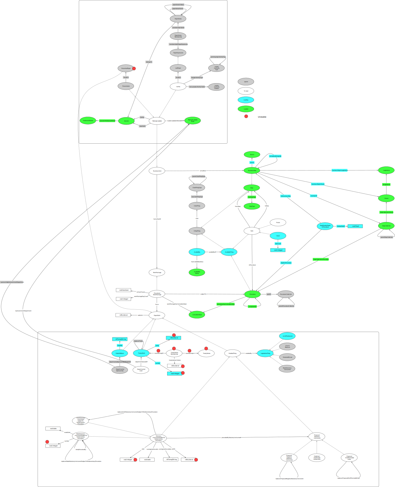

# Importing procedure editor data to Data Graphs

The procedure editor database is [SQL Server](https://en.wikipedia.org/wiki/Microsoft_SQL_Server). Jianhan provides a dump of this data, which is converted to [Postgres](https://en.wikipedia.org/wiki/PostgreSQL) by James.

This page lists the Postgres queries necessary to produce CSV files to populate Data Graphs.

## ParliamentPeriod

Sourced from:

[https://docs.google.com/spreadsheets/d/1e3AnQebAO5ug-Pc_0qDq9KkyZiy0dRhJMvm0lRRJOXk/](https://docs.google.com/spreadsheets/d/1e3AnQebAO5ug-Pc_0qDq9KkyZiy0dRhJMvm0lRRJOXk/edit?usp=sharing)

## Session inParliamentPeriod and hasSession

Sourced from:

[https://docs.google.com/spreadsheets/d/1e3AnQebAO5ug-Pc_0qDq9KkyZiy0dRhJMvm0lRRJOXk/](https://docs.google.com/spreadsheets/d/1e3AnQebAO5ug-Pc_0qDq9KkyZiy0dRhJMvm0lRRJOXk/edit?usp=sharing)

## AvailabilityStatus

Populated by hand (open / closed).

## Legislature

<pre>
	<code>
		COPY (
			SELECT
				id,
				legislaturename AS name,
				triplestoreid AS triplestoreId
			FROM dbo.legislature
		)
		TO '/Users/smethurstm/Documents/ontologies/procedure/meta/editor/data-graphs/instance-data/dumps/legislatures.csv' DELIMITER ',' CSV HEADER;
	</code>
</pre>

## House and inLegislature

<pre>
	<code>
		COPY (
			SELECT
				id,
				housename AS name,
				legislatureid AS inLegislature,
				triplestoreid AS triplestoreId
			FROM dbo.house
		)
		TO '/Users/smethurstm/Documents/ontologies/procedure/meta/editor/data-graphs/instance-data/dumps/houses.csv' DELIMITER ',' CSV HEADER;
	</code>
</pre>

## Source

<pre>
	<code>
		COPY (
			SELECT
				id,
				publicationname AS title,
				publicationurl AS url,
				triplestoreid AS triplestoreId
			FROM dbo.proceduresteppublication
		)
		TO '/Users/smethurstm/Documents/ontologies/procedure/meta/editor/data-graphs/instance-data/dumps/sources.csv' DELIMITER ',' CSV HEADER;
	</code>
</pre>

## StepType

<pre>
	<code>
		COPY (
			SELECT 
				id,
				proceduresteptypename AS label,
				proceduresteptypedescription AS description,
				triplestoreid AS triplestoreId
			FROM dbo.proceduresteptype
		)
		TO '/Users/smethurstm/Documents/ontologies/procedure/meta/editor/data-graphs/instance-data/dumps/step-types.csv' DELIMITER ',' CSV HEADER;
	</code>
</pre>

## CalculationStyle

<pre>
	<code>
		COPY (
			SELECT
				id,
				label,
				eggtimerid AS parliamentaryTimeIdentifier,
				triplestoreid AS triplestoreId
			FROM dbo.procedurecalculationstyle
		)
		TO '/Users/smethurstm/Documents/ontologies/procedure/meta/editor/data-graphs/instance-data/dumps/calculation-styles.csv' DELIMITER ',' CSV HEADER;
	</code>
</pre>

## MakingAvailableBody

[CSV file from SPARQL query](https://api.parliament.uk/s/6cf146cf)

Remember to set date format to dd/mm/yyyy on import.

## Prepare steps for export

### Add the new full label column to steps

<pre>
	<code>
		ALTER TABLE dbo.procedurestep
		ADD COLUMN full_label varchar(1000);
	</code>
</pre>

### Populate the new full label column for non-business steps

<pre>
	<code>
		UPDATE dbo.ProcedureStep SET full_label = 
        (
          SELECT
		  	CONCAT ( dbo.ProcedureStep.ProcedureStepName, ' ', st.proceduresteptypename)
          FROM dbo.ProcedureStepType st 
          WHERE dbo.ProcedureStep.proceduresteptypeid = st.id
        )
		WHERE dbo.ProcedureStep.proceduresteptypeid != 1;
	</code>
</pre>

### Populate the new full label column for business steps

<pre>
	<code>
		UPDATE dbo.ProcedureStep SET full_label =
	    (
			SELECT
				CASE 
					WHEN step_houses.houses_string IS NOT NULL
						THEN CONCAT( s.procedurestepname, ' (', step_houses.houses_string, ')'  )
					WHEN legislature.name IS NOT NULL
						THEN CONCAT( s.procedurestepname, ' (', legislature.name, ')'  )
					ELSE
						s.procedurestepname
				END
			FROM dbo.procedurestep s
			
			LEFT JOIN
				(
					SELECT sh.procedurestepid AS step_id, STRING_AGG(h.id::text, ', ') AS step_houses_concatenated, STRING_AGG(h.housename::text, ', ') AS houses_string
					FROM dbo.procedurestephouse sh, dbo.house h
					WHERE sh.houseid = h.id
					GROUP BY step_id
				) step_houses
			ON step_houses.step_id = s.id
			
			LEFT JOIN
				(
					SELECT l.id, l.legislaturename AS name
					FROM dbo.legislature l
				) legislature
			ON legislature.id = s.legislatureid
			
			WHERE dbo.ProcedureStep.id = s.id
		)
		WHERE dbo.ProcedureStep.proceduresteptypeid = 1;
	</code>
</pre>

## Step (non-business)

<pre>
	<code>
		COPY (
			SELECT
				s.id,
				s.full_label AS label,
				s.procedurestepname AS name,
				s.proceduresteptypeid AS hasStepType,
				s.procedurestepdescription AS description,
				s.triplestoreid AS triplestoreId
			FROM dbo.procedurestep s, dbo.proceduresteptype st
			WHERE s.proceduresteptypeid != 1
			AND s.proceduresteptypeid = st.id
		)
		TO '/Users/smethurstm/Documents/ontologies/procedure/meta/editor/data-graphs/instance-data/dumps/non-business-steps.csv' DELIMITER ',' CSV HEADER;
	</code>
</pre>

## Procedure and procedureHasCalculationStyle

<pre>
	<code>
		COPY (
			SELECT
				p.id,
				p.procedurename AS name,
				p.proceduredescription AS description,
				p.displayorder AS displayOrder,
				calculation_styles.calculation_styles_string AS procedureHasCalculationStyle,
				p.triplestoreid AS triplestoreId
			FROM dbo.procedure p
			LEFT JOIN
				(
					SELECT pcsa.procedureid AS procedure_id, STRING_AGG(pcs.id::text, ', ') AS calculation_styles_string
					FROM dbo.procedurecalculationstyleapplicability pcsa, dbo.procedurecalculationstyle pcs
					WHERE pcsa.procedurecalculationstyleid = pcs.id
					GROUP BY procedure_id
				) calculation_styles
			ON calculation_styles.procedure_id = p.id
		)
		TO '/Users/smethurstm/Documents/ontologies/procedure/meta/editor/data-graphs/instance-data/dumps/procedures.csv' DELIMITER ',' CSV HEADER;
	</code>
</pre>

## componentOf

Populated by hand.

## Availability (procedure only)
<pre>
	<code>
		COPY (
			SELECT
				id,
				CONCAT( 'Availability of ', procedurename, ' (', startdate::date, ' - ', enddate::date, ')' ) AS label,
				CONCAT('urn:procedure-editor:Procedure:',id) AS availabilityOf,
				startdate::date AS startOn,
				enddate::date AS endOn,
				'urn:procedure-editor:AvailabilityStatus:4sGJ6xVObCL4KQiPfQ2b6s' AS hasAvailabilityStatus
			FROM dbo.procedure
			WHERE (
				startdate IS NOT NULL
				OR
				enddate IS NOT NULL
			)
		)
		TO '/Users/smethurstm/Documents/ontologies/procedure/meta/editor/data-graphs/instance-data/dumps/procedure-availability.csv' DELIMITER ',' CSV HEADER;
	</code>
</pre>

## StepCollection, stepCollectionInHouse and stepCollectionInProcedure

<pre>
	<code>
		COPY (
			SELECT
				id,
				stepcollectionname AS name,
				houseid AS stepCollectionInHouse,
				procedureid AS stepCollectionInProcedure,
				'FALSE' AS isMechanical,
				triplestoreid
			FROM dbo.procedurestepcollection
		)
		TO '/Users/smethurstm/Documents/ontologies/procedure/meta/editor/data-graphs/instance-data/dumps/step-collections.csv' DELIMITER ',' CSV HEADER;
	</code>
</pre>

Update step collections 'Start steps', 'End steps', 'Bicameral end steps' and 'Website visible steps' to have isMechanical set to TRUE.

## BusinessStep, Step, actualisedAlongside, source, hasStepType, businessStepInLegislature, businessStepInHouse and memberOf

<pre>
	<code>
		COPY (
			SELECT
				s.id,
				s.full_label AS label,
				s.procedurestepname AS name,
				s.procedurestepdescription AS description,
				proceduresteptypeid AS hasStepType,
				step_houses.step_houses_concatenated AS businessStepInHouse,
				s.legislatureid AS businessStepInLegislature,
				collection_memberships.step_collections_concatenated AS memberOf,
				s.procedurestepscopenote AS actualisationNote,
				s.proceduresteplinknote AS linkNote,
				s.procedurestepdatenote AS dateNote,
				actualised_alongsides.actualised_alongside_concatenated AS actualisedAlongside,
				s.proceduresteppublicationid AS source,
				s.triplestoreid AS triplestoreId
			FROM dbo.procedurestep s
			LEFT JOIN
				(
					SELECT scm.procedurestepid AS step_id, STRING_AGG(sc.id::text, ', ') AS step_collections_concatenated
					FROM dbo.procedurestepcollectionmembership scm, dbo.procedurestepcollection sc
					WHERE scm.procedurestepcollectionid = sc.id
					GROUP BY step_id
				) collection_memberships
			ON collection_memberships.step_id = s.id
			LEFT JOIN
				(
					SELECT sh.procedurestepid AS step_id, STRING_AGG(h.id::text, ', ') AS step_houses_concatenated, STRING_AGG(h.housename::text, ' and ') AS houses_string
					FROM dbo.procedurestephouse sh, dbo.house h
					WHERE sh.houseid = h.id
					GROUP BY step_id
				) step_houses
			ON step_houses.step_id = s.id
			LEFT JOIN
				(
					SELECT sas.procedurestepid AS from_step_id, STRING_AGG(sas.commonlyactualisedalongsideprocedurestepid::text, ', ') AS actualised_alongside_concatenated
					FROM dbo.procedurestepalongsidestep sas
					GROUP BY from_step_id
				) actualised_alongsides
			ON actualised_alongsides.from_step_id = s.id
			WHERE s.proceduresteptypeid = 1
		)
		TO '/Users/smethurstm/Documents/ontologies/procedure/meta/editor/data-graphs/instance-data/dumps/business_steps.csv' DELIMITER ',' CSV HEADER;
	</code>
</pre>

## StepDisplayDepthInProcedure, forBusinessStep, depthInProcedure and displayDepth

<pre>
	<code>
		COPY (
			SELECT
				sd.id,
				CONCAT( s.procedurestepname, ' has step depth ', sd.depth, ' in the ', p.procedurename, ' procedure' ) AS label,
				sd.procedurestepid AS forBusinessStep,
				sd.procedureid AS depthInProcedure,
				sd.depth AS displayDepth,
				sd.triplestoreid AS triplestoreId
			FROM dbo.procedurestepdisplaydepth sd, dbo.procedurestep s, dbo.procedure p
			WHERE sd.procedurestepid = s.id
			AND sd.procedureid = p.id
		)
		TO '/Users/smethurstm/Documents/ontologies/procedure/meta/editor/data-graphs/instance-data/dumps/step-display-depths.csv' DELIMITER ',' CSV HEADER;
	</code>
</pre>

## Clock, Path, fromStep, toStep, inProcedure and dayCount

<pre>
	<code>
		COPY (
			SELECT
				c.id,
				c.clocklabel AS label,
				c.procedureid AS inProcedure,
				CONCAT('urn:procedure-editor:BusinessStep:',fromstepid) AS fromStep,
				CONCAT('urn:procedure-editor:BusinessStep:',tostepid) AS toStep,
				c.daycount AS clockDayCount,
				c.triplestoreid AS triplestoreId
			FROM dbo.procedureclock c
		)
		TO '/Users/smethurstm/Documents/ontologies/procedure/meta/editor/data-graphs/instance-data/dumps/clocks.csv' DELIMITER ',' CSV HEADER;
	</code>
</pre>

## Route, Path, fromStep, toStep and inProcedure

We need to flag routes forming part of a non-component procedure as being not required for export, where those routes also form part of a component procedure.

### Preparation for flagging exportable routes.

We add a <code>is_included_in_export</code> boolean to the procedurerouteprocedure join table.

<pre>
	<code>
		ALTER TABLE dbo.procedurerouteprocedure
		ADD is_included_in_export BOOLEAN DEFAULT TRUE;
	</code>
</pre>

We set the <code>is_included_in_export</code> boolean to false for any route forming part of a non-component procedure, where that route also forms part of a component procedure.

### Flag duplicate EVEL routes

This update flags routes forming part of the EVEL component procedure, where those routes form part of a different procedure:

<pre>
	<code>
		UPDATE dbo.procedurerouteprocedure SET is_included_in_export = FALSE
		WHERE dbo.procedurerouteprocedure.procedurerouteid IN (
			SELECT rp.procedurerouteid
			FROM dbo.procedurerouteprocedure rp
			WHERE rp.procedureid = 11
		)
		AND dbo.procedurerouteprocedure.procedureid != 11;
	</code>
</pre>

### Flag duplicate SLSC routes

This update flags routes forming part of the SLSC component procedure, where those routes form part of a different procedure:

<pre>
	<code>
		UPDATE dbo.procedurerouteprocedure SET is_included_in_export = FALSE
		WHERE dbo.procedurerouteprocedure.procedurerouteid IN (
			SELECT rp.procedurerouteid
			FROM dbo.procedurerouteprocedure rp
			WHERE rp.procedureid = 8
		)
		AND dbo.procedurerouteprocedure.procedureid != 8;
	</code>
</pre>

### Flag duplicate JCSI routes

This update flags routes forming part of the JCSI component procedure, where those routes form part of a different procedure:

<pre>
	<code>
		UPDATE dbo.procedurerouteprocedure SET is_included_in_export = FALSE
		WHERE dbo.procedurerouteprocedure.procedurerouteid IN (
			SELECT rp.procedurerouteid
			FROM dbo.procedurerouteprocedure rp
			WHERE rp.procedureid = 28
		)
		AND dbo.procedurerouteprocedure.procedureid != 28;
	</code>
</pre>

### Flag duplicate SCSI routes

This update flags routes forming part of the SCSI component procedure, where those routes form part of a different procedure:

<pre>
	<code>
		UPDATE dbo.procedurerouteprocedure SET is_included_in_export = FALSE
		WHERE dbo.procedurerouteprocedure.procedurerouteid IN (
			SELECT rp.procedurerouteid
			FROM dbo.procedurerouteprocedure rp
			WHERE rp.procedureid = 9
		)
		AND dbo.procedurerouteprocedure.procedureid != 9;
	</code>
</pre>

### Flag duplicate Commons first reading routes

This update flags routes forming part of the Commons first reading component procedure, where those routes form part of a different procedure:

<pre>
	<code>
		UPDATE dbo.procedurerouteprocedure SET is_included_in_export = FALSE
		WHERE dbo.procedurerouteprocedure.procedurerouteid IN (
			SELECT rp.procedurerouteid
			FROM dbo.procedurerouteprocedure rp
			WHERE rp.procedureid = 41
		)
		AND dbo.procedurerouteprocedure.procedureid != 41;
	</code>
</pre>

### Flag duplicate Commons ten minute rule bill routes

This update flags routes forming part of the Commons ten minute rule bill component procedure, where those routes form part of a different procedure:

<pre>
	<code>
		UPDATE dbo.procedurerouteprocedure SET is_included_in_export = FALSE
		WHERE dbo.procedurerouteprocedure.procedurerouteid IN (
			SELECT rp.procedurerouteid
			FROM dbo.procedurerouteprocedure rp
			WHERE rp.procedureid = 44
		)
		AND dbo.procedurerouteprocedure.procedureid != 44;
	</code>
</pre>

### Flag duplicate treaty BAT routes

This update flags routes forming part of the treaty BAT component procedure, where those routes form part of a different procedure:

<pre>
	<code>
		UPDATE dbo.procedurerouteprocedure SET is_included_in_export = FALSE
		WHERE dbo.procedurerouteprocedure.procedurerouteid IN (
			SELECT rp.procedurerouteid
			FROM dbo.procedurerouteprocedure rp
			WHERE rp.procedureid = 61
		)
		AND dbo.procedurerouteprocedure.procedureid != 61;
	</code>
</pre>

### Flag duplicate treaty EFRA routes

This update flags routes forming part of the treaty EFRA component procedure, where those routes form part of a different procedure:

<pre>
	<code>
		UPDATE dbo.procedurerouteprocedure SET is_included_in_export = FALSE
		WHERE dbo.procedurerouteprocedure.procedurerouteid IN (
			SELECT rp.procedurerouteid
			FROM dbo.procedurerouteprocedure rp
			WHERE rp.procedureid = 29
		)
		AND dbo.procedurerouteprocedure.procedureid != 29;
	</code>
</pre>

### Flag duplicate treaty HAC routes

This update flags routes forming part of the treaty HAC component procedure, where those routes form part of a different procedure:

<pre>
	<code>
		UPDATE dbo.procedurerouteprocedure SET is_included_in_export = FALSE
		WHERE dbo.procedurerouteprocedure.procedurerouteid IN (
			SELECT rp.procedurerouteid
			FROM dbo.procedurerouteprocedure rp
			WHERE rp.procedureid = 66
		)
		AND dbo.procedurerouteprocedure.procedureid != 66;
	</code>
</pre>

### Flag duplicate treaty IAC and EAC routes

This update flags routes forming part of the treaty IAC and EAC component procedure, where those routes form part of a different procedure:

<pre>
	<code>
		UPDATE dbo.procedurerouteprocedure SET is_included_in_export = FALSE
		WHERE dbo.procedurerouteprocedure.procedurerouteid IN (
			SELECT rp.procedurerouteid
			FROM dbo.procedurerouteprocedure rp
			WHERE rp.procedureid = 16
		)
		AND dbo.procedurerouteprocedure.procedureid != 16;
	</code>
</pre>

### Flag duplicate treaty ITC routes

This update flags routes forming part of the treaty ITC component procedure, where those routes form part of a different procedure:

<pre>
	<code>
		UPDATE dbo.procedurerouteprocedure SET is_included_in_export = FALSE
		WHERE dbo.procedurerouteprocedure.procedurerouteid IN (
			SELECT rp.procedurerouteid
			FROM dbo.procedurerouteprocedure rp
			WHERE rp.procedureid = 26
		)
		AND dbo.procedurerouteprocedure.procedureid != 26;
	</code>
</pre>

### Flag duplicate treaty JCHR routes

This update flags routes forming part of the treaty JCHR component procedure, where those routes form part of a different procedure:

<pre>
	<code>
		UPDATE dbo.procedurerouteprocedure SET is_included_in_export = FALSE
		WHERE dbo.procedurerouteprocedure.procedurerouteid IN (
			SELECT rp.procedurerouteid
			FROM dbo.procedurerouteprocedure rp
			WHERE rp.procedureid = 15
		)
		AND dbo.procedurerouteprocedure.procedureid != 15;
	</code>
</pre>

### Flag duplicate treaty Lords' committees routes

This update flags routes forming part of the treaty Lords' committees component procedure, where those routes form part of a different procedure:

<pre>
	<code>
		UPDATE dbo.procedurerouteprocedure SET is_included_in_export = FALSE
		WHERE dbo.procedurerouteprocedure.procedurerouteid IN (
			SELECT rp.procedurerouteid
			FROM dbo.procedurerouteprocedure rp
			WHERE rp.procedureid = 13
		)
		AND dbo.procedurerouteprocedure.procedureid != 13;
	</code>
</pre>

### Flag duplicate treaty NIAC routes

This update flags routes forming part of the treaty NIAC component procedure, where those routes form part of a different procedure:

<pre>
	<code>
		UPDATE dbo.procedurerouteprocedure SET is_included_in_export = FALSE
		WHERE dbo.procedurerouteprocedure.procedurerouteid IN (
			SELECT rp.procedurerouteid
			FROM dbo.procedurerouteprocedure rp
			WHERE rp.procedureid = 56
		)
		AND dbo.procedurerouteprocedure.procedureid != 56;
	</code>
</pre>

### Flag duplicate treaty other Commons' committees routes

This update flags routes forming part of the treaty other Commons' committees component procedure, where those routes form part of a different procedure:

<pre>
	<code>
		UPDATE dbo.procedurerouteprocedure SET is_included_in_export = FALSE
		WHERE dbo.procedurerouteprocedure.procedurerouteid IN (
			SELECT rp.procedurerouteid
			FROM dbo.procedurerouteprocedure rp
			WHERE rp.procedureid = 65
		)
		AND dbo.procedurerouteprocedure.procedureid != 65;
	</code>
</pre>

### Flag duplicate treaty pre-laying routes

This update flags routes forming part of the treaty pre-laying component procedure, where those routes form part of a different procedure:

<pre>
	<code>
		UPDATE dbo.procedurerouteprocedure SET is_included_in_export = FALSE
		WHERE dbo.procedurerouteprocedure.procedurerouteid IN (
			SELECT rp.procedurerouteid
			FROM dbo.procedurerouteprocedure rp
			WHERE rp.procedureid = 62
		)
		AND dbo.procedurerouteprocedure.procedureid != 62;
	</code>
</pre>

### Flag duplicate DPRRC scrutiny reserve routes

This update flags routes forming part of the DPRRC scrutiny reserve component procedure, where those routes form part of a different procedure:

<pre>
	<code>
		UPDATE dbo.procedurerouteprocedure SET is_included_in_export = FALSE
		WHERE dbo.procedurerouteprocedure.procedurerouteid IN (
			SELECT rp.procedurerouteid
			FROM dbo.procedurerouteprocedure rp
			WHERE rp.procedureid = 60
		)
		AND dbo.procedurerouteprocedure.procedureid != 60;
	</code>
</pre>

### Flag duplicate Great Steward of Scotland routes

This update flags routes forming part of the Great Steward of Scotland component procedure, where those routes form part of a different procedure:

<pre>
	<code>
		UPDATE dbo.procedurerouteprocedure SET is_included_in_export = FALSE
		WHERE dbo.procedurerouteprocedure.procedurerouteid IN (
			SELECT rp.procedurerouteid
			FROM dbo.procedurerouteprocedure rp
			WHERE rp.procedureid = 40
		)
		AND dbo.procedurerouteprocedure.procedureid != 40;
	</code>
</pre>

### Flag duplicate legislative consent motion Northern Ireland routes

This update flags routes forming part of the legislative consent motion Northern Ireland component procedure, where those routes form part of a different procedure:

<pre>
	<code>
		UPDATE dbo.procedurerouteprocedure SET is_included_in_export = FALSE
		WHERE dbo.procedurerouteprocedure.procedurerouteid IN (
			SELECT rp.procedurerouteid
			FROM dbo.procedurerouteprocedure rp
			WHERE rp.procedureid = 58
		)
		AND dbo.procedurerouteprocedure.procedureid != 58;
	</code>
</pre>

### Flag duplicate legislative consent motion Scotland routes

This update flags routes forming part of the legislative consent motion Scotland component procedure, where those routes form part of a different procedure:

<pre>
	<code>
		UPDATE dbo.procedurerouteprocedure SET is_included_in_export = FALSE
		WHERE dbo.procedurerouteprocedure.procedurerouteid IN (
			SELECT rp.procedurerouteid
			FROM dbo.procedurerouteprocedure rp
			WHERE rp.procedureid = 46
		)
		AND dbo.procedurerouteprocedure.procedureid != 46;
	</code>
</pre>

### Flag duplicate legislative consent motion Welsh routes

This update flags routes forming part of the legislative consent motion Welsh component procedure, where those routes form part of a different procedure:

<pre>
	<code>
		UPDATE dbo.procedurerouteprocedure SET is_included_in_export = FALSE
		WHERE dbo.procedurerouteprocedure.procedurerouteid IN (
			SELECT rp.procedurerouteid
			FROM dbo.procedurerouteprocedure rp
			WHERE rp.procedureid = 57
		)
		AND dbo.procedurerouteprocedure.procedureid != 57;
	</code>
</pre>

### Flag duplicate LRO Commons committee consideration routes

This update flags routes forming part of the LRO Commons committee consideration component procedure, where those routes form part of a different procedure:

<pre>
	<code>
		UPDATE dbo.procedurerouteprocedure SET is_included_in_export = FALSE
		WHERE dbo.procedurerouteprocedure.procedurerouteid IN (
			SELECT rp.procedurerouteid
			FROM dbo.procedurerouteprocedure rp
			WHERE rp.procedureid = 53
		)
		AND dbo.procedurerouteprocedure.procedureid != 53;
	</code>
</pre>

### Flag duplicate LRO Commons procedure determination routes

This update flags routes forming part of the LRO Commons procedure determination component procedure, where those routes form part of a different procedure:

<pre>
	<code>
		UPDATE dbo.procedurerouteprocedure SET is_included_in_export = FALSE
		WHERE dbo.procedurerouteprocedure.procedurerouteid IN (
			SELECT rp.procedurerouteid
			FROM dbo.procedurerouteprocedure rp
			WHERE rp.procedureid = 51
		)
		AND dbo.procedurerouteprocedure.procedureid != 51;
	</code>
</pre>

### Flag duplicate LRO draft affirmative routes

This update flags routes forming part of the LRO draft affirmative component procedure, where those routes form part of a different procedure:

<pre>
	<code>
		UPDATE dbo.procedurerouteprocedure SET is_included_in_export = FALSE
		WHERE dbo.procedurerouteprocedure.procedurerouteid IN (
			SELECT rp.procedurerouteid
			FROM dbo.procedurerouteprocedure rp
			WHERE rp.procedureid = 49
		)
		AND dbo.procedurerouteprocedure.procedureid != 49;
	</code>
</pre>

### Flag duplicate LRO draft negative routes

This update flags routes forming part of the LRO draft negative component procedure, where those routes form part of a different procedure:

<pre>
	<code>
		UPDATE dbo.procedurerouteprocedure SET is_included_in_export = FALSE
		WHERE dbo.procedurerouteprocedure.procedurerouteid IN (
			SELECT rp.procedurerouteid
			FROM dbo.procedurerouteprocedure rp
			WHERE rp.procedureid = 48
		)
		AND dbo.procedurerouteprocedure.procedureid != 48;
	</code>
</pre>

### Flag duplicate LRO Lords' Committee consideration routes

This update flags routes forming part of the LRO Lords' Committee consideration component procedure, where those routes form part of a different procedure:

<pre>
	<code>
		UPDATE dbo.procedurerouteprocedure SET is_included_in_export = FALSE
		WHERE dbo.procedurerouteprocedure.procedurerouteid IN (
			SELECT rp.procedurerouteid
			FROM dbo.procedurerouteprocedure rp
			WHERE rp.procedureid = 52
		)
		AND dbo.procedurerouteprocedure.procedureid != 52;
	</code>
</pre>

### Flag duplicate LRO Lords' debates routes

This update flags routes forming part of the LRO Lords' debates component procedure, where those routes form part of a different procedure:

<pre>
	<code>
		UPDATE dbo.procedurerouteprocedure SET is_included_in_export = FALSE
		WHERE dbo.procedurerouteprocedure.procedurerouteid IN (
			SELECT rp.procedurerouteid
			FROM dbo.procedurerouteprocedure rp
			WHERE rp.procedureid = 55
		)
		AND dbo.procedurerouteprocedure.procedureid != 55;
	</code>
</pre>

### Flag duplicate LRO Lords' procedure determination routes

This update flags routes forming part of the LRO Lords' procedure determination component procedure, where those routes form part of a different procedure:

<pre>
	<code>
		UPDATE dbo.procedurerouteprocedure SET is_included_in_export = FALSE
		WHERE dbo.procedurerouteprocedure.procedurerouteid IN (
			SELECT rp.procedurerouteid
			FROM dbo.procedurerouteprocedure rp
			WHERE rp.procedureid = 50
		)
		AND dbo.procedurerouteprocedure.procedureid != 50;
	</code>
</pre>

### Flag duplicate local government finance report routes

This update flags routes forming part of the local government finance report component procedure, where those routes form part of a different procedure:

<pre>
	<code>
		UPDATE dbo.procedurerouteprocedure SET is_included_in_export = FALSE
		WHERE dbo.procedurerouteprocedure.procedurerouteid IN (
			SELECT rp.procedurerouteid
			FROM dbo.procedurerouteprocedure rp
			WHERE rp.procedureid = 12
		)
		AND dbo.procedurerouteprocedure.procedureid != 12;
	</code>
</pre>

### Flag duplicate Prince of Wales' consent routes

This update flags routes forming part of the Prince of Wales' consent component procedure, where those routes form part of a different procedure:

<pre>
	<code>
		UPDATE dbo.procedurerouteprocedure SET is_included_in_export = FALSE
		WHERE dbo.procedurerouteprocedure.procedurerouteid IN (
			SELECT rp.procedurerouteid
			FROM dbo.procedurerouteprocedure rp
			WHERE rp.procedureid = 39
		)
		AND dbo.procedurerouteprocedure.procedureid != 39;
	</code>
</pre>

### Flag duplicate Queens' consent routes

This update flags routes forming part of the Queens' consent component procedure, where those routes form part of a different procedure:

<pre>
	<code>
		UPDATE dbo.procedurerouteprocedure SET is_included_in_export = FALSE
		WHERE dbo.procedurerouteprocedure.procedurerouteid IN (
			SELECT rp.procedurerouteid
			FROM dbo.procedurerouteprocedure rp
			WHERE rp.procedureid = 37
		)
		AND dbo.procedurerouteprocedure.procedureid != 37;
	</code>
</pre>

### Flag duplicate PNSI Commons' committee routes

This update flags routes forming part of the PNSI Commons' committee component procedure, where those routes form part of a different procedure:

<pre>
	<code>
		UPDATE dbo.procedurerouteprocedure SET is_included_in_export = FALSE
		WHERE dbo.procedurerouteprocedure.procedurerouteid IN (
			SELECT rp.procedurerouteid
			FROM dbo.procedurerouteprocedure rp
			WHERE rp.procedureid = 77
		)
		AND dbo.procedurerouteprocedure.procedureid != 77;
	</code>
</pre>

### Flag duplicate scrutiny reserve JCHR routes

This update flags routes forming part of the scrutiny reserve JCHR component procedure, where those routes form part of a different procedure:

<pre>
	<code>
		UPDATE dbo.procedurerouteprocedure SET is_included_in_export = FALSE
		WHERE dbo.procedurerouteprocedure.procedurerouteid IN (
			SELECT rp.procedurerouteid
			FROM dbo.procedurerouteprocedure rp
			WHERE rp.procedureid = 76
		)
		AND dbo.procedurerouteprocedure.procedureid != 76;
	</code>
</pre>

### Flag duplicate draft affirmative Lords motions routes

This update flags routes forming part of the draft affirmative Lords motions component procedure, where those routes form part of a different procedure:

<pre>
	<code>
		UPDATE dbo.procedurerouteprocedure SET is_included_in_export = FALSE
		WHERE dbo.procedurerouteprocedure.procedurerouteid IN (
			SELECT rp.procedurerouteid
			FROM dbo.procedurerouteprocedure rp
			WHERE rp.procedureid = 70
		)
		AND dbo.procedurerouteprocedure.procedureid != 70;
	</code>
</pre>

### Flag duplicate draft affirmative Commons motions routes

This update flags routes forming part of the draft affirmative Commons motions component procedure, where those routes form part of a different procedure:

<pre>
	<code>
		UPDATE dbo.procedurerouteprocedure SET is_included_in_export = FALSE
		WHERE dbo.procedurerouteprocedure.procedurerouteid IN (
			SELECT rp.procedurerouteid
			FROM dbo.procedurerouteprocedure rp
			WHERE rp.procedureid = 83
		)
		AND dbo.procedurerouteprocedure.procedureid != 83;
	</code>
</pre>

### Flag duplicate Draft affirmative: Joint Committee on Statutory Instruments (JCSI) Scrutiny Reserve routes

This update flags routes forming part of the Draft affirmative: Joint Committee on Statutory Instruments (JCSI) Scrutiny Reserve component procedure, where those routes form part of a different procedure:

<pre>
	<code>
		UPDATE dbo.procedurerouteprocedure SET is_included_in_export = FALSE
		WHERE dbo.procedurerouteprocedure.procedurerouteid IN (
			SELECT rp.procedurerouteid
			FROM dbo.procedurerouteprocedure rp
			WHERE rp.procedureid = 67
		)
		AND dbo.procedurerouteprocedure.procedureid != 67;
	</code>
</pre>

### Flag duplicate Made affirmative: Commons motions routes

This update flags routes forming part of the Made affirmative: Commons motions component procedure, where those routes form part of a different procedure:

<pre>
	<code>
		UPDATE dbo.procedurerouteprocedure SET is_included_in_export = FALSE
		WHERE dbo.procedurerouteprocedure.procedurerouteid IN (
			SELECT rp.procedurerouteid
			FROM dbo.procedurerouteprocedure rp
			WHERE rp.procedureid = 69
		)
		AND dbo.procedurerouteprocedure.procedureid != 69;
	</code>
</pre>

### Flag duplicate Made affirmative: Lords motions routes

This update flags routes forming part of the Made affirmative: Lords motions component procedure, where those routes form part of a different procedure:

<pre>
	<code>
		UPDATE dbo.procedurerouteprocedure SET is_included_in_export = FALSE
		WHERE dbo.procedurerouteprocedure.procedurerouteid IN (
			SELECT rp.procedurerouteid
			FROM dbo.procedurerouteprocedure rp
			WHERE rp.procedureid = 84
		)
		AND dbo.procedurerouteprocedure.procedureid != 84;
	</code>
</pre>

### Flag duplicate Made negative: Lords motions routes

This update flags routes forming part of the Made negative: Lords motions component procedure, where those routes form part of a different procedure:

<pre>
	<code>
		UPDATE dbo.procedurerouteprocedure SET is_included_in_export = FALSE
		WHERE dbo.procedurerouteprocedure.procedurerouteid IN (
			SELECT rp.procedurerouteid
			FROM dbo.procedurerouteprocedure rp
			WHERE rp.procedureid = 74
		)
		AND dbo.procedurerouteprocedure.procedureid != 74;
	</code>
</pre>

### Flag duplicate CRAG Treaty PAC routes

This update flags routes forming part of the CRAG Treaty PAC component procedure, where those routes form part of a different procedure:

<pre>
	<code>
		UPDATE dbo.procedurerouteprocedure SET is_included_in_export = FALSE
		WHERE dbo.procedurerouteprocedure.procedurerouteid IN (
			SELECT rp.procedurerouteid
			FROM dbo.procedurerouteprocedure rp
			WHERE rp.procedureid = 64
		)
		AND dbo.procedurerouteprocedure.procedureid != 64;
	</code>
</pre>

### Flag duplicate Made negative: Referral to a Delegated Legislation Committee (DLC) routes

This update flags routes forming part of the Made negative: Referral to a Delegated Legislation Committee (DLC) component procedure, where those routes form part of a different procedure:

<pre>
	<code>
		UPDATE dbo.procedurerouteprocedure SET is_included_in_export = FALSE
		WHERE dbo.procedurerouteprocedure.procedurerouteid IN (
			SELECT rp.procedurerouteid
			FROM dbo.procedurerouteprocedure rp
			WHERE rp.procedureid = 71
		)
		AND dbo.procedurerouteprocedure.procedureid != 71;
	</code>
</pre>

### Flag duplicate Made negative: Commons motions routes

This update flags routes forming part of the Made negative: Commons motions component procedure, where those routes form part of a different procedure:

<pre>
	<code>
		UPDATE dbo.procedurerouteprocedure SET is_included_in_export = FALSE
		WHERE dbo.procedurerouteprocedure.procedurerouteid IN (
			SELECT rp.procedurerouteid
			FROM dbo.procedurerouteprocedure rp
			WHERE rp.procedureid = 72
		)
		AND dbo.procedurerouteprocedure.procedureid != 72;
	</code>
</pre>

### Flag duplicate Made negative - Commons motion to consider routes

This update flags routes forming part of the Made negative - Commons motion to consider component procedure, where those routes form part of a different procedure:

<pre>
	<code>
		UPDATE dbo.procedurerouteprocedure SET is_included_in_export = FALSE
		WHERE dbo.procedurerouteprocedure.procedurerouteid IN (
			SELECT rp.procedurerouteid
			FROM dbo.procedurerouteprocedure rp
			WHERE rp.procedureid = 73
		)
		AND dbo.procedurerouteprocedure.procedureid != 73;
	</code>
</pre>

### Flag duplicate Draft negative: Lords motions routes

This update flags routes forming part of the Draft negative: Lords motions component procedure, where those routes form part of a different procedure:

<pre>
	<code>
		UPDATE dbo.procedurerouteprocedure SET is_included_in_export = FALSE
		WHERE dbo.procedurerouteprocedure.procedurerouteid IN (
			SELECT rp.procedurerouteid
			FROM dbo.procedurerouteprocedure rp
			WHERE rp.procedureid = 81
		)
		AND dbo.procedurerouteprocedure.procedureid != 81;
	</code>
</pre>

### Flag duplicate Draft negative - Commons motion to consider routes

This update flags routes forming part of the Draft negative - Commons motion to consider component procedure, where those routes form part of a different procedure:

<pre>
	<code>
		UPDATE dbo.procedurerouteprocedure SET is_included_in_export = FALSE
		WHERE dbo.procedurerouteprocedure.procedurerouteid IN (
			SELECT rp.procedurerouteid
			FROM dbo.procedurerouteprocedure rp
			WHERE rp.procedureid = 80
		)
		AND dbo.procedurerouteprocedure.procedureid != 80;
	</code>
</pre>

### Flag duplicate Draft negative: Commons motions routes

This update flags routes forming part of the Draft negative: Commons motions component procedure, where those routes form part of a different procedure:

<pre>
	<code>
		UPDATE dbo.procedurerouteprocedure SET is_included_in_export = FALSE
		WHERE dbo.procedurerouteprocedure.procedurerouteid IN (
			SELECT rp.procedurerouteid
			FROM dbo.procedurerouteprocedure rp
			WHERE rp.procedureid = 78
		)
		AND dbo.procedurerouteprocedure.procedureid != 78;
	</code>
</pre>

### Flag duplicate Draft negative: Referral to a Delegated Legislation Committee (DLC) routes

This update flags routes forming part of the Draft negative: Referral to a Delegated Legislation Committee (DLC) component procedure, where those routes form part of a different procedure:

<pre>
	<code>
		UPDATE dbo.procedurerouteprocedure SET is_included_in_export = FALSE
		WHERE dbo.procedurerouteprocedure.procedurerouteid IN (
			SELECT rp.procedurerouteid
			FROM dbo.procedurerouteprocedure rp
			WHERE rp.procedureid = 79
		)
		AND dbo.procedurerouteprocedure.procedureid != 79;
	</code>
</pre>

### Flag duplicate Made affirmative: Joint Committee on Statutory Instruments (JCSI) Scrutiny Reserve routes

This update flags routes forming part of the Made affirmative: Joint Committee on Statutory Instruments (JCSI) Scrutiny Reserve component procedure, where those routes form part of a different procedure:

<pre>
	<code>
		UPDATE dbo.procedurerouteprocedure SET is_included_in_export = FALSE
		WHERE dbo.procedurerouteprocedure.procedurerouteid IN (
			SELECT rp.procedurerouteid
			FROM dbo.procedurerouteprocedure rp
			WHERE rp.procedureid = 82
		)
		AND dbo.procedurerouteprocedure.procedureid != 82;
	</code>
</pre>

### Route proliferation checking queries

A query for Jayne to check that routes flagged as not included for export look correct.

<pre>
	<code>
		COPY (
			SELECT p.procedurename AS procedure, from_s.procedurestepname AS from_step, to_s.procedurestepname AS to_step
			FROM dbo.procedurerouteprocedure pr, dbo.procedure p, dbo.procedureroute r, dbo.procedurestep from_s, dbo.procedurestep to_s
			WHERE pr.is_included_in_export is FALSE
			AND pr.procedureid = p.id
			AND pr.procedurerouteid = r.id
			AND r.fromprocedurestepid = from_s.id
			AND r.toprocedurestepid = to_s.id
		)
		TO '/Users/smethurstm/Documents/ontologies/procedure/meta/editor/data-graphs/instance-data/dumps/reporting/ignored-routes.csv' DELIMITER ',' CSV HEADER;
	</code>
</pre>

A query for Jayne to check which routes are in more than one procedure. Includes only routes flagged as being included for export.

<pre>
	<code>
		COPY (
			SELECT
				r.id AS route_id,
				r.triplestoreid AS route_triplestore_id,
				from_step.name AS from_step_name,
				to_step.name AS to_step_name,
				procedure_routes.procedure_count AS procedure_count,
				STRING_AGG(procedure.name::text, ' | ') AS procedures
			FROM dbo.procedureroute r
			LEFT JOIN
				(
					SELECT pr.procedurerouteid, p.procedurename AS name
					FROM dbo.procedurerouteprocedure pr, dbo.procedure p
					WHERE pr.procedureid = p.id
					AND pr.is_included_in_export is TRUE
				) procedure
			ON procedure.procedurerouteid = r.id

			INNER JOIN (
				SELECT s.id, s.procedurestepname AS name
				FROM dbo.procedurestep s
	
			) from_step
			ON from_step.id = r.fromprocedurestepid

			INNER JOIN (
				SELECT s.id, s.procedurestepname AS name
				FROM dbo.procedurestep s
	
			) to_step
			ON to_step.id = r.toprocedurestepid

			INNER JOIN (
				SELECT pr.procedurerouteid, count(pr.id) AS procedure_count
				FROM dbo.procedurerouteprocedure pr
				WHERE pr.is_included_in_export is TRUE
				GROUP BY pr.procedurerouteid
	
			) procedure_routes
			ON procedure_routes.procedurerouteid = r.id
			WHERE procedure_count > 1
			GROUP BY r.id, from_step.name, to_step.name, procedure_count
			ORDER BY procedure_count DESC
		)
		TO '/Users/smethurstm/Documents/ontologies/procedure/meta/editor/data-graphs/instance-data/dumps/reporting/route-profileration.csv' DELIMITER ',' CSV HEADER;
	</code>
</pre>

### Export routes flagged as exportable.

<pre>
	<code>
		COPY (
			SELECT 
				r.id,
				r.triplestoreid AS triplestoreId,
				pr.procedureid AS inProcedure,
				CONCAT( 'Route from ', from_step.full_label, ' to ', to_step.full_label, ' in the ', p.procedurename, ' procedure' ) AS label,
				CASE
				  WHEN from_step.proceduresteptypeid = 1
				  THEN CONCAT( 'urn:procedure-editor:BusinessStep:', from_step.id )
				ELSE
				  CONCAT( 'urn:procedure-editor:Step:', from_step.id )
				END AS fromStep,

				CASE
				  WHEN to_step.proceduresteptypeid = 1
				  THEN CONCAT( 'urn:procedure-editor:BusinessStep:', to_step.id )
				ELSE
				  CONCAT( 'urn:procedure-editor:Step:', to_step.id )
				END AS toStep

			FROM dbo.procedureroute AS r, dbo.procedurerouteprocedure AS pr, dbo.procedurestep AS from_step, dbo.procedurestep AS to_step, dbo.procedure p
			
			WHERE r.id = pr.procedurerouteid
			AND from_step.id = r.fromprocedurestepid
			AND to_step.id = r.toprocedurestepid
			AND pr.is_included_in_export IS TRUE
			AND pr.procedureid = p.id
		)
		TO '/Users/smethurstm/Documents/ontologies/procedure/meta/editor/data-graphs/instance-data/dumps/routes.csv' DELIMITER ',' CSV HEADER;
	</code>
</pre>

## AvailableThing, availabilityOf, Availability and hasAvailabilityStatus (for routes)

<pre>
	<code>
		COPY (
			SELECT
				r.id AS id,
				CONCAT('urn:procedure-editor:Route:',r.id) AS availabilityOf,
				r.startdate::Date AS startOn,
				r.enddate::Date AS endOn,
				'urn:procedure-editor:AvailabilityStatus:4sGJ6xVObCL4KQiPfQ2b6s' AS hasAvailabilityStatus,
				CONCAT( 'Availability of route from ', from_step.full_label, ' to ', to_step.full_label, ' in the ', p.procedurename, ' procedure' ) AS label
			
			FROM dbo.procedureroute r, dbo.procedurerouteprocedure AS pr, dbo.procedurestep AS from_step, dbo.procedurestep AS to_step, dbo.procedure p

			WHERE r.id = pr.procedurerouteid
			AND from_step.id = r.fromprocedurestepid
			AND to_step.id = r.toprocedurestepid
			AND pr.is_included_in_export IS TRUE
			AND (
				r.startdate IS NOT NULL
				OR
				r.enddate IS NOT NULL
			)
			AND pr.procedureid = p.id
		)
		TO '/Users/smethurstm/Documents/ontologies/procedure/meta/editor/data-graphs/instance-data/dumps/route-availability.csv' DELIMITER ',' CSV HEADER;
	</code>
</pre>

## ActOfParliament and EnablingThing

<pre>
	<code>
		COPY (
			SELECT
				id,
				title,
				royalassentdate::Date AS royalAssentDate,
				actyear AS year,
				actchapternumber AS chapterNumber,
				weblink AS legislationGovUri,
				uri AS dataParliamentUri,
				triplestoreid AS triplestoreId
			FROM dbo.solractofparliamentdata
			WHERE isdeleted IS FALSE
		)
		TO '/Users/smethurstm/Documents/ontologies/procedure/meta/editor/data-graphs/instance-data/dumps/acts-of-parliament.csv' DELIMITER ',' CSV HEADER;
	</code>
</pre>

As of 10/03/2026, there are 17,594 records in the solractofparliamentdata table, of which 1 has an isdeleted flag set to FALSE. 

The chapter property has been temporarily changed from integer to text because some Acts have a chapter number with 'c.'.

## PublicBill

<pre>
	<code>
		COPY (
			SELECT
				bill.id,
				bill.procedurebillworkname AS title,
				bill.procedurebillworklongtitle AS longTitle,
				wpt.weblink AS webLink,
				wpt.triplestoreid AS triplestoreId
			FROM dbo.procedurebillwork bill, dbo.procedureworkpackagedthing wpt
			WHERE bill.id = wpt.id
		)
		TO '/Users/smethurstm/Documents/ontologies/procedure/meta/editor/data-graphs/instance-data/dumps/public-bill-works.csv' DELIMITER ',' CSV HEADER;
	</code>
</pre>

## TreatyWork

<pre>
	<code>
		COPY (
			SELECT
				t.id,
				t.proceduretreatyname AS title,
				t.treatynumber AS number,
				t.treatyprefix AS prefix,
				work_packaged_thing.triplestoreid,
				work_packaged_thing.weblink
			FROM
				dbo.proceduretreaty t
	
			INNER JOIN (
				SELECT *
				FROM dbo.ProcedureWorkPackagedThing
			) AS work_packaged_thing
			ON work_packaged_thing.id = t.id
		)
		TO '/Users/smethurstm/Documents/ontologies/procedure/meta/editor/data-graphs/instance-data/dumps/treaties.csv' DELIMITER ',' CSV HEADER;
	</code>
</pre>

## TreatySeries

Populated by hand: Country Series (1), European Union Series (2), Miscellaneous Series (3)

## SeriesMembership (Country)

<pre>
	<code>
		COPY (
			SELECT
				sm.id,
				sm.citation AS label,
				sm.triplestoreid AS triplestoreId,
				sm.citation AS treatySeriesCitation,
				1 AS treatySeries,
				c.ProcedureTreatyId AS treaty
			FROM
				dbo.ProcedureSeriesMembership AS sm,
				dbo.ProcerdureCountrySeriesMembership AS c
			WHERE sm.id = c.id
			AND sm.citation IS NOT NULL /* required because negotiations toward a treaty are placed in the country series membership table with no citation */
		)
		TO '/Users/smethurstm/Documents/ontologies/procedure/meta/editor/data-graphs/instance-data/dumps/country-series-memberships.csv' DELIMITER ',' CSV HEADER;
	</code>
</pre>

## SeriesMembership (European Union)

<pre>
	<code>
		COPY (
			SELECT
				sm.id,
				sm.citation AS label,
				sm.triplestoreid AS triplestoreId,
				sm.citation AS treatySeriesCitation,
				2 AS treatySeries,
				eu.ProcedureTreatyId AS treaty
			FROM
				dbo.ProcedureSeriesMembership AS sm,
				dbo.ProcerdureEuropeanUnionSeriesMembership AS eu
			WHERE sm.id = eu.id
		)
		TO '/Users/smethurstm/Documents/ontologies/procedure/meta/editor/data-graphs/instance-data/dumps/eu-series-memberships.csv' DELIMITER ',' CSV HEADER;
	</code>
</pre>

## SeriesMembership (Miscellaneous)

<pre>
	<code>
		COPY (
			SELECT
				sm.id,
				sm.citation AS label,
				sm.triplestoreid AS triplestoreId,
				sm.citation AS treatySeriesCitation,
				3 AS treatySeries,
				misc.ProcedureTreatyId AS treaty
			FROM
				dbo.ProcedureSeriesMembership AS sm,
				dbo.ProcerdureMiscellaneousSeriesMembership AS misc
			WHERE sm.id = misc.id
		)
		TO '/Users/smethurstm/Documents/ontologies/procedure/meta/editor/data-graphs/instance-data/dumps/misc-series-memberships.csv' DELIMITER ',' CSV HEADER;
	</code>
</pre>

## DepartmentalLead

<pre>
	<code>
		COPY (
			SELECT
				t.id,
				CONCAT( 'Departmental lead for ', t.proceduretreatyname, ' from to' ) AS label,
				NULL AS startOn,
				NULL AS endON,
				t.id AS departmentalLeadOfTreaty,
				t.leadgovernmentorganisationtriplestoreid AS byMinisterialDepartment
			FROM
				dbo.proceduretreaty t
		)
		TO '/Users/smethurstm/Documents/ontologies/procedure/meta/editor/data-graphs/instance-data/dumps/departmental-leads.csv' DELIMITER ',' CSV HEADER;
	</code>
</pre>

## ProposedStatutoryInstrument

### ProposedNegativeStatutoryInstrument

<pre>
	<code>
		COPY (
			SELECT
				pnsi.id,
				pnsi.procedureproposednegativestatutoryinstrumentname AS title,
				work_packaged_thing.weblink AS webLink,
				enabling_act.acts_string AS enabledBy,
				work_packaged_thing.triplestoreid AS triplestoreId
	
			FROM dbo.procedureproposednegativestatutoryinstrument pnsi

			INNER JOIN (
				SELECT *
				FROM dbo.procedureworkpackagedthing
			) AS work_packaged_thing
			ON work_packaged_thing.id = pnsi.id

			LEFT JOIN (
				SELECT
					ea.procedureworkpackagedthingid,
					STRING_AGG( CONCAT( 'urn:procedure-editor:ActOfParliament:', act.id::text ), ',') AS acts_string
				FROM dbo.enablingact ea, dbo.solractofparliamentdata act
				WHERE ea.actofparliamentid = act.id
				GROUP BY ea.procedureworkpackagedthingid
	
			) AS enabling_act
			ON enabling_act.procedureworkpackagedthingid = work_packaged_thing.id
		)
		TO '/Users/smethurstm/Documents/ontologies/procedure/meta/editor/data-graphs/instance-data/dumps/pnsis.csv' DELIMITER ',' CSV HEADER;
	</code>
</pre>

### PublishedDraftUnderEUWA2018

<pre>
	<code>
		COPY (
			SELECT
				ppdue.id,
				ppdue.procedurepublisheddraftundereuwaname AS title,
				work_packaged_thing.weblink AS webLink,
				enabling_act.acts_string AS enabledBy,
				work_packaged_thing.triplestoreid
	
			FROM dbo.ProcedurePublishedDraftUnderEUWA ppdue

			INNER JOIN (
				SELECT *
				FROM dbo.procedureworkpackagedthing
			) AS work_packaged_thing
			ON work_packaged_thing.id = ppdue.id

			LEFT JOIN (
				SELECT
					ea.procedureworkpackagedthingid,
					STRING_AGG( CONCAT( 'urn:procedure-editor:ActOfParliament:', act.id::text ), ',') AS acts_string
				FROM dbo.enablingact ea, dbo.solractofparliamentdata act
				WHERE ea.actofparliamentid = act.id
				GROUP BY ea.procedureworkpackagedthingid
	
			) AS enabling_act
			ON enabling_act.procedureworkpackagedthingid = work_packaged_thing.id
		)
		TO '/Users/smethurstm/Documents/ontologies/procedure/meta/editor/data-graphs/instance-data/dumps/ppdue.csv' DELIMITER ',' CSV HEADER;
	</code>
</pre>

### ProposedDraftRemedialOrder

<pre>
	<code>
		COPY (
			SELECT
				ppdro.id,
				ppdro.procedureproposeddraftremedialordername AS title,
				work_packaged_thing.weblink AS webLink,
				enabling_act.acts_string AS enabledBy,
				work_packaged_thing.triplestoreid AS triplestoreId
	
			FROM dbo.ProcedureProposedDraftRemedialOrder ppdro

			INNER JOIN (
				SELECT *
				FROM dbo.procedureworkpackagedthing
			) AS work_packaged_thing
			ON work_packaged_thing.id = ppdro.id

			LEFT JOIN (
				SELECT
					ea.procedureworkpackagedthingid,
					STRING_AGG( CONCAT( 'urn:procedure-editor:ActOfParliament:', act.id::text ), ',') AS acts_string
				FROM dbo.enablingact ea, dbo.solractofparliamentdata act
				WHERE ea.actofparliamentid = act.id
				GROUP BY ea.procedureworkpackagedthingid
	
			) AS enabling_act
			ON enabling_act.procedureworkpackagedthingid = work_packaged_thing.id
		)
		TO '/Users/smethurstm/Documents/ontologies/procedure/meta/editor/data-graphs/instance-data/dumps/ppdro.csv' DELIMITER ',' CSV HEADER;
	</code>
</pre>

## StatutoryInstrumentSubjectToParliamentaryProcedure and precededByStatutoryInstrument

### DraftStatutoryInstrument

<pre>
	<code>
		COPY (
			SELECT
				si.id,
				si.procedurestatutoryinstrumentname AS title,
				work_packaged_thing.weblink AS webLink,
				enabling_act.acts_string AS enabledBy,
				si.comingintoforcedate::Date AS comingIntoForceDate,
				si.comingintoforcenote AS comingIntoForceNote,
				si.statutoryinstrumentnumberprefix AS prefix,
				si.statutoryinstrumentnumberyear AS year,
				CONCAT( 
					preceding_remedial_order.prec_ppdro_string,
					preceding_ppdue.prec_ppdue_string,
					preceding_pnsi.prec_pnsi_string
				) AS precededByProposedStatutoryInstrument,
				work_packaged_thing.triplestoreid AS triplestoreId
				
				FROM dbo.ProcedureStatutoryInstrument si

			INNER JOIN (
				SELECT *
				FROM dbo.procedureworkpackagedthing
			) AS work_packaged_thing
			ON work_packaged_thing.id = si.id
			
			/* Get any enabling Acts */
			LEFT JOIN (
				SELECT
					ea.procedureworkpackagedthingid,
					STRING_AGG( CONCAT( 'urn:procedure-editor:ActOfParliament:', act.id::text ), ',') AS acts_string
				FROM dbo.enablingact ea, dbo.solractofparliamentdata act
				WHERE ea.actofparliamentid = act.id
				GROUP BY ea.procedureworkpackagedthingid
	
			) AS enabling_act
			ON enabling_act.procedureworkpackagedthingid = work_packaged_thing.id
			
			/* Get any preceding proposed draft remedial orders */
			LEFT JOIN (
				SELECT
					prec.workpackagedisfollowedbyid AS follower_id,
					STRING_AGG( CONCAT( 'urn:procedure-editor:ProposedDraftRemedialOrder:', ppdro.id::text ), ',') AS prec_ppdro_string
				FROM
					dbo.ProcedureWorkPackagedThingPreceding prec,
					dbo.procedureworkpackagedthing preceding_wpt,
					dbo.ProcedureProposedDraftRemedialOrder ppdro
				WHERE prec.workpackagedisprecededbyid = preceding_wpt.id
				AND preceding_wpt.id = ppdro.id
				GROUP BY prec.workpackagedisfollowedbyid
			) AS preceding_remedial_order
			ON preceding_remedial_order.follower_id = work_packaged_thing.id
			
			/* Get any preceding published drafts */
			LEFT JOIN (
				SELECT
					prec.workpackagedisfollowedbyid AS follower_id,
					STRING_AGG( CONCAT( 'urn:procedure-editor:PublishedDraftUnderTheEuropeanUnionWithdrawalAct2018:', ppdue.id::text ), ',') AS prec_ppdue_string
				FROM
					dbo.ProcedureWorkPackagedThingPreceding prec,
					dbo.procedureworkpackagedthing preceding_wpt,
					dbo.ProcedurePublishedDraftUnderEUWA ppdue
				WHERE prec.workpackagedisprecededbyid = preceding_wpt.id
				AND preceding_wpt.id = ppdue.id
				GROUP BY prec.workpackagedisfollowedbyid
			
			
			) AS preceding_ppdue
			ON preceding_ppdue.follower_id = work_packaged_thing.id
			
			/* Get any preceding PNSIs */
			LEFT JOIN (
				SELECT
					prec.workpackagedisfollowedbyid AS follower_id,
					STRING_AGG( CONCAT( 'urn:procedure-editor:ProposedNegativeStatutoryInstrument:', pnsi.id::text ), ',') AS prec_pnsi_string
				FROM
					dbo.ProcedureWorkPackagedThingPreceding prec,
					dbo.procedureworkpackagedthing preceding_wpt,
					dbo.ProcedureProposedNegativeStatutoryInstrument pnsi
				WHERE prec.workpackagedisprecededbyid = preceding_wpt.id
				AND preceding_wpt.id = pnsi.id
				GROUP BY prec.workpackagedisfollowedbyid
			
			
			) AS preceding_pnsi
			ON preceding_pnsi.follower_id = work_packaged_thing.id
			
			/* Only get drafts */
			/* Is this correct? Some drafts get made dates later. Should we be splitting on presence of number? */
			WHERE si.madedate IS NULL
		)
		TO '/Users/smethurstm/Documents/ontologies/procedure/meta/editor/data-graphs/instance-data/dumps/draft-sis.csv' DELIMITER ',' CSV HEADER;
	</code>
</pre>

### MadeStatutoryInstrument

<pre>
	<code>
		COPY (
			SELECT
				si.id,
				si.procedurestatutoryinstrumentname AS title,
				work_packaged_thing.weblink AS webLink,
				si.statutoryinstrumentnumberyear AS year,
				si.statutoryinstrumentnumberprefix AS prefix,
				si.statutoryinstrumentnumber AS number,
				si.comingintoforcedate::Date AS comingIntoForceDate,
				si.comingintoforcenote AS comingIntoForceNote,
				si.madedate::Date AS madeDate,
				enabling_act.acts_string AS enabledBy,
				CONCAT( 
					preceding_remedial_order.prec_ppdro_string,
					preceding_ppdue.prec_ppdue_string,
					preceding_pnsi.prec_pnsi_string
				) AS precededByProposedStatutoryInstrument,
				work_packaged_thing.triplestoreid AS triplestoreId
				
	
			FROM dbo.ProcedureStatutoryInstrument si

			INNER JOIN (
				SELECT *
				FROM dbo.procedureworkpackagedthing
			) AS work_packaged_thing
			ON work_packaged_thing.id = si.id

			/* Get any enabling Acts */
			LEFT JOIN (
				SELECT
					ea.procedureworkpackagedthingid,
					STRING_AGG( CONCAT( 'urn:procedure-editor:ActOfParliament:', act.id::text ), ',') AS acts_string
				FROM dbo.enablingact ea, dbo.solractofparliamentdata act
				WHERE ea.actofparliamentid = act.id
				GROUP BY ea.procedureworkpackagedthingid
	
			) AS enabling_act
			ON enabling_act.procedureworkpackagedthingid = work_packaged_thing.id
			
			/* Get any preceding proposed draft remedial orders */
			LEFT JOIN (
				SELECT
					prec.workpackagedisfollowedbyid AS follower_id,
					STRING_AGG( CONCAT( 'urn:procedure-editor:ProposedDraftRemedialOrder:', ppdro.id::text ), ',') AS prec_ppdro_string
				FROM
					dbo.ProcedureWorkPackagedThingPreceding prec,
					dbo.procedureworkpackagedthing preceding_wpt,
					dbo.ProcedureProposedDraftRemedialOrder ppdro
				WHERE prec.workpackagedisprecededbyid = preceding_wpt.id
				AND preceding_wpt.id = ppdro.id
				GROUP BY prec.workpackagedisfollowedbyid
			) AS preceding_remedial_order
			ON preceding_remedial_order.follower_id = work_packaged_thing.id
			
			/* Get any preceding published drafts */
			LEFT JOIN (
				SELECT
					prec.workpackagedisfollowedbyid AS follower_id,
					STRING_AGG( CONCAT( 'urn:procedure-editor:PublishedDraftUnderTheEuropeanUnionWithdrawalAct2018:', ppdue.id::text ), ',') AS prec_ppdue_string
				FROM
					dbo.ProcedureWorkPackagedThingPreceding prec,
					dbo.procedureworkpackagedthing preceding_wpt,
					dbo.ProcedurePublishedDraftUnderEUWA ppdue
				WHERE prec.workpackagedisprecededbyid = preceding_wpt.id
				AND preceding_wpt.id = ppdue.id
				GROUP BY prec.workpackagedisfollowedbyid
			
			
			) AS preceding_ppdue
			ON preceding_ppdue.follower_id = work_packaged_thing.id
			
			/* Get any preceding PNSIs */
			LEFT JOIN (
				SELECT
					prec.workpackagedisfollowedbyid AS follower_id,
					STRING_AGG( CONCAT( 'urn:procedure-editor:ProposedNegativeStatutoryInstrument:', pnsi.id::text ), ',') AS prec_pnsi_string
				FROM
					dbo.ProcedureWorkPackagedThingPreceding prec,
					dbo.procedureworkpackagedthing preceding_wpt,
					dbo.ProcedureProposedNegativeStatutoryInstrument pnsi
				WHERE prec.workpackagedisprecededbyid = preceding_wpt.id
				AND preceding_wpt.id = pnsi.id
				GROUP BY prec.workpackagedisfollowedbyid
			
			
			) AS preceding_pnsi
			ON preceding_pnsi.follower_id = work_packaged_thing.id
			
			/* Only get mades */
			/* Is this correct? Some drafts get made dates later. Should we be splitting on presence of number? */
			WHERE si.madedate IS NOT NULL
		)
		TO '/Users/smethurstm/Documents/ontologies/procedure/meta/editor/data-graphs/instance-data/dumps/made-sis.csv' DELIMITER ',' CSV HEADER;
	</code>
</pre>

## ProceduralWorkPackage, WorkPackage, subjectTo, workPackageHasCalculationStyle and focus

### For PublicBill

<pre>
	<code>
		COPY (
			SELECT
				wpt.id,
				CONCAT( 'Work package for ', bill.procedurebillworkname ) AS label,
				wpt.daycount AS workPackageDayCount,
				
				CASE
					WHEN wpt.isclockfrozen IS TRUE THEN 'true'
				ELSE
					'false'
				END AS areClocksInWorkPackageFrozen,
				wpt.procedureworkpackagetriplestoreid AS triplestoreId,
				wpt.procedureid as subjectTo,
				wpt.procedurecalculationstyleid AS proceduralWorkPackageHasCalculationStyle,
				CONCAT( 'urn:procedure-editor:PublicBill:', bill.id ) AS proceduralWorkPackageFocus
			FROM
				dbo.procedurebillwork bill,
				dbo.procedureworkpackagedthing wpt
			WHERE bill.id = wpt.id
		)
		TO '/Users/smethurstm/Documents/ontologies/procedure/meta/editor/data-graphs/instance-data/dumps/public-bill-work-packages.csv' DELIMITER ',' CSV HEADER;
	</code>
</pre>
                                                                                                                           
### For Treaty
<pre>
	<code>
		COPY (
			SELECT
				wpt.id,
				CONCAT( 'Work package for ', t.proceduretreatyname ) AS label,
				wpt.daycount AS workPackageDayCount,
				
				CASE
					WHEN wpt.isclockfrozen IS TRUE THEN 'true'
				ELSE
					'false'
				END AS areClocksInWorkPackageFrozen,
				wpt.procedureworkpackagetriplestoreid AS triplestoreId,
				wpt.procedureid as subjectTo,
				wpt.procedurecalculationstyleid AS proceduralWorkPackageHasCalculationStyle,
				CONCAT( 'urn:procedure-editor:Treaty:', t.id ) AS proceduralWorkPackageFocus
			FROM
				dbo.ProcedureTreaty t,
				dbo.procedureworkpackagedthing wpt
			WHERE t.id = wpt.id
		)
		TO '/Users/smethurstm/Documents/ontologies/procedure/meta/editor/data-graphs/instance-data/dumps/treaty-work-packages.csv' DELIMITER ',' CSV HEADER;
	</code>
</pre>																																		   
### For ProposedNegativeStatutoryInstrument

<pre>
	<code>
		COPY (
			SELECT
				wpt.id,
				CONCAT( 'Work package for ', pnsi.procedureproposednegativestatutoryinstrumentname ) AS label,
				wpt.daycount AS workPackageDayCount,
				
				CASE
					WHEN wpt.isclockfrozen IS TRUE THEN 'true'
				ELSE
					'false'
				END AS areClocksInWorkPackageFrozen,
				wpt.procedureworkpackagetriplestoreid AS triplestoreId,
				wpt.procedureid as subjectTo,
				wpt.procedurecalculationstyleid AS proceduralWorkPackageHasCalculationStyle,
				CONCAT( 'urn:procedure-editor:ProposedNegativeStatutoryInstrument:', pnsi.id ) AS proceduralWorkPackageFocus
			FROM
				dbo.ProcedureProposedNegativeStatutoryInstrument pnsi,
				dbo.procedureworkpackagedthing wpt
			WHERE pnsi.id = wpt.id
		)
		TO '/Users/smethurstm/Documents/ontologies/procedure/meta/editor/data-graphs/instance-data/dumps/pnsi-work-packages.csv' DELIMITER ',' CSV HEADER;
	</code>
</pre>		

### For ProposedDraftRemedialOrder

<pre>
	<code>
		COPY (
			SELECT
				wpt.id,
				CONCAT( 'Work package for ', pdro.procedureproposeddraftremedialordername ) AS label,
				wpt.daycount AS workPackageDayCount,
				
				CASE
					WHEN wpt.isclockfrozen IS TRUE THEN 'true'
				ELSE
					'false'
				END AS areClocksInWorkPackageFrozen,
				wpt.procedureworkpackagetriplestoreid AS triplestoreId,
				wpt.procedureid as subjectTo,
				wpt.procedurecalculationstyleid AS proceduralWorkPackageHasCalculationStyle,
				CONCAT( 'urn:procedure-editor:ProposedDraftRemedialOrder:', pdro.id ) AS proceduralWorkPackageFocus
			FROM
				dbo.ProcedureProposedDraftRemedialOrder pdro,
				dbo.procedureworkpackagedthing wpt
			WHERE pdro.id = wpt.id
		)
		TO '/Users/smethurstm/Documents/ontologies/procedure/meta/editor/data-graphs/instance-data/dumps/proposed-draft-remedial-order-work-packages.csv' DELIMITER ',' CSV HEADER;
	</code>
</pre>

### For PublishedDraftUnderEUWA2018

<pre>
	<code>
		COPY (
			SELECT
				wpt.id,
				CONCAT( 'Work package for ', pd.procedurepublisheddraftundereuwaname ) AS label,
				wpt.daycount AS workPackageDayCount,
				
				CASE
					WHEN wpt.isclockfrozen IS TRUE THEN 'true'
				ELSE
					'false'
				END AS areClocksInWorkPackageFrozen,
				wpt.procedureworkpackagetriplestoreid AS triplestoreId,
				wpt.procedureid as subjectTo,
				wpt.procedurecalculationstyleid AS proceduralWorkPackageHasCalculationStyle,
				CONCAT( 'urn:procedure-editor:PublishedDraftUnderTheEuropeanUnionWithdrawalAct2018:', pd.id ) AS proceduralWorkPackageFocus
			FROM	
				dbo.ProcedurePublishedDraftUnderEUWA pd,
				dbo.procedureworkpackagedthing wpt
			WHERE pd.id = wpt.id
		)
		TO '/Users/smethurstm/Documents/ontologies/procedure/meta/editor/data-graphs/instance-data/dumps/published-draft-work-packages.csv' DELIMITER ',' CSV HEADER;
	</code>
</pre>

### For DraftStatutoryInstrument

<pre>
	<code>
		COPY (
			SELECT
				wpt.id,
				CONCAT( 'Work package for ', dsi.procedurestatutoryinstrumentname ) AS label,
				wpt.daycount AS workPackageDayCount,
				
				CASE
					WHEN wpt.isclockfrozen IS TRUE THEN 'true'
				ELSE
					'false'
				END AS areClocksInWorkPackageFrozen,
				wpt.procedureworkpackagetriplestoreid AS triplestoreId,
				wpt.procedureid as subjectTo,
				wpt.procedurecalculationstyleid AS proceduralWorkPackageHasCalculationStyle,
				CONCAT( 'urn:procedure-editor:DraftStatutoryInstrumentSubjectToParliamentaryProcedure:', dsi.id ) AS proceduralWorkPackageFocus
			FROM
				dbo.ProcedureStatutoryInstrument dsi,
				dbo.procedureworkpackagedthing wpt
			WHERE dsi.id = wpt.id
			
			/* Only get draft instruments */
			/* Is this correct? Some instruments laid as drafts gain made dates later. Should this be based on number? */
			AND dsi.madedate IS NULL
		)
		TO '/Users/smethurstm/Documents/ontologies/procedure/meta/editor/data-graphs/instance-data/dumps/draft-si-work-packages.csv' DELIMITER ',' CSV HEADER;
	</code>
</pre>

### For MadeStatutoryInstrument

<pre>
	<code>
		COPY (
			SELECT
				wpt.id,
				CONCAT( 'Work package for ', dsi.procedurestatutoryinstrumentname ) AS label,
				wpt.daycount AS workPackageDayCount,
				
				CASE
					WHEN wpt.isclockfrozen IS TRUE THEN 'true'
				ELSE
					'false'
				END AS areClocksInWorkPackageFrozen,
				wpt.procedureworkpackagetriplestoreid AS triplestoreId,
				wpt.procedureid as subjectTo,
				wpt.procedurecalculationstyleid AS proceduralWorkPackageHasCalculationStyle,
				CONCAT( 'urn:procedure-editor:MadeStatutoryInstrumentSubjectToParliamentaryProcedure:', dsi.id ) AS proceduralWorkPackageFocus
			FROM
				dbo.ProcedureStatutoryInstrument dsi,
				dbo.procedureworkpackagedthing wpt
			WHERE dsi.id = wpt.id
			
			/* Only get made instruments */
			/* Is this correct? Some instruments laid as drafts gain made dates later. Should this be based on number? */
			AND dsi.madedate IS NOT NULL
		)
		TO '/Users/smethurstm/Documents/ontologies/procedure/meta/editor/data-graphs/instance-data/dumps/made-si-work-packages.csv' DELIMITER ',' CSV HEADER;
	</code>
</pre>

## Non-making available business items

### Remove business item URLs that are not URLs.

Remove this for new data dump.

<pre>
	<code>
		UPDATE dbo.ProcedureBusinessItem SET weblink = NULL WHERE id=90633;
	</code>
</pre>

<pre>
	<code>
		COPY (
			SELECT
				bi.id AS id,
				CASE
					WHEN bi.businessitemdate IS NOT NULL
					THEN
						CASE
							WHEN bill.name IS NOT NULL
							THEN
								CONCAT( 'Business item forming part of the ', bill.name, ' work package, on ', bi.businessitemdate::date, ', actualising ', actualisation.step_labels_concatenated )
							WHEN treaty.name IS NOT NULL
							THEN
								CONCAT( 'Business item forming part of the ', treaty.name, ' work package, on ', bi.businessitemdate::date, ', actualising ', actualisation.step_labels_concatenated )
							WHEN pnsi.name IS NOT NULL
							THEN
								CONCAT( 'Business item forming part of the ', pnsi.name, ' work package, on ', bi.businessitemdate::date, ', actualising ', actualisation.step_labels_concatenated )
							WHEN pd.name IS NOT NULL
							THEN
								CONCAT( 'Business item forming part of the ', pd.name, ' work package, on ', bi.businessitemdate::date, ', actualising ', actualisation.step_labels_concatenated )
							WHEN ppdro.name IS NOT NULL
							THEN
								CONCAT( 'Business item forming part of the ', ppdro.name, ' work package, on ', bi.businessitemdate::date, ', actualising ', actualisation.step_labels_concatenated )
							WHEN si.name IS NOT NULL
							THEN
								CONCAT( 'Business item forming part of the ', si.name, ' work package, on ', bi.businessitemdate::date, ', actualising ', actualisation.step_labels_concatenated )
						END
					WHEN bi.businessitemdate IS NULL
					THEN
						CASE
							WHEN bill.name IS NOT NULL
							THEN
								CONCAT( 'Business item forming part of the ', bill.name, ' work package ', ', actualising ', actualisation.step_labels_concatenated )
							WHEN treaty.name IS NOT NULL
							THEN
								CONCAT( 'Business item forming part of the ', treaty.name, ' work package ', ', actualising ', actualisation.step_labels_concatenated )
							WHEN pnsi.name IS NOT NULL
							THEN
								CONCAT( 'Business item forming part of the ', pnsi.name, ' work package ', ', actualising ', actualisation.step_labels_concatenated )
							WHEN pd.name IS NOT NULL
							THEN
								CONCAT( 'Business item forming part of the ', pd.name, ' work package ', ', actualising ', actualisation.step_labels_concatenated )
							WHEN ppdro.name IS NOT NULL
							THEN
								CONCAT( 'Business item forming part of the ', ppdro.name, ' work package ', ', actualising ', actualisation.step_labels_concatenated )
							WHEN si.name IS NOT NULL
							THEN
								CONCAT( 'Business item forming part of the ', si.name, ' work package ', ', actualising ', actualisation.step_labels_concatenated )
						END
					
				END AS businessItemlabel,
				bi.triplestoreid AS triplestoreId,
				bi.weblink AS webLink,
				bi.businessitemdate::date AS occursOn,
				CONCAT( 'urn:procedure-editor:ProceduralWorkPackage:', procedureworkpackageid ) AS formsPartOf,
				actualisation.step_ids_concatenated AS actualises
			FROM dbo.ProcedureBusinessItem bi
			
			/* Inner join to work packaged thing */
			INNER JOIN (
				SELECT *
				FROM
					dbo.ProcedureWorkPackagedThing
			) work_package
			ON work_package.id = bi.procedureworkpackageid
			
			/* Left join to actualisations */
			LEFT JOIN (
				SELECT
					a.procedurebusinessitemid,
					STRING_AGG(s.id::text, ', ') AS step_ids_concatenated,
					STRING_AGG(s.full_label::text, ', ') AS step_labels_concatenated
				FROM
					dbo.ProcedureBusinessItemProcedureStep a,
					dbo.ProcedureStep s
				WHERE a.procedurestepid = s.id
				
				GROUP BY a.procedurebusinessitemid
			) AS actualisation
			ON actualisation.procedurebusinessitemid = bi.id
			
			
			/* Left join to bills */
			LEFT JOIN (
				SELECT bill.id, bill.procedurebillworkname AS name
				FROM dbo.ProcedureBillWork bill
			) AS bill
			ON bill.id = work_package.id
			
			/* Left join to treaties */
			LEFT JOIN (
				SELECT t.id, t.proceduretreatyname AS name
				FROM dbo.ProcedureTreaty t
			) AS treaty
			ON treaty.id = work_package.id
			
			/* Left join to PNSI */
			LEFT JOIN (
				SELECT pnsi.id, pnsi.procedureproposednegativestatutoryinstrumentname AS name
				FROM dbo.ProcedureProposedNegativeStatutoryInstrument pnsi
			) AS pnsi
			ON pnsi.id = work_package.id
			
			/* Left join to published draft */
			LEFT JOIN (
				SELECT pd.id, pd.procedurepublisheddraftundereuwaname AS name
				FROM dbo.ProcedurePublishedDraftUnderEUWA pd
			) AS pd
			ON pd.id = work_package.id
			
			/* Left join to proposed draft remedial order */
			LEFT JOIN (
				SELECT ppdro.id, ppdro.procedureproposeddraftremedialordername AS name
				FROM dbo.ProcedureProposedDraftRemedialOrder ppdro
			) AS ppdro
			ON ppdro.id = work_package.id
			
			/* Left join to draft and made statutory instruments */
			LEFT JOIN (
				SELECT si.id, si.procedurestatutoryinstrumentname AS name
				FROM dbo.ProcedureStatutoryInstrument si
			) AS si
			ON si.id = work_package.id
			
			/* Don't include layings */
			WHERE bi.id NOT IN (
				SELECT procedurebusinessitemid
				FROM dbo.ProcedureLaying
			)
			
			GROUP BY bi.id, actualisation.step_ids_concatenated, actualisation.step_labels_concatenated, ppdro.name, si.name, pnsi.name, pd.name, bill.name, treaty.name
		)
		TO '/Users/smethurstm/Documents/ontologies/procedure/meta/editor/data-graphs/instance-data/dumps/non-laying-business-items.csv' DELIMITER ',' CSV HEADER;
	</code>
</pre>

### Export the laying business items.
<pre>
	<code>
		COPY (
			SELECT
				bi.id AS id,
				CASE
					WHEN bi.businessitemdate IS NOT NULL
					THEN
						CASE
							WHEN bill.name IS NOT NULL
							THEN
								CONCAT( 'Laying for ', bill.name, ' work package, on ', bi.businessitemdate::date, ', actualising ', actualisation.step_labels_concatenated )
							WHEN treaty.name IS NOT NULL
							THEN
								CONCAT( 'Laying for ', treaty.name, ' work package, on ', bi.businessitemdate::date, ', actualising ', actualisation.step_labels_concatenated )
							WHEN pnsi.name IS NOT NULL
							THEN
								CONCAT( 'Laying for ', pnsi.name, ' work package, on ', bi.businessitemdate::date, ', actualising ', actualisation.step_labels_concatenated )
							WHEN pd.name IS NOT NULL
							THEN
								CONCAT( 'Laying for ', pd.name, ' work package, on ', bi.businessitemdate::date, ', actualising ', actualisation.step_labels_concatenated )
							WHEN ppdro.name IS NOT NULL
							THEN
								CONCAT( 'Laying for ', ppdro.name, ' work package, on ', bi.businessitemdate::date, ', actualising ', actualisation.step_labels_concatenated )
							WHEN si.name IS NOT NULL
							THEN
								CONCAT( 'Laying for ', si.name, ' work package, on ', bi.businessitemdate::date, ', actualising ', actualisation.step_labels_concatenated )
							
					END
					WHEN bi.businessitemdate IS NULL
					THEN
						CASE
							WHEN bill.name IS NOT NULL
							THEN
								CONCAT( 'Laying for of the ', bill.name, ' work package ', ', actualising ', actualisation.step_labels_concatenated )
							WHEN treaty.name IS NOT NULL
							THEN
								CONCAT( 'Laying for of the ', treaty.name, ' work package ', ', actualising ', actualisation.step_labels_concatenated )
							WHEN pnsi.name IS NOT NULL
							THEN
								CONCAT( 'Laying for ', pnsi.name, ' work package ', ', actualising ', actualisation.step_labels_concatenated )
							WHEN pd.name IS NOT NULL
							THEN
								CONCAT( 'Laying for ', pd.name, ' work package ', ', actualising ', actualisation.step_labels_concatenated )
							WHEN ppdro.name IS NOT NULL
							THEN
								CONCAT( 'Laying for ', ppdro.name, ' work package ', ', actualising ', actualisation.step_labels_concatenated )
							WHEN si.name IS NOT NULL
							THEN
								CONCAT( 'Laying for ', si.name, ' work package ', ', actualising ', actualisation.step_labels_concatenated )
							
						END
				END AS businessItemLabel,
				CONCAT( 'urn:procedure-editor:ProceduralWorkPackage:', procedureworkpackageid ) AS formsPartOf,
				actualisation.step_ids_concatenated AS actualises,
				bi.businessitemdate::Date AS occursOn,
				bi.weblink AS webLink,
				CONCAT( 'urn:procedure-editor:MakingAvailableBody:', laying.body_triplestore_id ) AS madeAvailableOnBehalfOf,
				bi.triplestoreid AS triplestoreId
				
			FROM dbo.ProcedureBusinessItem bi
			
			/* Left join to gets the business steps actualised */
			LEFT JOIN (
				SELECT
					a.procedurebusinessitemid,
					STRING_AGG(s.id::text, ', ') AS step_ids_concatenated,
					STRING_AGG(s.full_label::text, ', ') AS step_labels_concatenated
				FROM
					dbo.ProcedureBusinessItemProcedureStep a,
					dbo.ProcedureStep s
				WHERE a.procedurestepid = s.id
				
				GROUP BY a.procedurebusinessitemid
			) AS actualisation
			ON actualisation.procedurebusinessitemid = bi.id
			
			/* Inner join to work packaged thing */
			INNER JOIN (
				SELECT *
				FROM
					dbo.ProcedureWorkPackagedThing
			) work_package
			ON work_package.id = bi.procedureworkpackageid
			
			/* We only want business items that are layings ... */
			/* ... so we inner join to layings, returning the triplestore ID of the laying body */
			INNER JOIN (
				SELECT
					laying.procedurebusinessitemid,
					body.triplestoreid AS body_triplestore_id
				FROM
					dbo.ProcedureLaying AS laying,
					dbo.LayingBody AS body
				WHERE laying.layingbodyid = body.id
			) laying
			ON laying.procedurebusinessitemid = bi.id
			
			/* Left join to bills */
			LEFT JOIN (
				SELECT bill.id, bill.procedurebillworkname AS name
				FROM dbo.ProcedureBillWork bill
			) AS bill
			ON bill.id = work_package.id
			
			/* Left join to treaties */
			LEFT JOIN (
				SELECT t.id, t.proceduretreatyname AS name
				FROM dbo.ProcedureTreaty t
			) AS treaty
			ON treaty.id = work_package.id
			
			/* Left join to PNSI */
			LEFT JOIN (
				SELECT pnsi.id, pnsi.procedureproposednegativestatutoryinstrumentname AS name
				FROM dbo.ProcedureProposedNegativeStatutoryInstrument pnsi
			) AS pnsi
			ON pnsi.id = work_package.id
			
			/* Left join to published draft */
			LEFT JOIN (
				SELECT pd.id, pd.procedurepublisheddraftundereuwaname AS name
				FROM dbo.ProcedurePublishedDraftUnderEUWA pd
			) AS pd
			ON pd.id = work_package.id
			
			/* Left join to proposed draft remedial order */
			LEFT JOIN (
				SELECT ppdro.id, ppdro.procedureproposeddraftremedialordername AS name
				FROM dbo.ProcedureProposedDraftRemedialOrder ppdro
			) AS ppdro
			ON ppdro.id = work_package.id
			
			/* Left join to draft and made statutory instruments */
			LEFT JOIN (
				SELECT si.id, si.procedurestatutoryinstrumentname AS name
				FROM dbo.ProcedureStatutoryInstrument si
			) AS si
			ON si.id = work_package.id
			
			GROUP BY bi.id, actualisation.step_ids_concatenated, actualisation.step_labels_concatenated, ppdro.name, si.name, pnsi.name, pd.name, bill.name, treaty.name, laying.body_triplestore_id
		)
		TO '/Users/smethurstm/Documents/ontologies/procedure/meta/editor/data-graphs/instance-data/dumps/laying-business-items.csv' DELIMITER ',' CSV HEADER;
	</code>
</pre>