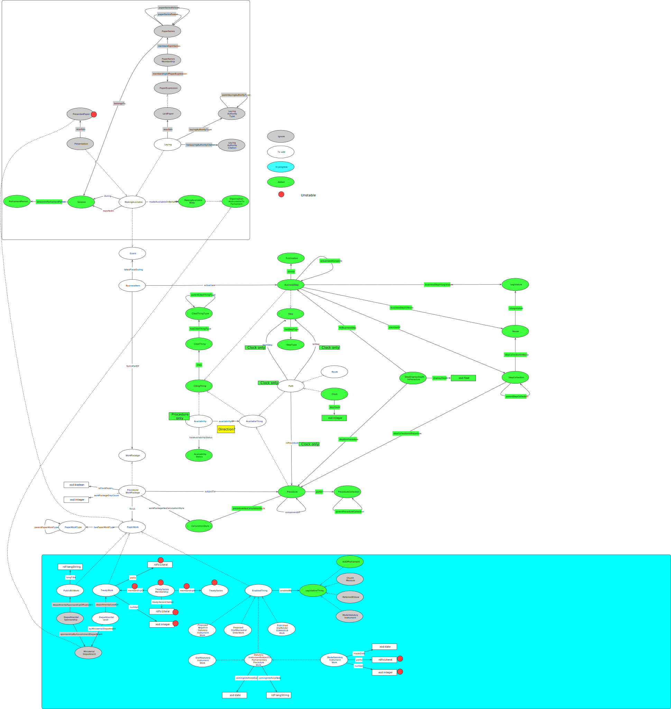

# Importing procedure editor data to Data Graphs

The procedure editor database is [SQL Server](https://en.wikipedia.org/wiki/Microsoft_SQL_Server). Jianhan provides a dump of this data, which is converted to [Postgres](https://en.wikipedia.org/wiki/PostgreSQL) using [DBBeaver](https://en.wikipedia.org/wiki/DBeaver).

This page lists the Postgres queries necessary to produce CSV files to populate Data Graphs.

	

## Done

### ParliamentPeriod

Sourced from:
https://docs.google.com/spreadsheets/d/1e3AnQebAO5ug-Pc_0qDq9KkyZiy0dRhJMvm0lRRJOXk/edit?usp=sharing

### Session and sessionInParliamentPeriod

Sourced from:
https://docs.google.com/spreadsheets/d/1e3AnQebAO5ug-Pc_0qDq9KkyZiy0dRhJMvm0lRRJOXk/edit?usp=sharing

### OrganisationAccountableToParliament and MakingAvailableBody

<code>select * from procedure.layingbody;<c/ode>

### AvailabilityStatus

Populated by hand (open / closed).

### Publication

<code>select * from procedure.proceduresteppublication;</code>

### Legislature

<code>select * from procedure.legislature;</code>

### House and inLegislature

<code>select * from procedure.house;</code>

### StepType

<code>select * from procedure.proceduresteptype;</code>

### ActOfParliament and EnablingThing

<code>select * from procedure.solractofparliamentdata;</code>

### CalculationStyle

<code>select * from procedure.procedurecalculationstyle;</code>

### Step (non-business)

<code>select * from procedure.procedurestep where proceduresteptypeid != 1;</code>

### Procedure and procedureHasCalculationStyle

<code>
SELECT p.*, calculation_styles.calculation_styles__string
FROM procedure.procedure p
LEFT JOIN
	(
		SELECT pcsa.procedureid AS procedure_id, STRING_AGG(pcs.id::text, ', ') AS calculation_styles_string
		FROM procedure.procedurecalculationstyleapplicability pcsa, procedure.procedurecalculationstyle pcs
		WHERE pcsa.procedurecalculationstyleid = pcs.id
		GROUP BY procedure_id
	) calculation_styles
ON calculation_styles.procedure_id = p.id
</code>

### StepCollection, stepCollectionInHouse and stepCollectionInProcedure

<code>select * from procedure.procedurestepcollection;</code>

### componentOf

Populated by hand.

## Doing

### BusinessStep, Step, actualisedAlongside, source, hasStepType, businessStepInLegislature, businessStepInHouse and memberOf

<code>
SELECT
	s.*,
	CASE 
		WHEN step_houses.houses_string = 'House of Commons' OR step_houses.houses_string = 'House of Lords' OR step_houses.houses_string = 'House of Commons and House of Lords'
		THEN CONCAT( s.procedurestepname, ' (', step_houses.houses_string, legislature.name, ')'  )
	ELSE
		s.procedurestepname
	END,
	collection_memberships.step_id AS step_collections_string,
	step_houses.step_houses_string AS step_houses_string,
	actualised_alongsides.actualised_alongside_text AS actualised_alongside_text
FROM procedure.procedurestep s
LEFT JOIN
	(
		SELECT scm.procedurestepid AS step_id, STRING_AGG(sc.id::text, ', ') AS step_collections_string
		FROM procedure.procedurestepcollectionmembership scm, procedure.procedurestepcollection sc
		WHERE scm.procedurestepcollectionid = sc.id
		GROUP BY step_id
	) collection_memberships
ON collection_memberships.step_id = s.id
LEFT JOIN
	(
		SELECT sh.procedurestepid AS step_id, STRING_AGG(h.id::text, ', ') AS step_houses_string, STRING_AGG(h.housename::text, ' and ') AS houses_string
		FROM procedure.procedurestephouse sh, procedure.house h
		WHERE sh.houseid = h.id
		GROUP BY step_id
	) step_houses
ON step_houses.step_id = s.id
LEFT JOIN
	(
		SELECT sas.procedurestepid AS from_step_id, STRING_AGG(sas.commonlyactualisedalongsideprocedurestepid::text, ', ') AS actualised_alongside_text
		
		
		FROM procedure.procedurestepalongsidestep sas
		GROUP BY from_step_id
	) actualised_alongsides
ON actualised_alongsides.from_step_id = s.id
LEFT JOIN
	(
		SELECT l.id, l.legislaturename AS name
		FROM procedure.legislature l
	) legislature
ON legislature.id = s.legislatureid
WHERE s.proceduresteptypeid = 1;
</code>

